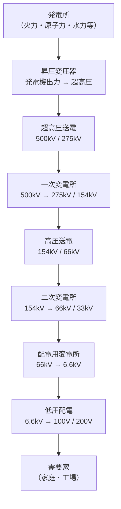

# 電力系統・需給運用

!!! warning "⚠️ 未確認"
    このページはv0.5ドラフトです。数値・公式は参考書で確認してください。

## 1. 直感的理解

**電力系統の本質**: 発電した電力を「今この瞬間に」需要と一致させ続ける。電力は在庫を持てない（蓄電池が普及する前の前提）。**需給のバランスが崩れると周波数が変動する**。

```
需要 > 供給 → 発電機が重くなる（回りにくくなる）→ 周波数低下
供給 > 需要 → 発電機が軽くなる（回りやすくなる）→ 周波数上昇
```

> **5秒で思い出す**
>
> **周波数 = 電力系統の健康診断。50Hz（東日本）/60Hz（西日本）を保つことが目標。**

!!! tip "覚え方"
    「周波数が下がる = 需要過多のサイン（発電機が回しにくい）」
    「揚水発電 = 夜間に汲み上げ（蓄電）、昼間に放出（発電）」

---

## 2. 電力系統の全体像



### 電圧区分と用途

| 区分 | 電圧レベル | 主な用途 |
|------|-----------|---------|
| 超高圧送電 | 500kV、275kV | 長距離・大容量幹線送電 |
| 高圧送電 | 154kV、66kV | 地域幹線送電 |
| 特別高圧配電 | 33kV、22kV | 大規模工場・地域変電所 |
| 高圧配電 | 6.6kV | 一般配電線路 |
| 低圧 | 100V / 200V | 家庭・小規模商業 |

---

## 3. 需給運用の仕組み

### 負荷追従制御 LFC（Load Frequency Control）

**目的**: 系統周波数を定格（50Hz / 60Hz）に維持する

- 発電機の出力を自動調整（ガバナ：速度調定）
- 区域内の周波数偏差を検出 → 制御信号を発電機に送る
- 応答速度: 秒〜分オーダー

### 経済負荷配分 EDC（Economic Dispatch Control）

- 複数の発電所を最も経済的な配分で運用する制御
- 燃料費（限界コスト）が安い発電所から優先的に起動・増出力する
- 送電ロスも考慮した最適化が行われる

### 揚水発電による需給調整

```
夜間（需要谷）: 余剰電力で水を下池から上池へ揚水（電力消費）
昼間（需要ピーク）: 上池から下池へ放水して発電（電力供給）
```

- 揚水効率: 約70〜80%（揚水で使った電力の70〜80%が発電で回収）
- 夜間の原子力・火力ベース電源の余剰電力を有効活用
- 電力貯蔵手段として最大規模の技術（蓄電池の普及前は唯一に近い）

### 系統安定度

| 種類 | 定義 | 対策 |
|------|------|------|
| 定態安定度 | 定常状態で小さな擾乱に対して安定を保てる限界 | 送電線を並列化・電圧維持 |
| 動態安定度 | 自動制御（AVR・PSS等）を含む動的安定性 | 自動電圧調整器（AVR）の整定 |
| 過渡安定度 | 短絡・地絡などの大きな擾乱後に同期を保てるか | 高速遮断・系統連系強化 |

---

## 4. 電力品質の比較表

| 指標 | 定義 | 管理目標 | 問題発生時の影響 |
|------|------|---------|---------------|
| 周波数 | 交流の毎秒サイクル数 | 50Hz±0.2Hz（東日本） | ズレると同期発電機が脱調・機器誤動作 |
| 電圧（低圧） | 100V系の電圧 | 101V±6V（95〜107V） | 低すぎ→機器故障、高すぎ→絶縁破壊 |
| 電圧（高圧） | 6.6kV系の電圧 | 6,600V±600V（6,000〜7,200V） | 電動機の効率低下・過熱 |
| 高調波 | 基本波の整数倍の周波数成分 | 総合高調波電圧歪率 5%以下 | 機器過熱・通信障害・継電器誤動作 |
| 電圧不平衡率 | 三相各相電圧の不均一度 | 3%以下 | 誘導電動機の効率低下・過熱 |

---

## 5. 系統連系の要件

### 分散型電源（太陽光・風力・小水力等）の系統連系

**系統連系規程**（JEAG 9701）の主なポイント:

| 要件 | 内容 |
|------|------|
| 単独運転防止 | 系統停電時に分散型電源が単独で運転（アイランディング）しないこと |
| 逆潮流 | 余剰電力を系統に逆流させること。大部分の分散型電源で認められている |
| 保護協調 | 系統の保護システムと連系点の保護装置を協調させること |
| 電圧変動 | 連系により配電線の電圧が許容範囲を超えないこと |
| 高調波 | インバータから発生する高調波が規制値以下であること |

### 単独運転防止（アイランディング防止）

```
系統停電時のリスク:
  系統 ← [連系点] ← 太陽光発電
             ↑
  需要家に電圧が印加されたまま
  → 作業員の感電リスク
  → 系統復旧時の位相不一致による機器損傷
```

**検出方法**:
- 能動的方式: 周波数・電圧に意図的な変動を与えて単独運転を検出
- 受動的方式: 周波数・電圧の急変を検出

**対策**: 系統停電を検出したら自動的に解列（連系点遮断）する

### 太陽光・風力の大量導入と系統安定性

- **出力変動**: 天候・風速依存で大きく変動する → 従来型発電機による調整力が必要
- **慣性力の低下**: インバータ経由の連系では系統の慣性力（イナーシャ）が低下 → 周波数変動が大きくなりやすい
- **対策**: 蓄電池システム（BESS）・揚水発電との組み合わせ、需要側制御（DR）

---

## 6. 公式マップ

### レイヤーA: 設備利用率と供給予備力

#### 設備利用率

$$\boxed{\text{設備利用率} = \frac{\text{年間発電電力量 [kWh]}}{\text{設備容量 [kW]} \times 8760 \text{ [h]}} \times 100 \quad [\%]}$$

- 設備利用率が高い → 発電設備を有効活用している
- 太陽光の設備利用率: 約12〜18%（年間を通じて昼間のみ、天候依存）
- 火力の設備利用率: 約50〜80%（ベース・ミドル運用による）

#### 供給予備力・供給予備率

$$\boxed{\text{供給予備率} = \frac{\text{供給力} - \text{最大需要電力}}{\text{最大需要電力}} \times 100 \quad [\%]}$$

- 供給予備率が高い → 余裕が大きく安定供給しやすい（ただし経済性は下がる）
- 一般に供給予備率は **8〜10%以上**を目標とすることが多い

### レイヤーB: 負荷持続曲線の読み方

**負荷持続曲線**: 年間8760時間を通じて、各負荷レベルが何時間持続するかを表したグラフ

```
電力需要 (kW)
    ↑
最大 ├──────┐ ← ピーク負荷（年間数十〜数百時間）
    │      │   揚水・ガスタービン等で対応
    ├──────────────┐ ← ミドル負荷
    │              │   LNG・石油火力等で対応
    ├──────────────────────── ← ベース負荷
    │                         原子力・石炭火力・大型水力等
    └───────────────────────────→ 時間 [h]
                              8760h（1年）
```

- **ベース負荷**: 年間ほぼ常時必要な最低限の電力。原子力・石炭火力で賄う
- **ミドル負荷**: 昼間・平日に追加的に必要な電力。LNG火力で対応
- **ピーク負荷**: 夏の猛暑日・冬の厳寒日など年間数十〜数百時間のみ。揚水・ガスタービンで対応

---

## 7. 勘違いTOP3

### 勘違い①: 「周波数低下は供給過多のサイン」

**誤り。** 周波数低下は**需要が供給を上回っている状態**（需要過多）のサイン。

発電機は回転体（同期発電機）。需要が増えると発電機が重くなり（回しにくくなり）、回転数（＝周波数）が下がる。逆に供給が需要を上回ると発電機が回りやすくなり周波数が上昇する。

### 勘違い②: 「供給予備率は小さい方がよい（ムダがない）」

**誤り。** 供給予備率は大きい方が電力の安定供給に有利（安全マージンが大きい）。ただし設備を多く持つほどコストがかかるため、**供給安定性と経済性のトレードオフ**になる。試験では「予備率が高い ＝ 安定」と覚えておく。

### 勘違い③: 「揚水発電所は昼間に揚水を行う」

**誤り。** 揚水（水を汲み上げる：電力を消費）するのは**夜間**（電力需要の谷、余剰電力が発生する時間帯）。昼間は放水して**発電**する（ピーク対応）。

---

## 8. 正誤判定の急所

| 文 | 判定 | 解説 |
|---|------|------|
| 系統周波数が低下するのは需要が供給を上回っている状態である | **正** | 発電機の回転数（周波数）が需要増で低下する |
| 揚水発電所は電力需要の多い昼間に揚水を行う | **誤** | 揚水は**夜間**（余剰電力を利用）。昼間は**放水・発電** |
| 設備利用率が高いほど発電設備を有効活用している | **正** | 設備利用率 = 実際の発電量 / 最大可能発電量 |
| 低圧100V系の電圧の適正範囲は100V±10Vである | **誤** | 適正範囲は **101V±6V**（95〜107V） |
| 太陽光発電を大量に系統連系すると系統の慣性力が増す | **誤** | インバータ連系では慣性力（イナーシャ）は**低下**する |
| 単独運転防止は系統停電時に分散型電源を自動解列させる技術である | **正** | アイランディング防止。作業員感電リスクや位相不一致を防ぐ |
| 経済負荷配分（EDC）は限界コストの高い発電所から優先的に起動する | **誤** | 限界コストの**低い**発電所から優先的に起動する（安い順）|
| 供給予備率が高いほど電力供給の安定性が高い | **正** | 余裕が大きいほど需要変動や設備故障に対応しやすい |

---

## 📊 出題実績

| 年度 | 問 | タイトル | 問題タイプ | 難易度 |
|------|---|---------|----------|--------|
| R07下 | 問10 | 電力系統の周波数制御と需給調整 | 論説 | ★★★☆☆ |
| R07上 | 問10 | 電力系統の需給バランスと揚水発電の役割 | 穴埋 | ★★☆☆☆ |
| R06下 | 問10 | 電力系統における設備利用率と供給予備率の計算 | 計算 | ★★★☆☆ |
| R06上 | 問10 | 系統連系規程のポイント（単独運転防止・逆潮流） | 論説 | ★★★☆☆ |
| R05下 | 問10 | 系統周波数と需給バランスの関係 | 論説 | ★★☆☆☆ |
| R05上 | 問10 | 揚水発電の仕組みと需給調整への活用 | 穴埋 | ★★☆☆☆ |
| R04下 | 問10 | 負荷持続曲線の読み方とベース・ピーク負荷 | 論説 | ★★★★☆ |
| R04上 | 問10 | 電力系統の需給調整と周波数維持 | 穴埋 | ★★☆☆☆ |
| R03 | 問10 | 電力系統の安定度と系統連系 | 論説 | ★★★☆☆ |
| R02 | 問10 | 系統連系規程（単独運転防止・逆潮流の正誤判定） | 論説 | ★★★☆☆ |
| R01 | 問10 | 負荷持続曲線とベース・ミドル・ピーク負荷の概念 | 論説 | ★★★★☆ |

> **出題傾向まとめ**: 「周波数低下 = 需要過多」の因果関係は毎回のように確認される。揚水発電の昼夜のポンプ/発電の向きも頻出。設備利用率・供給予備率の計算式は数値問題として出ることがある。系統連系・単独運転防止は再エネ普及を背景に近年出題頻度が上がっている。負荷持続曲線の概念（ベース/ミドル/ピーク）も知識問題として出る。
>
> 詳細解説: [電験王 電力系統カテゴリ](https://denken-ou.com/denryoku/?cat=keitou)
