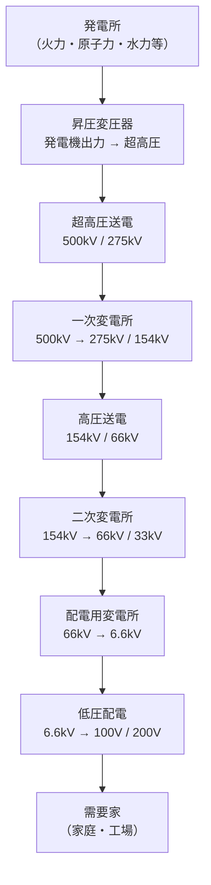

# 電力系統・需給運用

---

## 1. 直感的理解

**電力系統の本質**: 発電した電力を「今この瞬間に」需要と一致させ続ける。電力は在庫を持てない（蓄電池が普及する前の前提）。**需給のバランスが崩れると周波数が変動する**。

!!! note "周波数と需給バランスの因果関係（最重要）"
    電力系統の発電機（同期発電機）は物理的な回転体。需給バランスが崩れると次の物理メカニズムが働く：

    **需要 > 供給の場合**:
    → 発電機が「余分な負荷をかけられた」状態  
    → 回転子の運動エネルギーが奪われる  
    → 回転数が低下 → **周波数が低下**（東日本なら50Hz以下になる）

    **供給 > 需要の場合**:
    → 発電機が「空回りする」状態  
    → 回転子にエネルギーが蓄積される  
    → 回転数が上昇 → **周波数が上昇**

    周波数は全系統の発電機が同期しているため、一瞬で系統全体に伝わる。だから周波数は「電力系統の健康診断」として機能する。

---

## 2. 電力系統の全体像


```mermaid
graph TD
    A["発電所<br/>（火力・原子力・水力等）"] --> B["昇圧変圧器<br/>発電機出力 → 超高圧"]
    B --> C["超高圧送電<br/>500kV / 275kV"]
    C --> D["一次変電所<br/>500kV → 275kV / 154kV"]
    D --> E["高圧送電<br/>154kV / 66kV"]
    E --> F["二次変電所<br/>154kV → 66kV / 33kV"]
    F --> G["配電用変電所<br/>66kV → 6.6kV"]
    G --> H["低圧配電<br/>6.6kV → 100V / 200V"]
    H --> I["需要家<br/>（家庭・工場）"]
```

### 電圧区分と用途

| 区分 | 電圧レベル | 主な用途 |
|------|-----------|---------|
| 超高圧送電 | 500kV、275kV | 長距離・大容量幹線送電 |
| 高圧送電 | 154kV、66kV | 地域幹線送電 |
| 特別高圧配電 | 33kV、22kV | 大規模工場・地域変電所 |
| 高圧配電 | 6.6kV | 一般配電線路 |
| 低圧 | 100V / 200V | 家庭・小規模商業 |

!!! note "なぜ高電圧で長距離送電するのか（因果理解）"
    送電線で消費される電力損失は $P_{loss} = I^2 R$。同じ電力 $P = VI$ を送る場合、電圧Vを高くすると電流Iが小さくなる（$I = P/V$）。電流が小さいと線路抵抗による損失 $I^2R$ が大幅に減少する。さらに電流が小さければ電線を細くできるため材料コストも削減できる。超高圧（500kV）では低圧（6.6kV）に比べて約5,700倍電圧が高く、同じ電流密度なら線路損失を約1/3,000万に圧縮できる計算になる。

---

## 3. 需給運用の仕組み

### 負荷追従制御 LFC（Load Frequency Control）

**目的**: 系統周波数を定格（50Hz / 60Hz）に維持する

- 発電機の出力を自動調整（ガバナ：速度調定）
- 区域内の周波数偏差を検出 → 制御信号を発電機に送る
- 応答速度: 秒〜分オーダー

### 経済負荷配分 EDC（Economic Dispatch Control）

- 複数の発電所を最も経済的な配分で運用する制御
- 燃料費（限界コスト）が**安い発電所から優先的に**起動・増出力する
- 送電ロスも考慮した最適化が行われる

!!! warning "【頻出引っかけ】EDCの優先順位"
    「経済負荷配分（EDC）は限界コストの高い発電所から優先的に起動する」→ **誤り**。  
    コストが**低い**（安い）発電所から優先的に起動する。目的は系統全体の燃料費最小化。コストの高い発電所は最後に起動するピーク対応電源。

### 揚水発電による需給調整

```
夜間（需要谷）: 余剰電力で水を下池から上池へ揚水（電力消費）
昼間（需要ピーク）: 上池から下池へ放水して発電（電力供給）
```

!!! note "揚水発電の物理的仕組み（因果理解）"
    揚水発電所はポンプ水車と同期電動機/発電機を兼用する可逆設備。  
    夜間: 系統から電力を受け、同期電動機がポンプ水車を駆動して下池の水を上池へ汲み上げる（位置エネルギーとして電力を蓄える）。  
    昼間: 上池の水を放水し、ポンプ水車が水力タービンとして回転、同期発電機が発電する。  
    揚水効率は約70〜80%（100kWhの電力で揚水し、放水発電で70〜80kWhを取り出せる）。20〜30%はモーター・ポンプ・発電機の損失。効率は低いが、夜間の余剰電力（原子力・石炭は出力調整が困難）を有効活用できる唯一の大規模貯蔵手段として経済的価値が高い。

### 系統安定度

| 種類 | 定義 | 対策 |
|------|------|------|
| 定態安定度 | 定常状態で小さな擾乱に対して安定を保てる限界 | 送電線を並列化・電圧維持 |
| 動態安定度 | 自動制御（AVR・PSS等）を含む動的安定性 | 自動電圧調整器（AVR）の整定 |
| 過渡安定度 | 短絡・地絡などの大きな擾乱後に同期を保てるか | 高速遮断・系統連系強化 |

!!! note "系統安定度の物理的意味（因果理解）"
    同期発電機は電力系統全体で「同じ速度で回転」している。安定度とは「外乱（負荷急変・短絡等）が起きても同期を失わず（脱調せず）元の運転状態に戻れるか」の指標。  
    **定態安定度**: 小さな負荷変動に対する復元力。送電電力の上限（定態安定限界）を超えて運用しなければよい。  
    **過渡安定度**: 短絡事故のような大きな擾乱では、発電機が加速して他機との位相差が急拡大する。これを素早く遮断（高速遮断）して位相差が大きくなる前に系統を切り離すことで脱調を防ぐ。

---

## 4. 電力品質の比較表

!!! note "電力品質の管理基準（数値は覚える）"
    | 指標 | 管理目標 |
    |------|---------|
    | 周波数（東日本） | **50Hz ± 0.2Hz** |
    | 低圧100V系 | **101V ± 6V**（95〜107V） |
    | 高圧6.6kV系 | **6,600V ± 600V**（6,000〜7,200V） |
    | 高調波電圧歪率 | **5%以下** |
    | 電圧不平衡率 | **3%以下** |

| 指標 | 定義 | 管理目標 | 問題発生時の影響 |
|------|------|---------|---------------|
| 周波数 | 交流の毎秒サイクル数 | 50Hz±0.2Hz（東日本） | ズレると同期発電機が脱調・機器誤動作 |
| 電圧（低圧） | 100V系の電圧 | 101V±6V（95〜107V） | 低すぎ→機器故障、高すぎ→絶縁破壊 |
| 電圧（高圧） | 6.6kV系の電圧 | 6,600V±600V（6,000〜7,200V） | 電動機の効率低下・過熱 |
| 高調波 | 基本波の整数倍の周波数成分 | 総合高調波電圧歪率 5%以下 | 機器過熱・通信障害・継電器誤動作 |
| 電圧不平衡率 | 三相各相電圧の不均一度 | 3%以下 | 誘導電動機の効率低下・過熱 |

---

## 5. 系統連系の要件

### 分散型電源（太陽光・風力・小水力等）の系統連系

**系統連系規程**（JEAG 9701）の主なポイント:

| 要件 | 内容 |
|------|------|
| 単独運転防止 | 系統停電時に分散型電源が単独で運転（アイランディング）しないこと |
| 逆潮流 | 余剰電力を系統に逆流させること。大部分の分散型電源で認められている |
| 保護協調 | 系統の保護システムと連系点の保護装置を協調させること |
| 電圧変動 | 連系により配電線の電圧が許容範囲を超えないこと |
| 高調波 | インバータから発生する高調波が規制値以下であること |

### 単独運転防止（アイランディング防止）

```
系統停電時のリスク:
  系統 ← [連系点] ← 太陽光発電
             ↑
  需要家に電圧が印加されたまま
  → 作業員の感電リスク
  → 系統復旧時の位相不一致による機器損傷
```

**検出方法**:
- 能動的方式: 周波数・電圧に意図的な変動を与えて単独運転を検出
- 受動的方式: 周波数・電圧の急変を検出

**対策**: 系統停電を検出したら自動的に解列（連系点遮断）する

!!! warning "【頻出引っかけ】系統連系と慣性力"
    「太陽光発電を大量に系統連系すると系統の慣性力が増す」→ **誤り**。  
    太陽光発電はインバータ（直流→交流変換器）経由で系統に接続されるため、発電機の回転体（同期発電機）の慣性力（イナーシャ）に相当するものがない。太陽光発電比率が上がると系統全体の慣性力が**低下**し、周波数が変動しやすくなる。これが再エネ大量導入時の系統安定性課題の一つ。

### 太陽光・風力の大量導入と系統安定性

- **出力変動**: 天候・風速依存で大きく変動する → 従来型発電機による調整力が必要
- **慣性力の低下**: インバータ経由の連系では系統の慣性力（イナーシャ）が低下 → 周波数変動が大きくなりやすい
- **対策**: 蓄電池システム（BESS）・揚水発電との組み合わせ、需要側制御（DR）

---

## 6. 公式マップ

!!! note "設備利用率の公式"
    $$\text{設備利用率} = \frac{\text{年間発電電力量 [kWh]}}{\text{設備容量 [kW]} \times 8760 \text{ [h]}} \times 100 \quad [\%]$$

    - 設備利用率が高い → 発電設備を有効活用している
    - 太陽光の設備利用率: 約12〜18%（年間を通じて昼間のみ、天候依存）
    - 火力の設備利用率: 約50〜80%（ベース・ミドル運用による）

!!! note "供給予備率の公式"
    $$\text{供給予備率} = \frac{\text{供給力} - \text{最大需要電力}}{\text{最大需要電力}} \times 100 \quad [\%]$$

    - 供給予備率が高い → 余裕が大きく安定供給しやすい（ただし経済性は下がる）
    - 一般に供給予備率は **8〜10%以上**を目標とすることが多い
    - **予備率が高い = 安定（ただし設備コストが増える）**

### レイヤーB: 負荷持続曲線の読み方

**負荷持続曲線**: 年間8760時間を通じて、各負荷レベルが何時間持続するかを表したグラフ

```
電力需要 (kW)
    ↑
最大 ├──────┐ ← ピーク負荷（年間数十〜数百時間）
    │      │   揚水・ガスタービン等で対応
    ├──────────────┐ ← ミドル負荷
    │              │   LNG・石油火力等で対応
    ├──────────────────────── ← ベース負荷
    │                         原子力・石炭火力・大型水力等
    └───────────────────────────→ 時間 [h]
                              8760h（1年）
```

- **ベース負荷**: 年間ほぼ常時必要な最低限の電力。原子力・石炭火力で賄う
- **ミドル負荷**: 昼間・平日に追加的に必要な電力。LNG火力で対応
- **ピーク負荷**: 夏の猛暑日・冬の厳寒日など年間数十〜数百時間のみ。揚水・ガスタービンで対応

---

## 7. 引っかけパターン

!!! warning "【頻出引っかけ1】周波数低下の原因を逆に理解"
    「周波数低下は供給が需要を上回っている状態（供給過多）のサイン」→ **誤り**。  
    周波数低下 = **需要が供給を上回っている状態（需要過多）**。発電機（回転体）に重い負荷がかかって回転数が落ちるイメージ。

!!! warning "【頻出引っかけ2】揚水の昼夜を逆に覚える"
    「揚水発電所は電力需要の多い昼間に揚水を行う」→ **誤り**。  
    揚水（水を汲み上げる：電力消費）は**夜間**（余剰電力を活用）。昼間は放水して**発電**する（ピーク対応）。昼夜の向きが逆になった出題が頻出。

!!! warning "【頻出引っかけ3】供給予備率の大小と安定性"
    「供給予備率は小さい方がよい（ムダがない）」→ **誤り**（あるいは一面的）。  
    予備率が高い方が電力の安定供給に有利（安全マージンが大きい）。ただし設備を多く持つほどコストがかかる。試験では「予備率が高い ＝ 安定」という観点で正誤判定する。

!!! warning "【頻出引っかけ4】低圧100V系の適正電圧範囲"
    「低圧100V系の電圧の適正範囲は100V±10Vである」→ **誤り**。  
    適正範囲は **101V±6V**（95〜107V）。±10Vは誤り。101Vという値が基準であることも含めて覚える。

---

## 8. 正誤判定の急所

| 文 | 判定 | 解説 |
|---|------|------|
| 系統周波数が低下するのは需要が供給を上回っている状態である | **正** | 発電機の回転数（周波数）が需要増で低下する |
| 揚水発電所は電力需要の多い昼間に揚水を行う | **誤** | 揚水は**夜間**（余剰電力を利用）。昼間は**放水・発電** |
| 設備利用率が高いほど発電設備を有効活用している | **正** | 設備利用率 = 実際の発電量 / 最大可能発電量 |
| 低圧100V系の電圧の適正範囲は100V±10Vである | **誤** | 適正範囲は **101V±6V**（95〜107V） |
| 太陽光発電を大量に系統連系すると系統の慣性力が増す | **誤** | インバータ連系では慣性力（イナーシャ）は**低下**する |
| 単独運転防止は系統停電時に分散型電源を自動解列させる技術である | **正** | アイランディング防止。作業員感電リスクや位相不一致を防ぐ |
| 経済負荷配分（EDC）は限界コストの高い発電所から優先的に起動する | **誤** | 限界コストの**低い**発電所から優先的に起動する（安い順）|
| 供給予備率が高いほど電力供給の安定性が高い | **正** | 余裕が大きいほど需要変動や設備故障に対応しやすい |

---

## 📊 出題実績

| 年度 | 問 | 出題内容 | 問題タイプ | 難易度 |
|------|---|---------|----------|--------|
| R07下 | 問10 | 電力系統の周波数制御と需給調整 | 論説 | ★★★☆☆ |
| R07上 | 問10 | 電力系統の需給バランスと揚水発電の役割 | 穴埋 | ★★☆☆☆ |
| R06下 | 問10 | 電力系統における設備利用率と供給予備率の計算 | 計算 | ★★★☆☆ |
| R06上 | 問10 | 系統連系規程のポイント（単独運転防止・逆潮流） | 論説 | ★★★☆☆ |
| R05下 | 問10 | 系統周波数と需給バランスの関係 | 論説 | ★★☆☆☆ |
| R05上 | 問10 | 揚水発電の仕組みと需給調整への活用 | 穴埋 | ★★☆☆☆ |
| R04下 | 問10 | 負荷持続曲線の読み方とベース・ピーク負荷 | 論説 | ★★★★☆ |
| R04上 | 問10 | 電力系統の需給調整と周波数維持 | 穴埋 | ★★☆☆☆ |
| R03 | 問10 | 電力系統の安定度と系統連系 | 論説 | ★★★☆☆ |
| R02 | 問10 | 系統連系規程（単独運転防止・逆潮流の正誤判定） | 論説 | ★★★☆☆ |
| R01 | 問10 | 負荷持続曲線とベース・ミドル・ピーク負荷の概念 | 論説 | ★★★★☆ |

> **出題傾向まとめ**: 「周波数低下 = 需要過多」の因果関係は毎回のように確認される。揚水発電の昼夜のポンプ/発電の向きも頻出。設備利用率・供給予備率の計算式は数値問題として出ることがある。系統連系・単独運転防止は再エネ普及を背景に近年出題頻度が上がっている。負荷持続曲線の概念（ベース/ミドル/ピーク）も知識問題として出る。
>
> 詳細解説: [電験王 電力系統カテゴリ](https://denken-ou.com/denryoku/?cat=keitou)

---

## 関連ページ

- [配電線路](haiden.md) — 配電電圧（6.6kV）、電圧管理の詳細
- [架空送電線路](kakuu-souden.md) — 送電線路の電気的特性、フェランチ効果
- [新エネルギー発電](shin-energy.md) — 太陽光・風力の系統連系詳細
