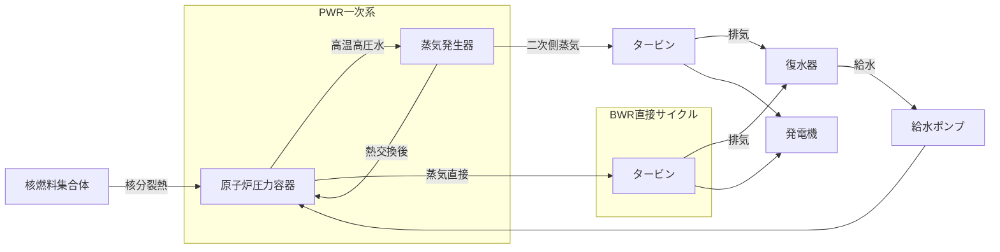

# ☢️ 原子力発電

> 核分裂の連鎖反応で熱を発生→蒸気→タービン。「燃料・制御・冷却」の3点が試験の核心。

!!! info "📋 v0.7 — 過去問データ充填済み"
    出題実績（R01〜R07）を充填済み。公式・数値は参考書で必ず確認してください。

---

## 🧠 直感的理解

火力発電との違いは「熱源が燃焼ではなく核分裂」という1点だけ。それ以外（蒸気→タービン→発電機）は同じ。

```
核燃料（核分裂）→ 熱エネルギー（冷却材）→ 蒸気（蒸気発生器 or 直接）→ タービン→ 発電機
```

**試験の核心3点**：

| 項目 | 火力との比較 |
|------|------------|
| 燃料 | 化石燃料ではなく **核燃料**（濃縮ウラン） |
| 出力制御 | 燃料調整ではなく **制御棒**（挿入で減少・引抜で増加） |
| 冷却 | 崩壊熱があるため **冷却は停止後も必要** |

!!! tip "原子炉の4要素（必須暗記）"
    **核燃料 · 減速材 · 制御棒 · 冷却材**

    この4要素の役割と具体的材料を押さえれば選択問題の大半は解ける。

---

## 🏭 設備を歩く



**主要機器一覧**

| 機器 | 役割 | 備考 |
|------|------|------|
| 核燃料集合体 | 核分裂反応で熱を発生 | UO₂ペレットを燃料棒に封入 |
| 減速材 | 高速中性子を熱中性子に減速 | 軽水・重水・黒鉛 |
| 制御棒 | 中性子を吸収して出力制御 | ハフニウム・ホウ素・カドミウム |
| 冷却材 | 核分裂熱を外部へ輸送 | 軽水・重水・液体ナトリウム |
| 圧力容器 | 炉心を収納・高圧維持 | 鋼製・数十cmの厚み |
| 格納容器 | 放射性物質の外部漏洩防止 | 最終バリア |

---

## 🔬 原子炉の種類比較表（最重要）

| 項目 | **PWR**（加圧水型） | **BWR**（沸騰水型） | **CANDU**（重水型） | **高速増殖炉** |
|------|-------------------|-------------------|-------------------|--------------|
| 減速材 | 軽水 | 軽水 | 重水 | なし（高速中性子利用） |
| 冷却材 | 軽水 | 軽水 | 重水 | 液体ナトリウム |
| 冷却材圧力 | 約155 atm（高圧） | 約70 atm（中圧） | 約100 atm | 低圧 |
| 蒸気発生方法 | 蒸気発生器（二次側） | 炉内で直接沸騰 | 蒸気発生器（二次側） | 蒸気発生器 |
| 冷却水系統 | **2系統**（一次・二次） | **1系統**（直接） | 2系統 | 2系統以上 |
| 国内主流か | ○（関西電力等） | ○（東京電力等） | ×（国内未使用） | △（もんじゅは廃炉） |
| 燃料濃縮度 | 低濃縮ウラン（2〜5%） | 低濃縮ウラン（2〜5%） | **天然ウラン**（0.7%） | 高濃縮プルトニウム |
| 特徴 | 安全性高・蒸気発生器必要 | 構造シンプル・放射性蒸気あり | 濃縮不要・燃料費安 | プルトニウム増殖可能 |

!!! note "PWR vs BWR の最重要ポイント"
    - **PWR**：一次冷却水は沸騰しない（加圧して液相維持）→蒸気発生器で二次側を沸騰させる
    - **BWR**：炉内で沸騰して直接タービンへ→放射性の蒸気がタービンを通る

---

## ♻️ 核燃料サイクルの要点

```
ウラン採掘 → 精錬 → 転換 → ウラン濃縮（U-235濃度を高める）→ 燃料加工（ペレット→燃料棒→集合体）
→ 原子炉 → 使用済み燃料 → 再処理（Pu抽出）→ MOX燃料 or 廃棄物処理
```

**核反応の基礎**

| 事象 | 内容 |
|------|------|
| U-235の核分裂 | 熱中性子を吸収して分裂→大量の熱エネルギーと2〜3個の中性子放出 |
| U-238の変換 | 中性子を吸収→Pu-239に変換（高速増殖炉の原理） |
| 連鎖反応 | 分裂で生じた中性子が次の核分裂を引き起こす |

**燃料構造**

```
ペレット（UO₂焼結体）→ 燃料棒（ジルカロイ被覆管）→ 燃料集合体（数百本束ねたもの）
```

---

## 🧮 公式マップ（知識テーマのため用語整理）

**核反応の用語整理表**

| 用語 | 意味 | 試験での扱い |
|------|------|------------|
| 臨界 | 連鎖反応が一定の割合で持続する状態（増倍率k=1） | 通常運転の状態 |
| 未臨界 | 連鎖反応が減衰していく状態（k<1） | 停止・制御棒挿入時 |
| 超臨界 | 連鎖反応が増加していく状態（k>1） | 出力上昇中（制御された状態） |
| 反応度 | 臨界からのずれを表す量（k-1）/k | 制御の指標 |
| 熱中性子 | 減速材で減速された低エネルギー中性子 | U-235を効率よく核分裂させる |
| 高速中性子 | 核分裂直後の高エネルギー中性子 | 高速増殖炉が利用 |

---

## ⚡ 正誤判定の急所（知識テーマの核心）

| 文章 | 正誤 | 解説 |
|------|------|------|
| 「PWRでは一次冷却水が直接タービンを回す」 | **誤** | 蒸気発生器で二次側の水を沸騰させ、その蒸気でタービンを回す |
| 「BWRでは一次冷却水が直接タービンを回す」 | **正** | 炉内で発生した蒸気が直接タービンへ（放射性蒸気に注意） |
| 「制御棒の材料にはウランが使われる」 | **誤** | ハフニウム・ホウ素・カドミウムなど「中性子を吸収しやすい材料」を使う |
| 「重水炉では重水が減速材と冷却材を兼ねる」 | **正** | CANDUはD₂Oが減速材・冷却材の両方 |
| 「CANDUは天然ウランを燃料に使用できる」 | **正** | 重水は中性子吸収が少ないため、濃縮不要の天然ウランで臨界維持可能 |
| 「国内の商業用原子炉はPWRとBWRのみ」 | **正** | 黒鉛炉（GCR）・重水炉（CANDU）は国内商業運転なし |
| 「制御棒を挿入すると原子炉出力が上昇する」 | **誤** | 挿入すると中性子吸収が増え出力**低下**。引き抜くと出力上昇 |
| 「PWRの冷却水系統はBWRより多い」 | **正** | PWR=2系統（一次・二次）、BWR=1系統（直接サイクル） |

---

## 💡 勘違いTOP3

**1. 「超臨界」は危険な爆発状態ではない**
超臨界とは「出力が増加しつつある制御された状態」。起動時は必ず超臨界を経て定格出力に達する。原子炉の「爆発」は超臨界ではなく「即発超臨界」（制御不能状態）。

**2. PWRとBWRの冷却水系統数**
PWR=2系統（放射性の一次冷却水と蒸気発生器で分離された非放射性の二次側）、BWR=1系統（直接サイクルのため蒸気自体が放射性）。保守作業のしやすさが異なる。

**3. 制御棒の操作と出力の方向**
「制御棒挿入 → 中性子吸収 → 核分裂減少 → 出力低下」
「制御棒引抜 → 中性子吸収減少 → 核分裂増加 → 出力上昇」
緊急停止（スクラム）は「全制御棒を一斉挿入」。

---

## 📊 出題実績

| 年度 | 問 | タイトル | 問題タイプ | 難易度 |
|------|---|---------|----------|--------|
| R07下 | 問4 | 将来に向けた新型炉の検討 | 論説 | ★★★★☆ |
| R07上 | 問4 | 原子力発電における核燃料サイクル | 穴埋 | ★★☆☆☆ |
| R06下 | 問4 | 原子力発電で使用される燃料と原理 | 論説 | ★★☆☆☆ |
| R06上 | 問4 | ウランの核分裂エネルギーと石炭の発熱量の比較 | 計算 | ★★★☆☆ |
| R05下 | 問4 | 軽水炉で使用される原子燃料 | 論説 | ★★☆☆☆ |
| R05上 | 問4 | ウランの発生エネルギーと重油量の比較 | 計算 | ★★★★☆ |
| R04下 | 問4 | 日本で採用されている原子炉の型と特性 | 穴埋 | ★★★☆☆ |
| R04上 | 問4 | 沸騰水型原子炉（BWR）の特徴 | 論説 | ★★☆☆☆ |
| R03 | 問5 | 日本で使用されている原子力発電の構造や特徴 | 論説 | ★★★☆☆ |
| R02 | 問4 | ウラン235など原子燃料に使用される物質 | 穴埋 | ★★☆☆☆ |
| R01 | 問4 | ウランと石炭の燃料消費量の違い | 計算 | ★★★☆☆ |
| H24 | 問4 | ウランと重油の燃料消費量の違い | 計算 | — |
| H23 | 問4 | ウラン235が核分裂により発生するエネルギー | 計算 | — |

> 詳細解説: [電験王 原子力カテゴリ](https://denken-ou.com/denryoku/?cat=genshiryoku)

!!! info "学習の優先順位"
    1. **PWR vs BWR の違い**（冷却水系統数・蒸気発生方法）
    2. **原子炉4要素の材料**（特に制御棒はハフニウム・ホウ素・カドミウム）
    3. **臨界・未臨界・超臨界の区別**
    4. CANDU・高速増殖炉は概要のみ
