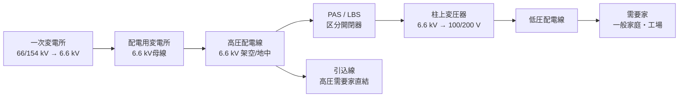

# 配電線路

## 1. 直感的理解

送電線から需要家まで「最後の1マイル」。超高圧・高圧で送られてきた電力を、配電用変電所で6.6 kVに降圧し、さらに柱上変圧器で100/200 Vに落として各家庭・工場に届ける仕組みが配電線路だ。

送電線路との本質的な違いは**距離が短い・分岐が多い・負荷が不均一**という3点。そのため電圧降下と電力損失を最小化しながら安定供給するのが主要課題になる。

> **tip**: 配電は3つのロス対策で整理する — **電圧降下・電力損失・力率低下**。この3つが試験でも現場でも常に問われる。

---

## 2. 設備を歩く

### 系統フロー（Mermaid図）

### 主要機器テーブル

| 機器名 | 機能 | ポイント |
|--------|------|----------|
| 配電用変圧器（柱上変圧器） | 6.6 kV → 100/200 V に降圧 | 単相3線式が主流。中性点接地 |
| 開閉器（PAS） | 需要家引込口の地絡保護・区分 | 高圧気中負荷開閉器。地絡検出機能付き |
| 開閉器（LBS） | 変圧器一次側の開閉・保護 | 限流ヒューズ付きが標準 |
| 低圧遮断器（MCCB） | 低圧幹線・分岐回路の過電流遮断 | 需要家内部設備 |
| 進相コンデンサ | 力率改善・無効電力補償 | 柱上または変電所に設置。電流低減で損失軽減 |
| 自動電圧調整器（AVR） | 配電線末端の電圧を自動補正 | 負荷変動・長距離線路に有効 |

---

## 3. 配電方式の比較表

| 方式 | 構成概要 | 信頼性 | 経済性 | 電圧品質 | 主な用途 |
|------|----------|--------|--------|----------|----------|
| **放射状方式** | 変電所から放射状に1本の幹線 | 低（1点故障で全停電） | 高（シンプル） | 普通 | 農村・郊外・一般住宅 |
| **ループ方式** | 幹線をリング状に接続、常時開路 | 中（区間切替で復旧可） | 中 | 良好 | 都市部・住宅密集地 |
| **スポットネットワーク方式** | 複数回線を並列接続、ネットワーク変圧器経由 | 高（多重化・無停電切替） | 低（設備コスト大） | 非常に良好 | 都市部の重要施設・大ビル |
| **バンキング方式** | 複数の柱上変圧器を低圧幹線で並列接続 | 中高（変圧器1台故障でも供給継続） | 中 | 良好 | 都市部住宅地 |

> **スポットネットワーク方式**は供給信頼性が最も高い。複数の配電線から受電し、1回線が停電しても他の回線で補える。

---

## 4. 負荷の指標比較表

| 指標 | 定義 | 公式 | 値の範囲 | 意味・使い分け |
|------|------|------|----------|---------------|
| **需要率** | 設備容量に対する最大需要電力の割合 | `需要率 = 最大需要電力 / 設備容量 × 100 [%]` | 0〜100% | 設備が「どれだけフル稼働に近いか」を示す。低いほど余裕がある |
| **負荷率** | 最大需要に対する平均需要の割合 | `負荷率 = 平均需要電力 / 最大需要電力 × 100 [%]` | 0〜100% | 高いほど設備利用効率が良い。低いとピーク対応のための無駄な設備容量が多い |
| **不等率** | 各需要家の最大需要の和を合成最大需要で割った値 | `不等率 = Σ(各需要家の最大需要電力) / 合成最大需要電力` | **1以上** | 各需要家の最大が同時に来ないほど不等率は大きくなる。設備容量の節減効果を表す |

### 覚え方と使い分け

- **需要率**：設備の「使われ方の濃さ」→ 電気工事の設備容量設計に使う
- **負荷率**：設備の「時間あたり効率」→ 高いほど経済的に運転できている
- **不等率**：複数需要家をまとめた「同時使用のバラつき」→ 変圧器・幹線の容量計算に使う。**必ず1以上**（全需要家が同時に最大を迎えることはない）

---

## 5. 公式マップ（最重要）

### レイヤーA：基本公式

#### 電圧降下

$$\Delta V_{単相2線} = 2I(R\cos\theta + X\sin\theta) \quad \text{[V]}$$

$$\Delta V_{三相3線} = \sqrt{3} \cdot I(R\cos\theta + X\sin\theta) \quad \text{[V]}$$

> **注意**：単相2線式は往路・復路で電流が流れるため係数が「2」。三相は「√3」。混同注意。

#### 電力損失（三相）

$$P_{loss} = 3I^2 R \quad \text{[W]}$$

> 3本の線それぞれで `I²R` の損失が発生するため係数が「3」。

#### 負荷指標の公式

$$\text{需要率} = \frac{\text{最大需要電力}}{\text{設備容量}} \times 100 \quad \text{[\%]}$$

$$\text{負荷率} = \frac{\text{平均需要電力}}{\text{最大需要電力}} \times 100 \quad \text{[\%]}$$

$$\text{不等率} = \frac{\sum \text{各需要家の最大需要電力}}{\text{合成最大需要電力}} \geq 1$$

---

### レイヤーB：応用公式

#### 力率改善のコンデンサ容量

$$Q_c = P(\tan\phi_1 - \tan\phi_2) \quad \text{[kvar]}$$

- `P`：有効電力 [kW]
- `φ1`：改善前の力率角
- `φ2`：改善後の力率角（目標）

**導出イメージ**：無効電力を `Q1 = P tanφ1` から `Q2 = P tanφ2` に減らすのに必要なコンデンサ容量 = `Q1 - Q2`

#### 力率改善後の電力損失軽減率

$$\text{損失軽減率} = 1 - \left(\frac{\cos\phi_1}{\cos\phi_2}\right)^2$$

> 力率が改善（cosφ上昇）すると電流が減り、損失は電流の2乗で減少する。

#### 電圧調整範囲（AVR・進相コンデンサ設置時）

$$\Delta V_{改善後} = \Delta V_{改善前} \times \frac{\cos\phi_2}{\cos\phi_1}$$

---

## 6. 解法パターン

### パターン①：電圧降下の計算

**問題形式**：「6.6 kV配電線に力率cosθ、電流Iが流れている。抵抗R、リアクタンスX。電圧降下を求めよ」

**手順**：
1. 方式（単相2線 or 三相3線）を確認
2. 該当公式を選択：
   - 単相2線：`ΔV = 2I(Rcosθ + Xsinθ)`
   - 三相3線：`ΔV = √3·I(Rcosθ + Xsinθ)`
3. sinθを計算：`sinθ = √(1 - cos²θ)`
4. 数値を代入して計算

**落とし穴**：単相2線の「2」を忘れて三相の√3を使ってしまうケース。問題文の「方式」を必ず確認する。

---

### パターン②：力率改善のコンデンサ容量計算

**問題形式**：「有効電力P [kW]、力率cosφ1の負荷を、力率cosφ2に改善したい。必要なコンデンサ容量を求めよ」

**手順**：
1. `tanφ1 = sinφ1 / cosφ1` を計算
2. `tanφ2 = sinφ2 / cosφ2` を計算
3. `Qc = P(tanφ1 - tanφ2)` [kvar]

**確認**：`Qc > 0` であること（改善後の力率角が小さくなるから）

---

### パターン③：需要率・負荷率・不等率の計算

**問題形式**：「需要家A・B・Cがあり、それぞれの設備容量・最大需要・平均需要・合成最大需要が与えられる。各指標を求めよ」

**手順**：
1. 需要率：`各需要家の最大需要 / 各需要家の設備容量`
2. 負荷率：`平均需要 / 最大需要`（ある期間の平均電力を最大電力で割る）
3. 不等率：`Σ(各最大需要) / 合成最大需要`
   - 合成最大需要は「全需要家の需要を合計したときの実際の最大値」（同時性を考慮した値）

**ポイント**：不等率の分子は「足し算」、分母は「同時性を考慮した実測値」。分子 ≥ 分母 なので不等率 ≥ 1。

---

## 7. 勘違いTOP3

### 勘違い①：単相2線式の係数「2」と三相の「√3」を混同する

**誤った思考**：「配電線も送電線と同じ三相3線式だから√3を使えばいい」

**正しい理解**：
- 三相3線式：`ΔV = √3·I(Rcosθ + Xsinθ)`
- 単相2線式：`ΔV = 2I(Rcosθ + Xsinθ)`（往路・復路で電流が2本分流れるため2倍）

問題文の「単相2線式」「三相3線式」を必ず確認してから公式を選ぶ。

---

### 勘違い②：不等率は「1以下」だと思っている

**誤った思考**：「率だから1（100%）以下のはず」

**正しい理解**：
不等率 = 各最大の和 ÷ 合成最大。各需要家が**同時に最大を迎えることはない**ため、分子（各最大の和）≥ 分母（実際の合成最大）となり、**不等率は常に1以上**。

需要率・負荷率は0〜1（0〜100%）だが、不等率だけは1以上という特殊な存在。

---

### 勘違い③：力率改善は「電圧を上げる」だけの効果と思っている

**誤った思考**：「進相コンデンサをつけると電圧が上がる」

**正しい理解**：
力率改善の本質は「**電流を減らす**」こと。電流が減ると：
1. 電圧降下 `ΔV = √3·I(Rcosθ + Xsinθ)` が減少 → 電圧品質改善
2. 電力損失 `Ploss = 3I²R` が減少（電流の2乗で効く！）
3. 線路の電流容量に余裕が生まれる

「コンデンサ → 電圧上昇」は結果であって目的ではない。電流削減が主効果。

---

## 8. 正誤判定の急所

| 命題 | 判定 | 解説 |
|------|------|------|
| 「不等率は常に1以下である」 | **誤** | 不等率 = Σ各最大 / 合成最大 ≥ 1 |
| 「進相コンデンサの設置で線路電流が減少する」 | **正** | 無効電流を補償し、有効電流のみ流れるようになるため |
| 「スポットネットワーク方式は供給信頼性が高い」 | **正** | 複数回線並列接続により1回線停電でも無停電継続 |
| 「負荷率が高いほど設備の利用効率が良い」 | **正** | 平均 / 最大 が高い = ピーク対比で無駄なく使えている |
| 「単相2線式の電圧降下は三相3線式より小さい」 | **誤** | 往復2本分で係数2倍。同条件なら単相2線式の方が大きい |
| 「需要率が100%に近いほど設備に余裕がない」 | **正** | 設備容量いっぱいの最大需要が発生しているということ |
| 「力率改善により電力損失は力率の2乗に反比例して減少する」 | **正** | Ploss ∝ I² ∝ (1/cosφ)²。力率が上がると損失は急激に減る |
| 「バンキング方式は放射状方式より信頼性が高い」 | **正** | 変圧器1台故障でも並列接続の他の変圧器が供給継続 |

---

## 9. 出題実績

| 年度 | 問番号 | 出題内容 |
|------|--------|----------|
| 令和5年度（2023） | 電力 問13 | 配電線の電圧降下計算（三相3線式） |
| 令和4年度（2022） | 電力 問12 | 需要率・負荷率・不等率の計算と定義 |
| 令和3年度（2021） | 電力 問14 | 力率改善のコンデンサ容量計算 |
| 令和2年度（2020） | 電力 問13 | 配電方式（放射状・ループ・スポットネットワーク）の特徴比較 |
| 令和元年度（2019） | 電力 問12 | 単相2線式の電圧降下と電力損失の計算 |
| 平成30年度（2018） | 電力 問13 | 不等率・需要率・負荷率の正誤判定 |
| 平成29年度（2017） | 電力 問14 | 進相コンデンサによる力率改善効果（電圧・損失の変化） |

> **頻出傾向**：電圧降下計算と負荷指標（需要率・負荷率・不等率）はほぼ隔年で出題。正誤判定形式でも計算形式でも両方対応できるようにしておく。

---

## 関連テーマ

- [架空送電線路](./kakou-souden.md) — 送電線路の電圧降下公式（配電と共通の基礎）
- [変圧器](./hensoki.md) — 柱上変圧器の原理・効率計算
