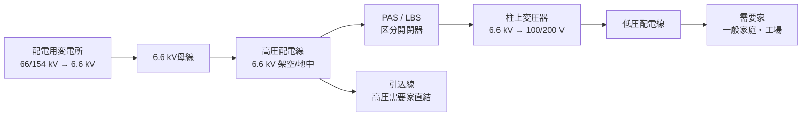

# 配電線路

## 1. 直感的理解

送電線から需要家まで「最後の1マイル」。超高圧・高圧で送られてきた電力を、配電用変電所で6.6 kVに降圧し、さらに柱上変圧器で100/200 Vに落として各家庭・工場に届ける仕組みが配電線路だ。

送電線路との本質的な違いは**距離が短い・分岐が多い・負荷が不均一**という3点。そのため電圧降下と電力損失を最小化しながら安定供給するのが主要課題になる。

配電は「3つのロス対策」で整理できる——**電圧降下・電力損失・力率低下**。この3つが試験でも現場でも常に問われる。

---

## 2. 設備を歩く

### 系統フロー（Mermaid図）

```mermaid
graph LR
    A[配電用変電所<br/>66/154 kV → 6.6 kV] --> B[6.6 kV母線]
    B --> C[高圧配電線<br/>6.6 kV 架空/地中]
    C --> D1[PAS / LBS<br/>区分開閉器]
    D1 --> E[柱上変圧器<br/>6.6 kV → 100/200 V]
    E --> F[低圧配電線]
    F --> G[需要家<br/>一般家庭・工場]
    C --> D2[引込線<br/>高圧需要家直結]
```

### 主要機器テーブル

| 機器名 | 機能 | ポイント |
|--------|------|----------|
| 配電用変圧器（柱上変圧器） | 6.6 kV → 100/200 V に降圧 | 単相3線式が主流。中性点接地 |
| 開閉器（PAS） | 需要家引込口の地絡保護・区分 | 高圧気中負荷開閉器。地絡検出機能付き |
| 開閉器（LBS） | 変圧器一次側の開閉・保護 | 限流ヒューズ付きが標準 |
| 低圧遮断器（MCCB） | 低圧幹線・分岐回路の過電流遮断 | 需要家内部設備 |
| 進相コンデンサ | 力率改善・無効電力補償 | 柱上または変電所に設置。電流低減で損失軽減 |
| 自動電圧調整器（AVR） | 配電線末端の電圧を自動補正 | 負荷変動・長距離線路に有効 |

---

## 3. 配電方式の比較表

| 方式 | 構成概要 | 信頼性 | 経済性 | 電圧品質 | 主な用途 |
|------|----------|--------|--------|----------|----------|
| **放射状方式** | 変電所から放射状に1本の幹線 | 低（1点故障で全停電） | 高（シンプル） | 普通 | 農村・郊外・一般住宅 |
| **ループ方式** | 幹線をリング状に接続、常時開路 | 中（区間切替で復旧可） | 中 | 良好 | 都市部・住宅密集地 |
| **スポットネットワーク方式** | 複数回線を並列接続、ネットワーク変圧器経由 | 高（多重化・無停電切替） | 低（設備コスト大） | 非常に良好 | 都市部の重要施設・大ビル |
| **バンキング方式** | 複数の柱上変圧器を低圧幹線で並列接続 | 中高（変圧器1台故障でも供給継続） | 中 | 良好 | 都市部住宅地 |

!!! note "スポットネットワーク方式の物理的背景"
    複数の配電線から受電し、各回線にネットワーク変圧器（逆潮流防止のプロテクタ付き）を接続することで、1回線が停電しても他の回線だけで全負荷を供給できる。プロテクタは「受電側から電源側への逆潮流が生じたとき自動的に開放する」装置で、これにより並列回線の独立性が保たれる。

!!! warning "バンキング方式の弱点：カスケーディング（連鎖遮断）"
    並列接続された変圧器の1台が故障すると、その負荷が残りの変圧器へ一斉に転嫁され、過負荷になった変圧器のヒューズが次々に飛んで**停電が連鎖的に波及**する現象をカスケーディングという。防止策は**区分ヒューズ（低圧幹線の区分箇所）と変圧器一次側ヒューズの保護協調**（区分ヒューズを先に溶断させて故障区間だけを切り離す）。「バンキングは信頼性が高い」の裏の弱点として論説で問われる。

---

## 4. 負荷の指標比較表

| 指標 | 定義 | 公式 | 値の範囲 | 意味・使い分け |
|------|------|------|----------|---------------|
| **需要率** | 設備容量に対する最大需要電力の割合 | `需要率 = 最大需要電力 / 設備容量 × 100 [%]` | 0〜100% | 設備が「どれだけフル稼働に近いか」を示す。低いほど余裕がある |
| **負荷率** | 最大需要に対する平均需要の割合 | `負荷率 = 平均需要電力 / 最大需要電力 × 100 [%]` | 0〜100% | 高いほど設備利用効率が良い。低いとピーク対応のための無駄な設備容量が多い |
| **不等率** | 各需要家の最大需要の和を合成最大需要で割った値 | `不等率 = Σ(各需要家の最大需要電力) / 合成最大需要電力` | **1以上** | 各需要家の最大が同時に来ないほど不等率は大きくなる。設備容量の節減効果を表す |

!!! note "不等率が必ず1以上になる物理的理由"
    各需要家の最大需要電力が「すべて同時刻に発生する」ことはあり得ない。朝9時にA工場が最大になっても、B工場は昼過ぎが最大、C家庭は夕方が最大というように時間帯がずれる。その結果、系統全体の合成最大は「各最大の単純な和」より必ず小さくなる（または等しい）。したがって 分子（Σ各最大） ≥ 分母（合成最大）となり、不等率は必ず1以上。不等率が大きいほど設備容量を節減できる。

---

## 5. 公式マップ（最重要）

### レイヤーA：基本公式

#### 電圧降下

$$\Delta V_{\text{単相2線}} = 2I(R\cos\theta + X\sin\theta) \quad \text{[V]}$$

$$\Delta V_{\text{三相3線}} = \sqrt{3} \cdot I(R\cos\theta + X\sin\theta) \quad \text{[V]}$$

!!! note "「2」と「√3」の物理的根拠"
    **単相2線式**：電流は往路（1本）と復路（1本）の2本の線を流れる。それぞれの線で `IR cosθ + IX sinθ` の電圧降下が生じるため、合計で2倍になる。

    **三相3線式**：1本の線路（相電圧基準）での電圧降下は `I(Rcosθ + Xsinθ)` だが、これは相電圧基準。問題で与えられる電圧は線間電圧であることが多い。相電圧から線間電圧への換算で √3 倍になるため、線間電圧基準の電圧降下は `√3·I(Rcosθ + Xsinθ)` になる。

#### 電力損失（三相）

$$P_{loss} = 3I^2 R \quad \text{[W]}$$

!!! note "「3」の物理的根拠"
    三相3線式では3本の線それぞれに電流 I が流れる。1本あたりの損失は I²R なので、3本合計すると 3I²R。力率は電流の大きさに「すでに含まれている」——電力が同じでも力率が低ければ電流が大きくなり、電力損失はその2乗で増加する。

#### 負荷指標の公式

$$\text{需要率} = \frac{\text{最大需要電力}}{\text{設備容量}} \times 100 \quad \text{[\%]}$$

$$\text{負荷率} = \frac{\text{平均需要電力}}{\text{最大需要電力}} \times 100 \quad \text{[\%]}$$

$$\text{不等率} = \frac{\sum \text{各需要家の最大需要電力}}{\text{合成最大需要電力}} \geq 1$$

---

### レイヤーB：応用公式

#### 力率改善のコンデンサ容量

$$Q_c = P(\tan\phi_1 - \tan\phi_2) \quad \text{[kvar]}$$

- `P`：有効電力 [kW]
- `φ1`：改善前の力率角
- `φ2`：改善後の力率角（目標）

!!! note "コンデンサ容量式の導出理由"
    電力の三角形で考える。有効電力Pは変わらず、無効電力だけを減らしたい。改善前の無効電力 Q1 = P tanφ1、改善後の目標 Q2 = P tanφ2。この差分をコンデンサで補償すれば良いので Qc = Q1 − Q2 = P(tanφ1 − tanφ2)。「なぜtanφを使うか」→ 有効電力Pを固定したまま無効電力の変化を表現するのに最も直接的だから。

#### 力率改善後の電力損失軽減率

$$\text{損失軽減率} = 1 - \left(\frac{\cos\phi_1}{\cos\phi_2}\right)^2$$

!!! note "損失軽減が「力率の2乗」で効く理由"
    同じ有効電力Pを送る場合、線電流 I = P / (√3·V·cosφ)。力率が cosφ1 から cosφ2 に改善されると電流は cosφ1/cosφ2 倍に減少する。電力損失 = 3I²R なので損失は電流の2乗に比例。つまり損失比 = (cosφ1/cosφ2)²。これが力率改善の最大のメリットで、力率を0.8から1.0に改善すると損失は 0.8² = 0.64倍、つまり36%削減できる。

!!! tip "🎯 調相設備（合格基準対応ナビ）"
    変電所での無効電力調整＝**調相設備**（電力用コンデンサ・分路リアクトル・SVC）は **R06下問6**（5 年で 1 問）の番外ポジション。本ページの「進相コンデンサ」が需要家側、変電所側は次の 2 観点で押さえれば足りる：

    1. **進み無効電力補償**：電力用コンデンサ（重負荷時の電圧低下対策）
    2. **遅れ無効電力補償**：分路リアクトル（軽負荷時のフェランチ効果対策）→ [地中送電 §7](chichuu-souden.md#traps)（フェランチ効果の物理）

    本領域は 5 年 1 問で論説中心のため独立ページは設けず、本ページの進相コンデンサ式と地中送電のフェランチ効果記述で必要十分。

---

## 6. 解法パターン

### パターン①：電圧降下の計算

**問題形式**：「6.6 kV配電線に力率cosθ、電流Iが流れている。抵抗R、リアクタンスX。電圧降下を求めよ」

**手順**：
1. 方式（単相2線 or 三相3線）を確認
2. 該当公式を選択：
   - 単相2線：`ΔV = 2I(Rcosθ + Xsinθ)`
   - 三相3線：`ΔV = √3·I(Rcosθ + Xsinθ)`
3. sinθを計算：`sinθ = √(1 - cos²θ)`
4. 数値を代入して計算

!!! warning "単相2線の「2」を忘れる引っかけ"
    問題文に「配電線」とだけ書いてあると「三相3線式」と思い込んで √3 を使ってしまうケースが頻出。問題文の「方式」を必ず確認してから公式を選ぶ。単相2線式・単相3線式・三相3線式で係数がすべて異なる（2・1・√3）。

---

### パターン②：力率改善のコンデンサ容量計算

**問題形式**：「有効電力P [kW]、力率cosφ1の負荷を、力率cosφ2に改善したい。必要なコンデンサ容量を求めよ」

**手順**：
1. `tanφ1 = sinφ1 / cosφ1` を計算
2. `tanφ2 = sinφ2 / cosφ2` を計算
3. `Qc = P(tanφ1 - tanφ2)` [kvar]

**確認**：`Qc > 0` であること（改善後の力率角が小さくなるから）

---

### パターン③：需要率・負荷率・不等率の計算

**問題形式**：「需要家A・B・Cがあり、それぞれの設備容量・最大需要・平均需要・合成最大需要が与えられる。各指標を求めよ」

**手順**：
1. 需要率：`各需要家の最大需要 / 各需要家の設備容量`
2. 負荷率：`平均需要 / 最大需要`（ある期間の平均電力を最大電力で割る）
3. 不等率：`Σ(各最大需要) / 合成最大需要`
   - 合成最大需要は「全需要家の需要を合計したときの実際の最大値」（同時性を考慮した値）

!!! warning "不等率の計算でよく起きる間違い"
    不等率の分子は「各需要家の最大需要を単純に足した値」、分母は「合成最大需要（同時性を考慮した実測値）」。「合成最大 ÷ 各最大の和」と逆にしてしまう誤りが多い。不等率の定義は「各最大を足した方が大きい」から必ず1以上になる、という方向性で確認する。

---

## 7. 引っかけパターン

!!! warning "引っかけ①：不等率は「1以下」だと思い込む"
    「率」という言葉から「百分率＝100%以下」と誤解しやすい。しかし不等率の定義 = Σ各最大 / 合成最大 であり、分子 ≥ 分母なので**不等率は常に1以上**。需要率・負荷率は0〜100%だが、不等率だけは1以上という特殊な存在。

!!! warning "引っかけ②：力率改善の主効果を「電圧上昇」と誤解する"
    力率改善の本質は**電流を減らすこと**。電流が減ると：
    1. 電圧降下 `ΔV = √3·I(Rcosθ + Xsinθ)` が減少 → 電圧品質改善
    2. 電力損失 `Ploss = 3I²R` が減少（電流の2乗で効く）
    3. 線路の電流容量に余裕が生まれる

    「コンデンサ → 電圧上昇」は結果であって目的ではない。電流削減が主効果。

!!! warning "引っかけ③：単相2線式と三相3線式の係数を混同する"
    「配電線はすべて三相3線式」という誤認から √3 を無条件で使ってしまう。低圧配電（100/200V）には単相2線式・単相3線式が多い。単相2線式の電圧降下の係数は「2」（往復2本）であり、三相3線式の「√3」より大きい。

---

## 8. 正誤判定の急所

| 命題 | 判定 | 解説 |
|------|------|------|
| 「不等率は常に1以下である」 | **誤** | 不等率 = Σ各最大 / 合成最大 ≥ 1 |
| 「進相コンデンサの設置で線路電流が減少する」 | **正** | 無効電流を補償し、有効電流のみ流れるようになるため |
| 「スポットネットワーク方式は供給信頼性が高い」 | **正** | 複数回線並列接続により1回線停電でも無停電継続 |
| 「負荷率が高いほど設備の利用効率が良い」 | **正** | 平均 / 最大 が高い = ピーク対比で無駄なく使えている |
| 「単相2線式の電圧降下は三相3線式より小さい」 | **誤** | 往復2本分で係数2倍。同条件なら単相2線式の方が大きい |
| 「需要率が100%に近いほど設備に余裕がない」 | **正** | 設備容量いっぱいの最大需要が発生しているということ |
| 「力率改善により電力損失は力率の2乗に反比例して減少する」 | **正** | Ploss ∝ I² ∝ (1/cosφ)²。力率が上がると損失は急激に減る |
| 「バンキング方式は放射状方式より信頼性が高い」 | **正** | 変圧器1台故障でも並列接続の他の変圧器が供給継続 |

---

## 9. 出題実績

> 📚 横断一覧: [分野別一覧（該当分野）](../kakomon/by-field.md#haiden) ／ [年度別一覧](../kakomon/by-year.md)

> 出題数約85問（電力科目最多テーマ）。計算・論説・穴埋めすべての形式で出題される。

| 年度 | 問 | タイトル | 問題タイプ | 難易度 |
|------|---|---------|----------|--------|
| R07下 | 問7 | 6.6kV非接地方式配電線及び高圧受電設備の保護 | 論説 | ★★★☆☆ |
| R07下 | 問12 | 三相変圧器二次側遮断器の定格遮断電流 | 計算 | ★★★☆☆ |
| R07下 | 問16 | 配電線の電圧降下と負荷電力の関係 | 計算 | ★★★★☆ |
| R07下 | 問17 | 力率の異なる負荷接続時の線路電流と電圧降下 | 計算 | ★★★☆☆ |
| R07上 | 問7 | 分散型電源の配電系統連系 | 論説 | ★★★☆☆ |
| R07上 | 問11 | 単相3線式配電方式の特徴 | 論説 | ★★☆☆☆ |
| R07上 | 問13 | 力率変化に伴う配電線の負荷電力の変化 | 計算 | ★★★☆☆ |
| R07上 | 問17 | 負荷追加した変圧器の過負荷運転防止 | 計算 | ★★★★☆ |
| R06下 | 問9 | 高低圧配電系統における保護 | 穴埋 | ★★☆☆☆ |
| R06下 | 問11 | 高圧受電設備を構成する機器 | 論説 | ★★★☆☆ |
| R06上 | 問7 | 配電線路の電圧維持対策 | 論説 | ★★★☆☆ |
| R06上 | 問17 | 三相3線式ループ配電線路の電圧降下 | 計算 | ★★★★☆ |
| R05下 | 問7 | 配電線路の電圧調整 | 論説 | ★★★☆☆ |
| R05下 | 問13 | 単相2線式及び単相3線式線路での電力損失 | 計算 | ★★★☆☆ |
| R05上 | 問6 | 配電線路に設置される開閉器類 | 論説 | ★★☆☆☆ |
| R04下 | 問13 | 低圧ネットワーク方式の特徴 | 論説 | ★★★☆☆ |
| R03 | 問12 | 単相3線式配電方式の特徴 | 論説 | ★★☆☆☆ |
| R03 | 問13 | 高低圧配電系統における保護 | 穴埋 | ★★☆☆☆ |
| R02 | 問12 | 高圧架空配電線路の構成機材 | 論説 | ★★☆☆☆ |
| R02 | 問13 | スポットネットワーク方式 | 穴埋 | ★★★☆☆ |
| R01 | 問12 | 配電線路の電気方式 | 論説 | ★★☆☆☆ |

!!! note "R08出題予測"
    R07でも計算問題が複数出題（問16・問17）。力率改善・電圧降下の計算は毎年出題されており継続が濃厚。論説ではスポットネットワーク方式とバンキング方式の比較、または分散型電源の配電系統連系が有力。

---

## 関連ページ

- [架空送電線路](./kakuu-souden.md) — 送電線路の電圧降下公式（配電と共通の基礎）
- [変圧器](./henatsuki.md) — 柱上変圧器の原理・効率計算
