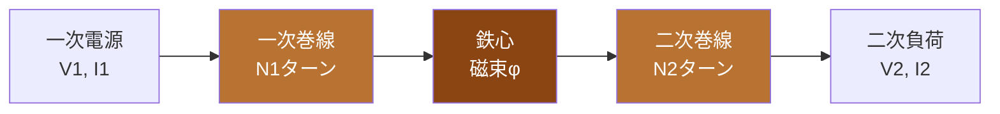
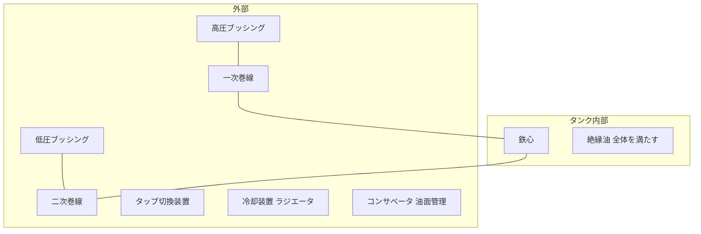

# 変圧器

## 1. 直感的理解

**変圧器の本質**: 巻数比で電圧・電流が逆比例する。磁束を介して一次側から二次側へエネルギーを転送する電気機器。

### なぜ変圧器なしでは長距離送電が不可能だったか

電力 P = VI（単相の場合）。同じ電力を送るなら、電圧を高くすれば電流を小さくできる。

電力損失は P_loss = I²R。電流が半分になれば損失は1/4になる。

例: 100kWを1kmの銅線（抵抗1Ω）で送る場合
- 100V送電: I = 1000A → 損失 = 1000² × 1 = 1,000,000W（送電不能）
- 100kV送電: I = 1A → 損失 = 1² × 1 = 1W（ほぼ無損失）

変圧器があるから高電圧で送り、需要地で低電圧に戻せる。これが電力システムの根幹。

> **5秒で思い出す**
>
> **V1/V2 = N1/N2 = I2/I1**
>
> 電圧は巻数に比例、電流は巻数に反比例（逆数）。エネルギー保存則から導ける。

---

## 2. 設備を歩く

### 磁気回路の構成

### 油入変圧器の全体構成

### 主要機器テーブル

| 機器 | 役割 | ポイント |
|------|------|---------|
| 鉄心 | 磁気回路を形成し磁束を集中させる | ケイ素鋼板を積層して渦電流損を低減 |
| 一次巻線 | 電源側の巻線。磁束を発生させる | 巻数N1が電圧比を決める |
| 二次巻線 | 負荷側の巻線。誘起電圧を取り出す | 巻数N2が二次電圧を決める |
| 絶縁油 | 絶縁と冷却を兼ねる | 鉱物油。PCBは現在使用禁止 |
| ブッシング | 高電圧導体をタンク壁から引き出す貫通絶縁体 | 磁器製またはポリマー製 |
| タップ切換装置 | 二次電圧を調整するため巻数を切り換える | 無電圧切換と負荷時切換がある |
| 冷却装置 | 損失（鉄損＋銅損）で発生した熱を除去 | 自冷/風冷/水冷の種別がある |

---

## 3. 変圧器の種類比較表

| 種類 | 絶縁媒体 | 冷却方式 | 主な用途 | 保守性 |
|------|---------|---------|---------|--------|
| 油入自冷式（ONAN） | 絶縁油 | 自然対流 | 配電用変圧器 | 油管理が必要。定期油分析 |
| 油入風冷式（ONAF） | 絶縁油 | 強制風冷（ファン） | 大容量変電所 | ファン保守が追加 |
| モールド式 | エポキシ樹脂 | 空冷（自然/強制） | 屋内・防爆環境 | 油不要で保守簡単。火災リスク低 |
| ガス絶縁式（GIS内） | SF6ガス | 自然冷却 | 都市部変電所・超高圧 | ガス管理が必要。小型化が最大の利点 |

---

## 4. 公式マップ

### レイヤーA: 基本公式

#### 巻数比（変圧比）

$$\frac{V_1}{V_2} = \frac{N_1}{N_2} = \frac{I_2}{I_1} = a \quad \text{（巻数比 } a\text{）}$$

- $V_1$: 一次電圧 [V]、$V_2$: 二次電圧 [V]
- $N_1$: 一次巻数、$N_2$: 二次巻数
- $I_1$: 一次電流 [A]、$I_2$: 二次電流 [A]

**電流は逆数**になる点に注意: $a = N_1/N_2$ のとき $I_1/I_2 = 1/a$

#### 等価回路（一次側換算）

二次側の抵抗・リアクタンスを一次側に換算する場合、**巻数比の2乗**をかける。

$$R_2' = a^2 R_2, \quad X_2' = a^2 X_2$$

- $R_2'$: 一次換算した二次抵抗
- 電圧は $a$ 倍、電流は $1/a$ 倍になるため、インピーダンスは $a^2$ 倍

---

### レイヤーB: 損失・効率・電圧変動率

#### 損失の分類

| 損失の種類 | 別名 | 発生場所 | 負荷依存性 |
|-----------|------|---------|-----------|
| 鉄損 $P_i$ | 無負荷損 | 鉄心 | **一定**（電圧に依存、負荷電流に無関係） |
| 銅損 $P_c$ | 負荷損 | 巻線抵抗 | **電流の2乗に比例**（負荷率の2乗に比例） |

$$P_i = P_{h} + P_{e} \quad \text{（ヒステリシス損＋渦電流損）}$$

$$P_c = I^2 R \quad \propto \text{（負荷率）}^2$$

#### 効率の計算

$$\eta = \frac{P_{out}}{P_{out} + P_i + P_c} \times 100 \quad [\%]$$

- $P_{out}$: 出力 [W]（= 負荷の消費電力）
- $P_i$: 鉄損（無負荷損）[W]
- $P_c$: 銅損（負荷損）[W]

**負荷率 $\alpha$ のとき:**

$$P_c(\alpha) = \alpha^2 \cdot P_{c(full)}$$

$$\eta(\alpha) = \frac{\alpha \cdot P_{rated} \cos\theta}{\alpha \cdot P_{rated} \cos\theta + P_i + \alpha^2 P_{c(full)}} \times 100$$

#### 最大効率条件

$$\boxed{P_i = \alpha^2 P_{c(full)}}$$

すなわち **鉄損 = 銅損のとき効率最大**。最大効率になる負荷率 $\alpha_m$:

$$\alpha_m = \sqrt{\frac{P_i}{P_{c(full)}}}$$

#### 電圧変動率

$$\varepsilon \approx \varepsilon_r \cos\theta + \varepsilon_x \sin\theta \quad [\%]$$

- $\varepsilon_r = \frac{P_c}{P_{rated}} \times 100$: 抵抗降下百分率（%抵抗）
- $\varepsilon_x$: リアクタンス降下百分率（%リアクタンス）
- $\cos\theta$: 負荷の力率

$$\text{電圧変動率} = \frac{V_{2(no load)} - V_{2(full load)}}{V_{2(full load)}} \times 100 \quad [\%]$$

---

## 5. 解法パターン

### パターン①: 効率計算

**問題のキーワード**: 「出力○kW」「鉄損○W」「銅損○W」「効率を求めよ」

**手順**:

1. 出力 $P_{out}$ を確認（力率が絡む場合は $P_{out} = S \cos\theta$）
2. 鉄損 $P_i$、銅損 $P_c$ を確認
3. $\eta = \frac{P_{out}}{P_{out} + P_i + P_c} \times 100$

**例題**: 定格出力10kW、鉄損200W、銅損300W のとき効率は？

$$\eta = \frac{10000}{10000 + 200 + 300} \times 100 = \frac{10000}{10500} \times 100 \approx 95.2\%$$

---

### パターン②: 最大効率を求める

**問題のキーワード**: 「最大効率」「最大効率となる負荷率」

**手順**:

1. 定格時の鉄損 $P_i$ と銅損 $P_{c(full)}$ を確認
2. 最大効率条件: $P_i = \alpha^2 P_{c(full)}$
3. $\alpha_m = \sqrt{P_i / P_{c(full)}}$ を計算
4. そのときの効率 $\eta_{max}$ を求める（分子 = $\alpha_m P_{rated} \cos\theta$、分母に $P_i + P_i = 2P_i$）

**例題**: 鉄損100W、定格銅損400W のとき最大効率となる負荷率は？

$$\alpha_m = \sqrt{\frac{100}{400}} = \sqrt{0.25} = 0.5 \quad (50\% \text{負荷})$$

---

### パターン③: 電圧変動率

**問題のキーワード**: 「%r（抵抗降下率）」「%x（リアクタンス降下率）」「力率」「電圧変動率」

**手順**:

1. %r と %x を確認
2. 力率 $\cos\theta$、$\sin\theta$ を計算
3. $\varepsilon = \varepsilon_r \cos\theta + \varepsilon_x \sin\theta$

**例題**: %r = 2%、%x = 4%、力率0.8（遅れ）のとき電圧変動率は？

$$\varepsilon = 2 \times 0.8 + 4 \times 0.6 = 1.6 + 2.4 = 4.0\%$$

---

## 6. 勘違いTOP3

### 勘違い①: 「鉄損は負荷電流が増えると大きくなる」

**誤り。** 鉄損（無負荷損）は印加電圧と周波数で決まる。負荷が変化しても鉄損は変わらない。

変化するのは銅損（負荷損）。銅損 $\propto I^2 \propto$ 負荷率$^2$。

> 現場で使える記憶法: 「**鉄は頑固、変わらない**。銅は柔軟、負荷に従う」

### 勘違い②: 「効率最大 = 全日効率最大」

**異なる概念。** 瞬時効率最大（$P_i = P_c$の条件）は特定の負荷率で成立する。

全日効率は1日24時間の負荷変動を積分した概念。

$$\eta_{day} = \frac{\sum P_{out} \cdot t}{\sum P_{out} \cdot t + P_i \cdot 24h + \sum P_c \cdot t} \times 100$$

軽負荷の時間が長い場合は鉄損を小さくした変圧器が有利。

### 勘違い③: 「減極性と加極性の違いがわからない」

**減極性（subtructive polarity）**: H1とX1の端子電圧が同位相（同方向）。一般的な電力変圧器はこちら。

**加極性（additive polarity）**: H1とX1の端子電圧が逆位相。

変圧器の並行運転では**極性が一致**していないと循環電流が流れて事故になる。

---

## 7. 正誤判定の急所

| 文 | 判定 | 解説 |
|---|------|------|
| 変圧器の鉄損は負荷電流の2乗に比例する | **誤** | 鉄損は一定（電圧・周波数依存）。電流の2乗に比例するのは銅損 |
| 最大効率条件は鉄損＝銅損 | **正** | $P_i = \alpha^2 P_{c(full)}$ のとき効率最大 |
| 変圧器の二次側に換算した抵抗は一次側の $1/a^2$ 倍 | **正** | $R_2' = R_1 / a^2$（二次換算）または $R_1' = a^2 R_1$（一次換算） |
| 油入変圧器の絶縁油はPCBが使われている | **誤** | PCBは毒性問題で現在使用禁止。現在は鉱物油または植物油 |
| 変圧器の並行運転の条件に「極性が一致すること」がある | **正** | 極性が異なると循環電流が流れ事故となる |
| 全日効率最大は瞬時効率最大の負荷率と同じ条件で達成される | **誤** | 全日効率は24時間の負荷パターンによって決まり、異なる概念 |
| タップ切換装置で無電圧切換は変圧器を停止させずに行える | **誤** | 無電圧切換は停止が必要。停止不要なのは負荷時タップ切換装置 |
| モールド変圧器は絶縁油が不要なため屋内設置に適している | **正** | 油漏れリスクがなく防火・保守の観点で屋内に有利 |

---

## 8. 出題実績

| 年度 | 問番号 | 難易度 | 内容 |
|------|--------|--------|------|
| 2023（R5）上期 | 問10 | 中 | 変圧器の効率計算（鉄損・銅損・定格容量から効率を求める） |
| 2022（R4）上期 | 問11 | 中 | 最大効率条件と最大効率を求める負荷率の計算 |
| 2021（R3）下期 | 問10 | 中 | 変圧器の並行運転条件と計算（負荷分担） |
| 2020（R2） | 問11 | やや難 | 電圧変動率（%r・%xから力率別の電圧変動率計算） |
| 2019（R1） | 問10 | 中 | 変圧器損失の種類と特性（鉄損・銅損の違い・最大効率） |
| 2018（H30） | 問10 | 中 | 三相変圧器のΔ-Y結線と変圧比・電流の計算 |
| 2017（H29） | 問10 | やや難 | 全日効率の計算（24時間の負荷パターンが与えられる） |

> **出題傾向まとめ**: 効率計算・最大効率条件の問題が最頻出。電圧変動率と並行運転条件も定期的に出る。「鉄損＝一定、銅損＝電流²に比例」の原則を軸に考えれば解ける問題が多い。
