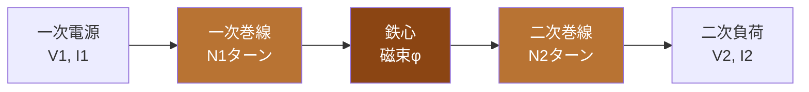
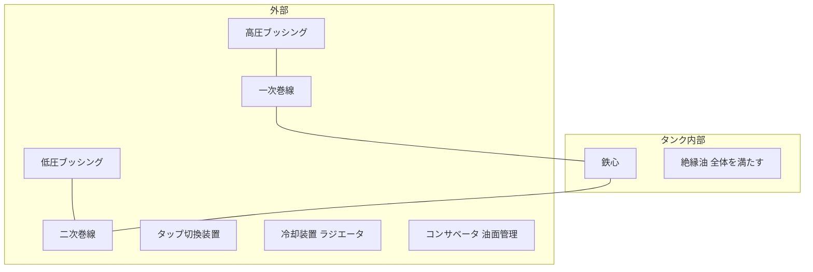

# 変圧器

!!! success "🎯 このページで得点できる問題"
    本ページを通読すると、過去問で次の論点に答えられるようになる：

    - **巻数比・電流比**：$V_1/V_2 = N_1/N_2 = I_2/I_1 = a$
    - **一次側／二次側 換算**：抵抗・リアクタンスは $a^2$ 倍／$1/a^2$ 倍（方向で逆数）
    - **効率・最大効率**：$\eta = P_{out}/(P_{out}+P_i+P_c)$、最大効率条件 $P_i = \alpha^2 P_{c,full}$
    - **電圧変動率**：$\varepsilon \approx \varepsilon_r \cos\theta + \varepsilon_x \sin\theta$、$\varepsilon_r = P_{c,full}/S_n$
    - **並行運転の負荷分担**：%Z が違うと容量比どおりに分担されない（分担 ∝ 1/%Z）

    各論点の詳細は §4 公式マップ・§5 解法パターンへ。深い損失計算は [変圧器損失・効率（深掘り）](henatsuki-loss.md) へ。

!!! note "🗺️ 棲み分けマップ"
    **本ページ＝変圧器（基礎ハブ）**：巻数比・等価回路・損失分類・効率の基本・最大効率条件・並行運転・電圧変動率の **全体俯瞰と代表解法**。変圧器を初めて学ぶ／復習するならまずここ。

    **[変圧器損失・効率（深掘り）](henatsuki-loss.md)**：全日効率の本格計算・年間損失電力量・更新経済性評価（法規 R04下問12 など B 問題対策）の **深掘り**。本ページの §4 損失・効率を理解してから読むページ。

    **使い分け**：概念整理・基本公式の暗記 → 本ページ／長時間運用・更新判断・施設管理 B 問題 → 深掘りページ。

## 1. 直感的理解

**変圧器の本質**: 巻数比で電圧・電流が逆比例する。磁束を介して一次側から二次側へエネルギーを転送する電気機器。

### なぜ変圧器なしでは長距離送電が実用的でない理由

電力 $P = VI$（単相相当で説明）。同じ電力を送るなら、電圧を高くすれば電流を小さくできる。

!!! note "三相回路での補足"
    実際の高圧送電は三相回路で、$P = \sqrt{3}\,V_L I_L \cos\theta$（$V_L$ は線間電圧、$I_L$ は線電流）。本節は「電圧と電流の反比例関係」を直感的に掴むため単相相当で説明している。

電力損失は $P_{loss} = I^2 R$。電流が半分になれば損失は 1/4 になる。

例: 100 kW を 1 km の銅線（抵抗 1 Ω）で送る場合
- 100 V 送電：$I = 1000$ A → 損失 = $1000^2 \times 1 = 1{,}000{,}000$ W（**送電電力と同じ大きさが損失** ＝ 実用的でない）
- 100 kV 送電：$I = 1$ A → 損失 = $1^2 \times 1 = 1$ W（ほぼ無損失）

変圧器があるから高電圧で送り、需要地で低電圧に戻せる。これが電力システムの根幹。

**5秒で思い出す**: V1/V2 = N1/N2 = I2/I1 — 電圧は巻数に比例、電流は巻数に反比例（逆数）。エネルギー保存則から導ける。

---

## 2. 設備を歩く

### 磁気回路の構成

```mermaid
graph LR
    A[一次電源<br/>V1, I1] --> B[一次巻線<br/>N1ターン]
    B --> C[鉄心<br/>磁束φ]
    C --> D[二次巻線<br/>N2ターン]
    D --> E[二次負荷<br/>V2, I2]

    style C fill:#8B4513,color:#fff
    style B fill:#B87333,color:#fff
    style D fill:#B87333,color:#fff
```

### 油入変圧器の全体構成

```mermaid
graph TD
    subgraph 外部
        A[高圧ブッシング] --- B[一次巻線]
        F[低圧ブッシング] --- G[二次巻線]
        H[タップ切換装置]
        I[冷却装置 ラジエータ]
        J[コンサベータ 油面管理]
    end
    subgraph タンク内部
        B --- C[鉄心]
        C --- G
        K[絶縁油 全体を満たす]
    end
```

### 主要機器テーブル

| 機器 | 役割 | ポイント |
|------|------|---------|
| 鉄心 | 磁気回路を形成し磁束を集中させる | ケイ素鋼板を積層して渦電流損を低減 |
| 一次巻線 | 電源側の巻線。磁束を発生させる | 巻数N1が電圧比を決める |
| 二次巻線 | 負荷側の巻線。誘起電圧を取り出す | 巻数N2が二次電圧を決める |
| 絶縁油 | 絶縁と冷却を兼ねる | 鉱物油。PCBは現在使用禁止 |
| ブッシング | 高電圧導体をタンク壁から引き出す貫通絶縁体 | 磁器製またはポリマー製 |
| タップ切換装置 | 二次電圧を調整するため巻数を切り換える | 無電圧切換と負荷時切換がある |
| 冷却装置 | 損失（鉄損＋銅損）で発生した熱を除去 | 自冷/風冷/水冷の種別がある |

---

## 3. 変圧器の種類比較表

| 種類 | 絶縁媒体 | 冷却方式 | 主な用途 | 保守性 |
|------|---------|---------|---------|--------|
| 油入自冷式（ONAN） | 絶縁油 | 自然対流 | 配電用変圧器 | 油管理が必要。定期油分析 |
| 油入風冷式（ONAF） | 絶縁油 | 強制風冷（ファン） | 大容量変電所 | ファン保守が追加 |
| モールド式 | エポキシ樹脂 | 空冷（自然/強制） | 屋内・防爆環境 | 油不要で保守簡単。火災リスク低 |
| ガス絶縁式（GIS内） | SF6ガス | 自然冷却 | 都市部変電所・超高圧 | ガス管理が必要。小型化が最大の利点 |

---

## 4. 公式マップ

### レイヤーA: 基本公式

#### 巻数比（変圧比）

$$\frac{V_1}{V_2} = \frac{N_1}{N_2} = \frac{I_2}{I_1} = a \quad \text{（巻数比 } a\text{）}$$

- $V_1$: 一次電圧 [V]、$V_2$: 二次電圧 [V]
- $N_1$: 一次巻数、$N_2$: 二次巻数
- $I_1$: 一次電流 [A]、$I_2$: 二次電流 [A]

!!! note "電流が巻数に「反比例」する理由"
    変圧器は理想的にはエネルギーを損失なく変換する（入力 = 出力）。一次側の電力 $P_1 = V_1 I_1$ と二次側の電力 $P_2 = V_2 I_2$ が等しいことから、$V_1 I_1 = V_2 I_2$。これを変形すると $I_1/I_2 = V_2/V_1 = N_2/N_1 = 1/a$。電圧が a 倍になれば電流は 1/a 倍になる——エネルギー保存則が出発点。

**電流は逆数**になる点に注意: $a = N_1/N_2$ のとき $I_1/I_2 = 1/a$

#### 等価回路（換算方向で逆数になる）

巻数比の定義は **$a = N_1/N_2 = V_1/V_2$**（一次／二次の比）。インピーダンス換算は **換算方向で $a^2$ 倍／$1/a^2$ 倍が逆転する**ので、必ず方向を確認する。

| 換算方向 | 抵抗・リアクタンス | 倍率 | 使う場面 |
|---|---|---|---:|
| **二次 → 一次**（二次抵抗を一次側に持っていく） | $R_2' = a^2 R_2$、$X_2' = a^2 X_2$ | $\times a^2$ | T 字型等価回路を一次側で書きたい |
| **一次 → 二次**（一次抵抗を二次側に持っていく） | $R_1'' = R_1/a^2$、$X_1'' = X_1/a^2$ | $\times 1/a^2$ | 等価回路を二次側で書きたい |

**覚え方**：「巻数比 $a$ は一次側を基準にした倍率（昇圧変圧器なら a > 1）。インピーダンスは電圧の二乗に比例するから、**高電圧側ほど大きく**見える」。一次側から見ると二次抵抗は $a^2$ 倍に見え、二次側から見ると一次抵抗は $1/a^2$ 倍に見える。

!!! note "インピーダンス換算が「a²倍」になる理由（二次→一次の場合）"
    一次側から見た二次側の等価インピーダンスは $Z_1 = V_1/I_1$。換算後の電圧は $V_1 = aV_2$、換算後の電流は $I_1 = I_2/a$。これを代入すると $Z_1 = aV_2/(I_2/a) = a^2 \cdot (V_2/I_2) = a^2 Z_2$。電圧が a 倍・電流が 1/a 倍になるため、インピーダンスは $a \times a = a^2$ 倍になる。逆方向（一次→二次）は同じ論理で $1/a^2$ 倍。

!!! warning "正誤判定で頻出のひっかけ"
    「変圧器の **二次側に換算した一次抵抗** は $a^2$ 倍」 → **誤**（正解は $1/a^2$ 倍）。

    「変圧器の **一次側に換算した二次抵抗** は $a^2$ 倍」 → **正**。

    主語（どちらの抵抗を）と修飾（どちらに換算した）の組み合わせを必ず読み分ける。

#### 等価回路図（T 字型・一次側換算）

二次側を一次側に換算した T 字型等価回路は次のようになる。励磁回路（$R_0, X_0$）は鉄損と励磁電流を担い、巻線抵抗・漏れリアクタンス（$R_1, X_1, R_2', X_2'$）は銅損と電圧変動率の根源。

<svg viewBox="0 0 820 320" xmlns="http://www.w3.org/2000/svg" width="100%" preserveAspectRatio="xMidYMid meet" role="img" aria-label="変圧器のT字型等価回路（一次側換算）">
<defs>
<filter id="shHen" x="-20%" y="-20%" width="140%" height="140%"><feDropShadow dx="0" dy="2" stdDeviation="2" flood-opacity="0.18"/></filter>
<linearGradient id="gPrim" x1="0" y1="0" x2="0" y2="1"><stop offset="0%" stop-color="#bbdefb"/><stop offset="100%" stop-color="#90caf9"/></linearGradient>
<linearGradient id="gSec" x1="0" y1="0" x2="0" y2="1"><stop offset="0%" stop-color="#ffe0b2"/><stop offset="100%" stop-color="#ffcc80"/></linearGradient>
<linearGradient id="gExc" x1="0" y1="0" x2="0" y2="1"><stop offset="0%" stop-color="#c8e6c9"/><stop offset="100%" stop-color="#a5d6a7"/></linearGradient>
</defs>
<text x="410" y="24" text-anchor="middle" font-size="15" font-weight="700" fill="#212121">T 字型等価回路（一次側換算・単相）</text>
<text x="180" y="60" text-anchor="middle" font-size="11" font-weight="700" fill="#1565c0">一次側</text>
<text x="180" y="76" text-anchor="middle" font-size="10" fill="#1565c0">巻線抵抗 R₁ ／ 漏れリアクタンス X₁</text>
<text x="640" y="60" text-anchor="middle" font-size="11" font-weight="700" fill="#e65100">二次側（a² 倍換算）</text>
<text x="640" y="76" text-anchor="middle" font-size="10" fill="#e65100">換算抵抗 R₂&apos; ／ 換算リアクタンス X₂&apos;</text>
<line x1="40" y1="140" x2="100" y2="140" stroke="#1565c0" stroke-width="2"/>
<text x="40" y="132" text-anchor="start" font-size="11" font-weight="700" fill="#0d47a1">一次端子</text>
<text x="40" y="160" text-anchor="start" font-size="11" fill="#0d47a1">V₁, I₁</text>
<rect x="100" y="128" width="70" height="24" rx="3" fill="url(#gPrim)" stroke="#0d47a1" stroke-width="1.5" filter="url(#shHen)"/>
<text x="135" y="144" text-anchor="middle" font-size="12" font-weight="700" fill="#0d47a1">R₁</text>
<rect x="190" y="128" width="70" height="24" rx="3" fill="url(#gPrim)" stroke="#0d47a1" stroke-width="1.5" filter="url(#shHen)"/>
<text x="225" y="144" text-anchor="middle" font-size="12" font-weight="700" fill="#0d47a1">X₁</text>
<line x1="170" y1="140" x2="190" y2="140" stroke="#1565c0" stroke-width="2"/>
<line x1="260" y1="140" x2="410" y2="140" stroke="#1565c0" stroke-width="2"/>
<line x1="410" y1="140" x2="410" y2="220" stroke="#2e7d32" stroke-width="2"/>
<rect x="380" y="160" width="60" height="24" rx="3" fill="url(#gExc)" stroke="#1b5e20" stroke-width="1.5" filter="url(#shHen)"/>
<text x="410" y="176" text-anchor="middle" font-size="12" font-weight="700" fill="#1b5e20">R₀</text>
<rect x="380" y="190" width="60" height="24" rx="3" fill="url(#gExc)" stroke="#1b5e20" stroke-width="1.5" filter="url(#shHen)"/>
<text x="410" y="206" text-anchor="middle" font-size="12" font-weight="700" fill="#1b5e20">X₀</text>
<text x="455" y="178" text-anchor="start" font-size="10" font-weight="700" fill="#1b5e20">励磁回路</text>
<text x="455" y="194" text-anchor="start" font-size="10" fill="#1b5e20">（鉄損 Pᵢ・</text>
<text x="455" y="210" text-anchor="start" font-size="10" fill="#1b5e20">励磁電流 I₀）</text>
<line x1="410" y1="220" x2="410" y2="248" stroke="#1565c0" stroke-width="2" stroke-dasharray="3,2"/>
<line x1="410" y1="140" x2="550" y2="140" stroke="#e65100" stroke-width="2"/>
<rect x="550" y="128" width="70" height="24" rx="3" fill="url(#gSec)" stroke="#e65100" stroke-width="1.5" filter="url(#shHen)"/>
<text x="585" y="144" text-anchor="middle" font-size="12" font-weight="700" fill="#e65100">R₂&apos;</text>
<rect x="640" y="128" width="70" height="24" rx="3" fill="url(#gSec)" stroke="#e65100" stroke-width="1.5" filter="url(#shHen)"/>
<text x="675" y="144" text-anchor="middle" font-size="12" font-weight="700" fill="#e65100">X₂&apos;</text>
<line x1="620" y1="140" x2="640" y2="140" stroke="#e65100" stroke-width="2"/>
<line x1="710" y1="140" x2="780" y2="140" stroke="#e65100" stroke-width="2"/>
<text x="780" y="132" text-anchor="end" font-size="11" font-weight="700" fill="#bf360c">負荷</text>
<text x="780" y="160" text-anchor="end" font-size="11" fill="#bf360c">V₂&apos;, I₂&apos;</text>
<line x1="40" y1="248" x2="780" y2="248" stroke="#616161" stroke-width="2"/>
<text x="410" y="268" text-anchor="middle" font-size="11" font-weight="700" fill="#424242">中性線・接地側（共通帰路）</text>
<rect x="40" y="284" width="740" height="28" rx="4" fill="#fafafa" stroke="#bdbdbd" stroke-width="0.8"/>
<text x="120" y="302" text-anchor="middle" font-size="10" font-weight="700" fill="#0d47a1">■ 青＝一次側</text>
<text x="280" y="302" text-anchor="middle" font-size="10" font-weight="700" fill="#1b5e20">■ 緑＝励磁（鉄損担当）</text>
<text x="460" y="302" text-anchor="middle" font-size="10" font-weight="700" fill="#e65100">■ 橙＝二次側 a² 倍換算</text>
<text x="660" y="302" text-anchor="middle" font-size="10" fill="#616161">銅損=(R₁+R₂&apos;)·I² / 鉄損=V²/R₀</text>
</svg>

**読み解き**：左右の **青（一次）と橙（二次・a²倍換算）** が銅損を担う直列インピーダンス。中央の **緑の励磁回路（並列 $R_0 \parallel X_0$）** が鉄損と励磁電流を担う。励磁回路は印加電圧で決まるため負荷電流に依らない → これが「鉄損は一定」の物理的根拠。

---

### レイヤーB: 損失・効率・電圧変動率

#### 損失の分類

| 損失の種類 | 別名 | 発生場所 | 負荷依存性 |
|-----------|------|---------|-----------|
| 鉄損 $P_i$ | 無負荷損 | 鉄心 | **一定**（電圧に依存、負荷電流に無関係） |
| 銅損 $P_c$ | 負荷損 | 巻線抵抗 | **電流の2乗に比例**（負荷率の2乗に比例） |

$$P_i = P_{h} + P_{e} \quad \text{（ヒステリシス損＋渦電流損）}$$

$$P_c = I^2 R \quad \propto \text{（負荷率）}^2$$

!!! note "鉄損が「負荷によらず一定」な理由"
    鉄損はヒステリシス損（磁区の向き転換に必要なエネルギー）と渦電流損（鉄心内を循環する誘導電流の損失）の和。どちらも「磁束密度の変化」によって決まり、磁束密度は印加電圧と周波数で決まる（ファラデーの法則: $e = N \cdot d\phi/dt$）。負荷電流が変わっても一次電圧がほぼ一定に保たれる限り、磁束密度は変わらず鉄損も変わらない。これが「無負荷損」とも呼ばれる理由。

#### 鉄損の内訳と低減策（ヒステリシス損・渦電流損）

鉄損 $P_i$ は **ヒステリシス損 $P_h$** と **渦電流損 $P_e$** の2要素に分解される。両者は周波数依存性も対策も全く違うので、混同しないことが論説問題の急所。

##### 周波数・磁束密度・板厚への依存性（試験頻出）

| 種類 | 周波数 $f$ 依存 | 磁束密度 $B_m$ 依存 | 鉄心板厚 $t$ 依存 | 比抵抗 $\rho$ 依存 |
|---|---|---|---|---|
| **ヒステリシス損** $P_h$ | $\propto f$ | $\propto B_m^{1.6}$（スタインメッツ式） | — | — |
| **渦電流損** $P_e$ | $\propto f^2$ | $\propto B_m^2$ | $\propto t^2$ | $\propto 1/\rho$ |

**読み解き**：
- **ヒステリシス損は f に1乗比例**（磁区反転の回数が増えるため）
- **渦電流損は f² 比例**（誘起電圧が f に比例 → I²R で2乗）
- **渦電流損は板厚 t² 比例**（板厚半分で渦電流損 1/4）
- **渦電流損は比抵抗 ρ に反比例**（材料が電気的に流しにくいほど渦電流が減る）

##### なぜ薄板積層・珪素鋼板にするか

鉄心を1枚の塊にすると変化磁束が大きな渦電流ループを作って I²R 発熱が大きい。そこで：

| 対策 | 物理メカニズム | 効果 |
|---|---|---|
| **薄板積層**（0.35mm や 0.5mm を絶縁塗装して積み重ね） | 渦電流の経路を板厚内に閉じ込め、断面積を小さくする | 渦電流損 $\propto t^2$ より、板厚半分で **約 1/4** |
| **珪素（Si）3% 程度を添加** | 比抵抗 $\rho$ が約 3〜4 倍に上昇 | 渦電流損 $\propto 1/\rho$ より、**約 1/3〜1/4** に低減 |
| **方向性珪素鋼板**（圧延方向に磁区を揃える） | 圧延方向の磁化に対しヒステリシスループが細く狭くなる | ヒステリシス損 が大幅低減（変圧器鉄心は方向性を活用） |
| **アモルファス（非晶質）合金** | 結晶構造を持たず磁区の向き転換が容易 → ループ面積が小さい | ヒステリシス損 **約 1/3〜1/4**（深掘りページ §4.3 参照） |

**読み解き**：薄板化＋珪素＝**渦電流損対策**、方向性鋼板・アモルファス＝**ヒステリシス損対策**。対策と対象損失の対応がそのまま論説問題で問われる。

!!! tip "現場視点：高調波と鉄損の急増"
    インバータ機器やコンバータが多い負荷では電源電圧に高調波が乗る。第n次高調波（周波数 $nf$）が鉄損に与える影響は **ヒステリシス損 ∝ n**・**渦電流損 ∝ n²** で増加。第5次高調波（300 Hz・基本波の10%振幅）が乗るだけで渦電流損は約 $(5)^2 \times (0.1)^2 = 0.25$ 倍 分が追加される。受変電設備で「ULTC変圧器の運転温度が上がってきた」場合は高調波負荷の増加を疑う典型ケース。

#### 図解：鉄損・銅損・合計損失の負荷率依存性

<svg viewBox="0 0 760 380" xmlns="http://www.w3.org/2000/svg" width="100%" preserveAspectRatio="xMidYMid meet" role="img" aria-label="鉄損・銅損・合計損失の負荷率依存性グラフ">
<text x="380" y="24" text-anchor="middle" font-size="15" font-weight="700" fill="#212121">負荷率と各損失の関係（鉄損は水平・銅損は放物線・合計はU字）</text>
<text x="380" y="44" text-anchor="middle" font-size="11" fill="#666">例：鉄損 Pᵢ=400 W・定格銅損 Pc,full=1600 W → 最大効率点 αₘ=√(400/1600)=0.5</text>
<line x1="80" y1="320" x2="680" y2="320" stroke="#424242" stroke-width="1.5"/>
<line x1="80" y1="60" x2="80" y2="320" stroke="#424242" stroke-width="1.5"/>
<text x="80" y="340" text-anchor="middle" font-size="11" fill="#424242">0</text>
<text x="200" y="340" text-anchor="middle" font-size="11" fill="#424242">0.25</text>
<text x="320" y="340" text-anchor="middle" font-size="11" fill="#424242">0.5</text>
<text x="440" y="340" text-anchor="middle" font-size="11" fill="#424242">0.75</text>
<text x="560" y="340" text-anchor="middle" font-size="11" fill="#424242">1.0</text>
<text x="680" y="340" text-anchor="middle" font-size="11" fill="#424242">1.2</text>
<text x="380" y="370" text-anchor="middle" font-size="12" font-weight="700" fill="#424242">負荷率 α</text>
<text x="62" y="82" text-anchor="end" font-size="11" fill="#424242">2400</text>
<text x="62" y="146" text-anchor="end" font-size="11" fill="#424242">1600</text>
<text x="62" y="210" text-anchor="end" font-size="11" fill="#424242">800</text>
<text x="62" y="274" text-anchor="end" font-size="11" fill="#424242">400</text>
<text x="62" y="320" text-anchor="end" font-size="11" fill="#424242">0</text>
<text x="32" y="190" text-anchor="middle" font-size="12" font-weight="700" fill="#424242" transform="rotate(-90 32 190)">損失 [W]</text>
<line x1="80" y1="274" x2="680" y2="274" stroke="#d32f2f" stroke-width="2.5" stroke-dasharray="6,3"/>
<text x="685" y="270" text-anchor="start" font-size="11" font-weight="700" fill="#d32f2f">鉄損 Pᵢ=400W</text>
<text x="685" y="284" text-anchor="start" font-size="10" fill="#d32f2f">（一定）</text>
<path d="M 80 320 Q 200 314 320 274 T 560 146 Q 620 110 680 84" fill="none" stroke="#2e7d32" stroke-width="2.5"/>
<text x="585" y="200" text-anchor="middle" font-size="11" font-weight="700" fill="#2e7d32">銅損 Pc = α²·1600W</text>
<text x="585" y="216" text-anchor="middle" font-size="10" fill="#2e7d32">（放物線・負荷率²比例）</text>
<path d="M 80 274 Q 200 270 320 210 T 560 64 Q 605 36 645 16" fill="none" stroke="#1565c0" stroke-width="3"/>
<text x="160" y="100" text-anchor="start" font-size="12" font-weight="700" fill="#1565c0">合計損失 Pᵢ + α²·Pc,full</text>
<text x="160" y="116" text-anchor="start" font-size="10" fill="#1565c0">（U字曲線）</text>
<circle cx="320" cy="210" r="5" fill="#1565c0" stroke="#0d47a1" stroke-width="1.5"/>
<line x1="320" y1="210" x2="320" y2="274" stroke="#bf8800" stroke-width="1" stroke-dasharray="2,2"/>
<line x1="270" y1="210" x2="370" y2="210" stroke="#0d47a1" stroke-width="1.5" stroke-dasharray="4,3"/>
<text x="220" y="200" text-anchor="end" font-size="10" font-weight="700" fill="#0d47a1">U字の谷（傾き0）</text>
<text x="220" y="214" text-anchor="end" font-size="9" fill="#0d47a1">＝2Pᵢ=800W</text>
<text x="308" y="246" text-anchor="end" font-size="9" fill="#bf360c">↕ 交点と谷は</text>
<text x="308" y="258" text-anchor="end" font-size="9" fill="#bf360c">同じα位置</text>
<circle cx="320" cy="274" r="6" fill="#fb8c00" stroke="#bf360c" stroke-width="2"/>
<line x1="320" y1="274" x2="320" y2="320" stroke="#bf8800" stroke-width="1" stroke-dasharray="3,2"/>
<text x="320" y="356" text-anchor="middle" font-size="11" font-weight="700" fill="#bf360c">αₘ=0.5</text>
<rect x="350" y="232" width="200" height="58" rx="6" fill="#fff8e1" stroke="#f57c00" stroke-width="1.5"/>
<text x="450" y="252" text-anchor="middle" font-size="11" font-weight="700" fill="#bf360c">▼ 最大効率点</text>
<text x="450" y="268" text-anchor="middle" font-size="10" fill="#bf360c">鉄損 = 銅損 = 400 W</text>
<text x="450" y="282" text-anchor="middle" font-size="10" fill="#bf360c">合計損失最小（傾き0）</text>
</svg>

**読み解き**：赤の点線（鉄損）は水平 — 負荷率に依存せず常に 400 W。緑の放物線（銅損）は $\alpha^2$ で増加 — 負荷率 0.5 で 400 W、定格 1.0 で 1600 W。青の U 字（合計損失）は両者の和で、**鉄損と銅損が交差する点 $\alpha_m = \sqrt{P_i/P_{c,full}} = 0.5$ で最小** ＝最大効率点。これが「鉄損＝銅損で効率最大」の幾何学的意味。

#### 損失の分離測定（無負荷試験・短絡試験）

鉄損と銅損は **電圧条件で支配される鉄損** と **電流条件で支配される銅損** という性質の違いから、2つの試験で完全に分離測定できる。電験3種でも頻出論点。

##### 無負荷試験 — 鉄損だけを取り出す

**回路**：定格電圧を一次側に印加・二次側は開放

二次側無負荷なので一次側に流れるのは励磁電流（鉄心磁化用の小電流・定格の数%）のみ。銅損 ∝ 電流² なので $(0.03)^2 \approx 0.001$ 倍と無視できる。一方、鉄損は印加電圧で決まるので定格通電時と同じ全量が発生する。**測定値 ≈ 鉄損 Pᵢ**。

##### 短絡試験 — 銅損だけを取り出す

**回路**：二次側を短絡・一次側に低電圧（インピーダンス電圧・定格の数%）を印加し定格電流を流す

印加電圧が定格の数% → 磁束密度も数% → 鉄損 ≈ ゼロ（鉄損は磁束密度のおよそ2乗で効くため）。一方、定格電流が流れているので銅損は定格時の全量が発生する。**測定値 ≈ 定格銅損 Pc,full**。同時に **%Z（パーセントインピーダンス）** も測れる — 並行運転負荷分担や短絡電流計算の基本データ。

##### 対称性比較表

| 観点 | 無負荷試験 | 短絡試験 |
|---|---|---|
| 印加電圧 | **定格電圧（100 %）** | インピーダンス電圧（定格の数%） |
| 流れる電流 | 励磁電流のみ（定格の数%） | **定格電流** |
| 二次側 | 開放 | 短絡 |
| 鉄損 | **全量発生** | ほぼゼロ |
| 銅損 | ほぼゼロ | **全量発生** |
| 主な測定量 | 鉄損 Pᵢ・励磁電流・力率 | 銅損 Pc,full・%Z・%R・%X |
| 試験電源容量 | 大（定格電圧必要） | 小（低電圧で済む） |

**読み解き**：鉄損は「電圧で発生」・銅損は「電流で発生」という支配因子の違いを利用し、片方を定格・もう片方をほぼゼロにすることで分離測定する。試験電源容量が短絡試験で小さく済むのは、定格電圧をかけずインピーダンス電圧だけで定格電流が流せるため。

!!! tip "実機での運用イメージ"
    受変電所での無負荷試験は「二次側ブレーカー全切＋一次側電源投入＋電力計読み」だけで実施可能で、定期点検でも比較的やりやすい。短絡試験は試験電源と短絡用バスバーの準備が必要で、通常はメーカー出荷試験で実施。現場では実施例は少ない。

##### 短絡試験データから %Z・%R・%X を分離する

短絡試験は銅損測定だけでなく、変圧器の**自己情報** %Z・%R・%X を引き出す入口でもある。これらは並行運転負荷分担計算・短絡電流計算の根本データ。

| 項目 | 短絡試験データからの導出 | 物理的意味 |
|---|---|---|
| **%Z**（パーセントインピーダンス） | $\%Z = \dfrac{V_s}{V_n} \times 100$（$V_s$=インピーダンス電圧、$V_n$=定格電圧） | 定格電流を流すのに何%の電圧が要るかで内部インピーダンスの大きさを表す |
| **%R**（パーセント抵抗） | $\%R = \dfrac{P_s}{S_n} \times 100$（$P_s$=短絡試験消費電力＝定格銅損、$S_n$=定格容量） | 定格容量に対する銅損の割合 — そのまま定格時の銅損率 |
| **%X**（パーセントリアクタンス） | $\%X = \sqrt{\%Z^2 - \%R^2}$ | 漏れリアクタンスの寄与分（直角三角形の関係） |

**読み解き**：%Z は「電圧の比」、%R は「電力の比」で取り出す。**%R の式は短絡試験消費電力をそのまま定格容量で割るだけ**で、定格電流換算不要（定格電流を流して測っているため）。

##### %Z・%R・%X から導かれる応用

| 用途 | 公式 | 意味 |
|---|---|---|
| **短絡電流** | $I_s = I_n \times \dfrac{100}{\%Z}$ | 二次側短絡時に流れる電流 — %Z が小さい変圧器ほど短絡電流大 |
| **並行運転の負荷分担**（容量同一） | 分担 $\propto \dfrac{1}{\%Z}$ | %Z が小さい変圧器が多く分担 → 過負荷リスク |
| **電圧変動率** | $\varepsilon \approx \%R \cos\theta + \%X \sin\theta$（負荷率α=1のとき） | 力率に応じて %R・%X の重み配分が変わる |
| **遮断器の定格遮断電流選定** | $I_s$ から遮断容量決定 | 受変電所の機器選定の根本データ |

!!! note "%Z が変圧器ごとに違う理由"
    %Z は変圧器の **設計時** に決まる固有値（鉄心寸法・巻線抵抗・漏れリアクタンスで決定）。一般に **大容量機ほど %Z は大きく**（10〜15%）、小容量機ほど小さい（5〜7%）。これは「並行運転で同じ容量比でも %Z が違うと均等分担できない」典型理由 — 容量が違う2機を並列接続するときは %Z 一致を別途確認する必要がある。

#### 効率の計算

!!! note "定格表記の規約（重要）"
    変圧器の **定格容量は皮相電力 $S_n$ [V·A]** で与えられる（例：500 kV·A 機）。負荷率 $\alpha$ も **皮相基準**で $\alpha = S/S_n$。有効電力出力は力率を掛けて $P_{out} = S_n \times \alpha \times \cos\theta$ となる。本ページでは記号を以下で統一する：

    - $S_n$：**定格容量** [V·A]（皮相）
    - $\alpha$：負荷率（0〜1・皮相基準）
    - $\cos\theta$：負荷力率
    - $P_{out} = S_n \alpha \cos\theta$：出力有効電力 [W]
    - $P_i$：鉄損（無負荷損）[W]
    - $P_{c,full}$：定格時の銅損（負荷損）[W]
    - 単位は損失も容量も **VA / W 系で統一**（混在禁止）

$$\eta = \frac{P_{out}}{P_{out} + P_i + P_c} \times 100 \quad [\%]$$

**負荷率 $\alpha$ のとき:**

$$P_c(\alpha) = \alpha^2 \cdot P_{c,full}$$

$$\eta(\alpha) = \frac{\alpha\, S_n \cos\theta}{\alpha\, S_n \cos\theta + P_i + \alpha^2 P_{c,full}} \times 100 \quad [\%]$$

#### 最大効率条件

$$\boxed{P_i = \alpha^2 P_{c,full}}$$

すなわち**鉄損 = 銅損のとき効率最大**。最大効率になる負荷率 $\alpha_m$:

$$\alpha_m = \sqrt{\frac{P_i}{P_{c,full}}}$$

!!! note "「鉄損＝銅損で効率最大」の数学的根拠"
    効率式を負荷率 α で微分して極値を求める。$\eta(\alpha) \propto \alpha S_n \cos\theta /(\alpha S_n \cos\theta + P_i + \alpha^2 P_{c,full})$。$d\eta/d\alpha = 0$ を解くと条件 $P_i = \alpha^2 P_{c,full}$ が得られる。直感的には「固定損（鉄損）= 変動損（銅損）」のときに全損失に対する出力割合が最大になる。これは最適化問題の一般解で「固定コストと可変コストが等しいとき単位あたりコストが最小」と同じ構造。

#### 図解：効率カーブ（負荷率 α × 効率 η の山型）

<svg viewBox="0 0 760 360" xmlns="http://www.w3.org/2000/svg" width="100%" preserveAspectRatio="xMidYMid meet" role="img" aria-label="効率カーブ：負荷率と効率の関係">
<text x="380" y="24" text-anchor="middle" font-size="15" font-weight="700" fill="#212121">効率カーブ（最大効率点で山型・両端で低下）</text>
<text x="380" y="44" text-anchor="middle" font-size="11" fill="#666">例：定格容量 10 kV·A・力率 1.0・Pᵢ=400 W・Pc,full=1600 W</text>
<line x1="80" y1="300" x2="680" y2="300" stroke="#424242" stroke-width="1.5"/>
<line x1="80" y1="60" x2="80" y2="300" stroke="#424242" stroke-width="1.5"/>
<text x="80" y="320" text-anchor="middle" font-size="11" fill="#424242">0</text>
<text x="200" y="320" text-anchor="middle" font-size="11" fill="#424242">0.25</text>
<text x="320" y="320" text-anchor="middle" font-size="11" fill="#424242">0.5</text>
<text x="440" y="320" text-anchor="middle" font-size="11" fill="#424242">0.75</text>
<text x="560" y="320" text-anchor="middle" font-size="11" fill="#424242">1.0</text>
<text x="680" y="320" text-anchor="middle" font-size="11" fill="#424242">1.2</text>
<text x="380" y="345" text-anchor="middle" font-size="12" font-weight="700" fill="#424242">負荷率 α</text>
<text x="62" y="82" text-anchor="end" font-size="11" fill="#424242">100%</text>
<text x="62" y="142" text-anchor="end" font-size="11" fill="#424242">90%</text>
<text x="62" y="202" text-anchor="end" font-size="11" fill="#424242">80%</text>
<text x="62" y="262" text-anchor="end" font-size="11" fill="#424242">70%</text>
<text x="62" y="300" text-anchor="end" font-size="11" fill="#424242">60%</text>
<text x="32" y="180" text-anchor="middle" font-size="12" font-weight="700" fill="#424242" transform="rotate(-90 32 180)">効率 η [%]</text>
<path d="M 80 300 Q 130 240 200 195 Q 260 175 320 165 Q 380 168 440 172 Q 500 176 560 180 Q 620 192 680 204" fill="none" stroke="#1565c0" stroke-width="3"/>
<circle cx="320" cy="165" r="7" fill="#fb8c00" stroke="#bf360c" stroke-width="2.5"/>
<line x1="320" y1="165" x2="320" y2="300" stroke="#bf8800" stroke-width="1" stroke-dasharray="3,2"/>
<text x="320" y="156" text-anchor="middle" font-size="11" font-weight="700" fill="#bf360c">最大効率 ηmax≈86.2%</text>
<text x="320" y="336" text-anchor="middle" font-size="11" font-weight="700" fill="#bf360c">αₘ=0.5</text>
<rect x="430" y="80" width="240" height="78" rx="6" fill="#e3f2fd" stroke="#1976d2" stroke-width="1.2"/>
<text x="550" y="100" text-anchor="middle" font-size="11" font-weight="700" fill="#0d47a1">▼ 最大効率の位置の出し方</text>
<text x="550" y="118" text-anchor="middle" font-size="10" fill="#0d47a1">αₘ = √(Pᵢ/Pc,full) = √(400/1600) = 0.5</text>
<text x="550" y="134" text-anchor="middle" font-size="10" fill="#0d47a1">ηmax = αₘSₙcosθ / (αₘSₙcosθ + 2Pᵢ)</text>
<text x="550" y="150" text-anchor="middle" font-size="10" fill="#0d47a1">= 5000 / (5000 + 800) = 5000/5800 ≈ 86.2%</text>
<circle cx="560" cy="180" r="5" fill="#7b1fa2" stroke="#4a148c" stroke-width="1.5"/>
<text x="560" y="195" text-anchor="middle" font-size="10" font-weight="700" fill="#4a148c">定格点 η≈83.3%</text>
<text x="560" y="210" text-anchor="middle" font-size="10" fill="#4a148c">（鉄損+銅損=2000W）</text>
<line x1="560" y1="180" x2="560" y2="300" stroke="#7b1fa2" stroke-width="1" stroke-dasharray="3,2"/>
<text x="560" y="336" text-anchor="middle" font-size="11" font-weight="700" fill="#4a148c">α=1.0</text>
<line x1="80" y1="165" x2="320" y2="165" stroke="#bf360c" stroke-width="1" stroke-dasharray="3,2"/>
<line x1="80" y1="180" x2="560" y2="180" stroke="#4a148c" stroke-width="1" stroke-dasharray="3,2"/>
<text x="92" y="174" text-anchor="start" font-size="9" font-weight="700" fill="#bf360c">η_max</text>
<text x="92" y="192" text-anchor="start" font-size="9" font-weight="700" fill="#4a148c">η_rated</text>
<text x="600" y="172" text-anchor="start" font-size="10" font-weight="700" fill="#bf360c">Δη≈3pt</text>
<text x="600" y="184" text-anchor="start" font-size="9" fill="#4a148c">（実機がほぼフラット）</text>
</svg>

**読み解き**：青の山型カーブが効率 $\eta(\alpha)$。$\alpha = 0.5$ で頂点（**最大効率 86.2 %**）に達し、軽負荷でも過負荷でも効率は低下する。最大効率点は §B 図の「鉄損＝銅損の交点」と同じ位置で、$\alpha_m = \sqrt{P_i/P_{c,full}}$。定格点（$\alpha=1.0$）の効率は鉄損 + 定格銅損 = 2000 W で 83.3 % と、最大効率点（86.2 %）より約 3 ポイント低いだけ — 実機の変圧器が「最大効率と定格効率がほぼフラットな山」になるのはこの理由。

!!! tip "🔗 次のステップ：損失深掘りページへ"
    鉄損・銅損・効率の **瞬時的な基本** が理解できたら、次は

    👉 **[変圧器損失・効率（深掘り）](henatsuki-loss.md)**

    で、**全日効率（24h 負荷パターン積分）／年間損失電力量／更新経済性評価（R04下問12 含む）** を確認する。施設管理 B 問題対策はこちら。

#### 電圧変動率

$$\varepsilon \approx \varepsilon_r \cos\theta + \varepsilon_x \sin\theta \quad [\%]$$

- $\varepsilon_r = \dfrac{P_{c,full}}{S_n} \times 100$：抵抗降下百分率（%抵抗）
- $\varepsilon_x$：リアクタンス降下百分率（%リアクタンス）
- $\cos\theta$：負荷の力率

!!! warning "$\varepsilon_r$ 分母は皮相 $S_n$（W/VA 混同に注意）"
    $\varepsilon_r$ は **定格電流時の銅損 [W]** を **定格容量 [V·A]** で割った百分率。両方とも数値次元は W／VA で同等だが、概念上は「電力損失÷皮相容量」である点が重要。分母を「定格有効出力 $P_n = S_n \cos\theta$」と誤読すると力率分だけ値がズレる。試験対策上は **「銅損／定格容量」** で固定して覚える。

$$\text{電圧変動率} = \frac{V_{2(\text{無負荷})} - V_{2(\text{全負荷})}}{V_{2(\text{全負荷})}} \times 100 \quad [\%]$$

---

## 5. 解法パターン

### パターン①: 効率計算

**問題のキーワード**: 「定格容量○ kV·A」「鉄損○ W」「銅損○ W」「力率○」「効率を求めよ」

**手順**:

1. 定格容量 $S_n$ [V·A] と負荷率 $\alpha$、力率 $\cos\theta$ から **出力 $P_{out} = S_n \alpha \cos\theta$** [W] を計算
2. 鉄損 $P_i$、銅損 $P_c(\alpha) = \alpha^2 P_{c,full}$ を計算
3. $\eta = \dfrac{P_{out}}{P_{out} + P_i + P_c} \times 100$

**例題**: 定格容量 10 kV·A、定格負荷（$\alpha = 1$）・力率 1.0、鉄損 200 W、定格銅損 300 W のとき効率は？

$$P_{out} = 10{,}000 \times 1 \times 1.0 = 10{,}000 \text{ W}, \quad P_c = 1^2 \times 300 = 300 \text{ W}$$

$$\eta = \frac{10{,}000}{10{,}000 + 200 + 300} \times 100 = \frac{10{,}000}{10{,}500} \times 100 \approx 95.2\%$$

---

### パターン②: 最大効率を求める

**問題のキーワード**: 「最大効率」「最大効率となる負荷率」

**手順**:

1. 定格時の鉄損 $P_i$ と銅損 $P_{c,full}$ を確認
2. 最大効率条件: $P_i = \alpha^2 P_{c,full}$
3. $\alpha_m = \sqrt{P_i / P_{c,full}}$ を計算
4. そのときの効率 $\eta_{max}$ を求める（分子 = $\alpha_m S_n \cos\theta$、分母に損失合計 $P_i + \alpha_m^2 P_{c,full} = 2P_i$）

**例題**: 鉄損 100 W、定格銅損 400 W のとき最大効率となる負荷率は？

$$\alpha_m = \sqrt{\frac{100}{400}} = \sqrt{0.25} = 0.5 \quad (50\% \text{負荷})$$

!!! warning "「最大効率のとき分母は 2Pi」の罠"
    最大効率条件では $P_i = \alpha_m^2 P_{c,full}$ が成立するため、損失の合計 = $P_i + \alpha_m^2 P_{c,full} = P_i + P_i = 2P_i$。問題で「最大効率のときの効率値を求めよ」と言われたら、分母に $2P_i$（または $2\alpha_m^2 P_{c,full}$）を使う。$P_{c,full}$ をそのまま使うと間違いになる。

---

### パターン③: 電圧変動率

**問題のキーワード**: 「%r（抵抗降下率）」「%x（リアクタンス降下率）」「力率」「電圧変動率」

**手順**:

1. %r と %x を確認
2. 力率 $\cos\theta$、$\sin\theta$ を計算
3. $\varepsilon = \varepsilon_r \cos\theta + \varepsilon_x \sin\theta$

**例題**: %r = 2%、%x = 4%、力率0.8（遅れ）のとき電圧変動率は？

$$\varepsilon = 2 \times 0.8 + 4 \times 0.6 = 1.6 + 2.4 = 4.0\%$$

---

### パターン④: 変圧器の並行運転での負荷分担

**問題のキーワード**: 「2台の変圧器を並行運転」「負荷分担」「過負荷にならない最大負荷」

!!! note "並行運転での負荷分担の原理"
    並行運転では 2 台の変圧器の二次端子が共通母線につながり、負荷電流を分担する。インピーダンスが大きい変圧器ほど分担電流は小さくなる（電流はインピーダンスに反比例）。**%Z が異なると負荷分担が容量比どおりにならず、%Z が小さい側に電流が集中して過負荷**になる。例：容量比 1:1 でも %Z が 4 % と 6 % だと 6:4 で分担するので、容量比どおりの均等分担にならない。

**並行運転の条件**:

1. **変圧比（巻数比）** が等しいこと → 違うと無負荷状態でも循環電流が流れる
2. **百分率インピーダンス降下（%Z）** が等しいこと → 違うと負荷分担が容量比から外れる
3. **極性**（減極性／加極性）が一致していること → 違うと二次側で電圧が和になり短絡的大電流
4. **相回転** が一致していること（三相の場合） → 違うと逆相成分で循環電流
5. **位相変位（時計表示・ベクトル群）** が一致していること（三相の場合） → Y-Y どうし／Δ-Y と Y-Δ など、結線方式の組み合わせで二次電圧位相がズレる
6. **結線方式** が同じ群（時計位置 0 群／6 群／1 群／11 群等）に属すること
7. **抵抗分とリアクタンス分の比（%R : %X）が近い**こと → 比が大きく違うと電流分担の力率がズレて有効・無効分の取り合いが不均衡になる

!!! tip "初学者向け：%Z 違いの直感"
    「2 台の井戸を並列につないで水を汲み上げる」イメージ。井戸 A（%Z 4 %）は抵抗が小さく水（電流）が流れやすい、井戸 B（%Z 6 %）は抵抗が大きく流れにくい → 結果、A 側に水が集中して A だけ先に枯れる（過負荷）。**容量比ではなく %Z 比**で負荷が決まる、と覚える。

!!! warning "「分担比 ∝ 1/%Z」の適用前提（重要）"
    この比例式は **同容量・同電圧**（共通基準）の 2 台を並列する直感例。**異容量機を並列**するときは次のいずれかで揃える必要がある：

    1. **実インピーダンス $Z$ で比較**：$\dot{I}_A : \dot{I}_B = 1/Z_A : 1/Z_B$
    2. **同一基準容量に換算した %Z で比較**：例えば 100 kV·A 機（%Z = 4 %）と 200 kV·A 機（%Z = 4 %）を並列する場合、両者の実インピーダンス比は容量と %Z の組み合わせで決まる（一般に分担容量比 = $S_A/Z_A : S_B/Z_B$）

    試験では同容量機の問題が大半だが、「異容量機」と明示されたら必ず基準容量を揃えてから比較する。

#### 図解：%Z が違う 2 台の負荷分担

<svg viewBox="0 0 760 340" xmlns="http://www.w3.org/2000/svg" width="100%" preserveAspectRatio="xMidYMid meet" role="img" aria-label="並行運転で%Zが違う2台の負荷分担">
<defs>
<filter id="shC" x="-20%" y="-20%" width="140%" height="140%"><feDropShadow dx="0" dy="2" stdDeviation="2" flood-opacity="0.18"/></filter>
<linearGradient id="gA" x1="0" y1="0" x2="0" y2="1"><stop offset="0%" stop-color="#ffcdd2"/><stop offset="100%" stop-color="#ef9a9a"/></linearGradient>
<linearGradient id="gB" x1="0" y1="0" x2="0" y2="1"><stop offset="0%" stop-color="#bbdefb"/><stop offset="100%" stop-color="#90caf9"/></linearGradient>
</defs>
<text x="380" y="24" text-anchor="middle" font-size="15" font-weight="700" fill="#212121">同容量で %Z が違うと負荷分担が偏る（A 過負荷リスク）</text>
<text x="380" y="44" text-anchor="middle" font-size="11" fill="#666">変圧器 A：容量 100 kV·A・%Z=4 % ／ 変圧器 B：容量 100 kV·A・%Z=6 %</text>
<rect x="270" y="68" width="220" height="40" rx="6" fill="#fffde7" stroke="#fbc02d" stroke-width="1.5" filter="url(#shC)"/>
<text x="380" y="92" text-anchor="middle" font-size="12" font-weight="700" fill="#bf8e00">共通母線（高圧側）負荷電流 I=100 A</text>
<line x1="320" y1="108" x2="220" y2="160" stroke="#d32f2f" stroke-width="6"/>
<polygon points="218,160 230,154 226,166" fill="#d32f2f"/>
<text x="245" y="135" text-anchor="middle" font-size="11" font-weight="700" fill="#bf360c">I_A=60 A</text>
<text x="245" y="150" text-anchor="middle" font-size="10" fill="#bf360c">（6 割）</text>
<line x1="440" y1="108" x2="540" y2="160" stroke="#1976d2" stroke-width="3"/>
<polygon points="542,160 530,154 534,166" fill="#1976d2"/>
<text x="515" y="135" text-anchor="middle" font-size="11" font-weight="700" fill="#0d47a1">I_B=40 A</text>
<text x="515" y="150" text-anchor="middle" font-size="10" fill="#0d47a1">（4 割）</text>
<rect x="120" y="160" width="200" height="120" rx="8" fill="url(#gA)" stroke="#c62828" stroke-width="2" filter="url(#shC)"/>
<text x="220" y="184" text-anchor="middle" font-size="14" font-weight="700" fill="#b71c1c">変圧器 A</text>
<text x="220" y="204" text-anchor="middle" font-size="11" font-weight="700" fill="#b71c1c">容量 100 kV·A</text>
<text x="220" y="222" text-anchor="middle" font-size="11" font-weight="700" fill="#b71c1c">%Z = 4 %（小さい）</text>
<line x1="140" y1="232" x2="300" y2="232" stroke="#c62828" stroke-width="0.8"/>
<text x="220" y="252" text-anchor="middle" font-size="12" font-weight="700" fill="#b71c1c">分担 60 % ＝ 60 kV·A</text>
<text x="220" y="270" text-anchor="middle" font-size="10" font-weight="700" fill="#b71c1c">▲ 容量比は 1:1 なのに偏る</text>
<rect x="440" y="160" width="200" height="120" rx="8" fill="url(#gB)" stroke="#1565c0" stroke-width="2" filter="url(#shC)"/>
<text x="540" y="184" text-anchor="middle" font-size="14" font-weight="700" fill="#0d47a1">変圧器 B</text>
<text x="540" y="204" text-anchor="middle" font-size="11" font-weight="700" fill="#0d47a1">容量 100 kV·A</text>
<text x="540" y="222" text-anchor="middle" font-size="11" font-weight="700" fill="#0d47a1">%Z = 6 %（大きい）</text>
<line x1="460" y1="232" x2="620" y2="232" stroke="#0d47a1" stroke-width="0.8"/>
<text x="540" y="252" text-anchor="middle" font-size="12" font-weight="700" fill="#0d47a1">分担 40 % ＝ 40 kV·A</text>
<text x="540" y="270" text-anchor="middle" font-size="10" fill="#0d47a1">▼ 余裕あり（軽負荷）</text>
<rect x="40" y="296" width="680" height="34" rx="4" fill="#fafafa" stroke="#bdbdbd" stroke-width="0.8"/>
<text x="380" y="316" text-anchor="middle" font-size="11" font-weight="700" fill="#424242">分担比 = (1/%Z) の比 → A:B = (1/4):(1/6) = 6:4 → A が 60 A・B が 40 A</text>
</svg>

**読み解き**：負荷電流 100 A を 2 台で分担するが、**%Z が小さい A 側に電流が偏る**（6:4 分担）。容量比は 1:1 なのに分担比が崩れるため、A が定格を超える可能性。これが「容量比どおりに分担されない」の正体。式で書くと **分担比 ∝ 1/%Z**。

### パターン⑤: 三相変圧器の結線方式と特徴判別

**問題のキーワード**：「Y-Y結線」「Δ-Δ結線」「Y-Δ結線」「Δ-Y結線」「中性点接地」「第3高調波」「位相変位」

!!! note "結線5方式の比較表（必修暗記）"

    | 結線 | 一次/二次 | 中性点 | 位相変位 | 第3高調波の処理 | 主な用途 | 弱点・特徴 |
    |---|---|---|---|---|---|---|
    | **Y-Y** | 星-星 | あり/あり | 0° | **吸収先がない** → 励磁電流に第3高調波が乗り誘起電圧が歪む | 配電にはほぼ使われない | **対策に第三巻線（Δ巻線）を追加**することが多い |
    | **Δ-Δ** | 三角-三角 | なし/なし | 0° | 一次・二次の **Δループ内で循環吸収** | 一般送配電・大容量 | 中性点が取れない／**1台故障時に V-V 結線運転可** |
    | **Y-Δ** | 星-三角 | あり/なし | **−30°**（二次が遅れ） | 二次Δで循環吸収 | **降圧用**（送電端） | 一次中性点接地可能・接地系統と組み合わせやすい |
    | **Δ-Y** | 三角-星 | なし/あり | **+30°**（二次が進み） | 一次Δで循環吸収 | **昇圧用**（発電所） | 二次中性点接地可能・配電系統へ供給 |
    | **V-V** | 単相2台でV組 | なし/なし | — | — | Δ-Δ の1台故障時の継続運転・小容量3相 | 出力 √3VI・利用率0.866・容量効率0.577（パターン⑥参照） |

**Y-Y結線が嫌われる理由（論説頻出）**：

1. 鉄心の磁気飽和で励磁電流に第3高調波が含まれる
2. **Y結線は中性線がなければ第3高調波電流の流れる経路がない** → 起電力に第3高調波電圧が乗って二次電圧が歪む
3. **Δ結線**は第3高調波電流が **Δループ内で循環できる** → 二次電圧波形をきれいに保つ
4. だから配電系統では Y-Δ や Δ-Y が主流

**位相変位 ±30° の重要性**：

- **Y-Δ**：一次基準で二次が **−30°（遅れ）**
- **Δ-Y**：一次基準で二次が **+30°（進み）**
- 並行運転条件には「位相変位の一致」が必要 — **Y-Δ と Δ-Y は並列接続不可**（30°差で大電流循環）

### パターン⑥: V結線の出力・利用率・容量効率

**問題のキーワード**：「単相変圧器3台のΔ結線で1台が故障」「V結線」「単相変圧器2台で三相」「利用率」

!!! note "V結線の3公式（H30問12型・周期出題）"

    単相変圧器1台の容量を $S_n$ [V·A]（電圧 $V$ × 電流 $I$）とする。V結線（2台で三相）の場合：

    | 量 | 公式 | 数値 |
    |---|---|---|
    | **V結線の三相出力（皮相）** | $S_V = \sqrt{3}\, V I = \sqrt{3}\, S_n$ | 単相1台の **√3 倍** |
    | **利用率**（2台の合計容量に対する三相出力比） | $U = \dfrac{S_V}{2 S_n} = \dfrac{\sqrt{3}}{2} \approx 0.866$ | **86.6 %** |
    | **容量効率**（Δ結線3台分容量に対するV結線出力比） | $\eta_V = \dfrac{S_V}{3 S_n} = \dfrac{1}{\sqrt{3}} \approx 0.577$ | **57.7 %** |

**読み解き**：
- V結線は単相変圧器2台で三相を組む → **2台分の容量を載せている**が、出力は √3 倍（= 約 1.73倍）にしかならない → 1台あたりは $\sqrt{3}/2 = 0.866$ しか使えない
- Δ-Δ結線3台のうち1台故障時に **残り2台でV結線運転** → 元の3台分の **57.7 % = 1/√3** の三相出力で継続可能
- だから Δ-Δ は「1台故障時の冗長運転」が可能、Y-Y はこの芸当ができない

**解法手順**：

1. 1台あたりの定格容量 $S_n$（または定格電圧×定格電流）を確認
2. **V結線出力 = √3 × $S_n$** を計算
3. 設問が「利用率」なら $\sqrt{3}/2 \approx 0.866$、「Δ-Δ比の容量効率」なら $1/\sqrt{3} \approx 0.577$

!!! tip "数値暗記の急所"
    **√3/2 = 0.866** と **1/√3 = 0.577** はそのまま選択肢に出る。両者を取り違えると即失点 — 「利用率は2台基準で 0.866」「容量効率は3台基準で 0.577」と分母を必ず意識する。

### パターン⑦: 短絡電流の計算（%Z 使用）

**問題のキーワード**：「変圧器二次側で三相短絡」「定格遮断電流」「遮断器選定」「対称分対称短絡電流」

!!! note "短絡電流の基本公式"

    $$I_s = I_n \times \dfrac{100}{\%Z}\quad [\text{A}]$$

    - $I_n$：変圧器の **定格電流**
    - $\%Z$：変圧器の **パーセントインピーダンス**（短絡試験から取得）

**解法手順**：

1. 定格容量 $S_n$ と定格電圧 $V_n$ から定格電流を計算：$I_n = \dfrac{S_n}{\sqrt{3}\, V_n}$（三相）
2. %Z から短絡電流：$I_s = I_n \times 100/\%Z$
3. 遮断器の **定格遮断電流** が $I_s$ を上回ることを確認

**例題（過去問頻出パターン）**：

500 kV·A・6600/210 V・%Z = 5 % の三相変圧器で、二次側三相短絡時の電流を求めよ。

**ステップ1（定格電流）**：

$$I_n = \dfrac{500 \times 10^3}{\sqrt{3} \times 210} \approx 1{,}375 \text{ A（二次側）}$$

**ステップ2（短絡電流）**：

$$I_s = 1{,}375 \times \dfrac{100}{5} = 27{,}500 \text{ A} = 27.5 \text{ kA}$$

**読み解き**：%Z が小さいほど短絡電流は大きくなる（反比例）。%Z = 5 % → 短絡電流は定格電流の 20 倍。これが「**%Z が小さい変圧器ほど遮断器の遮断容量を大きく取る必要がある**」根拠。

!!! tip "電源側の%Zを考慮する場合"
    実機では電源側（系統側）の %Z（系統インピーダンス）も加算する必要がある。試験で「電源側%Z = X %」が与えられたら **合成 %Z = 変圧器%Z + 電源%Z** で計算する。電源側を無視する設定では変圧器%Zのみで計算。

---

## 5.5 自問ブロック（Recall 想起練習）

理解度をセルフチェック。設問を読み口頭で答えてから折りたたみを開く。

??? question "Q1：なぜ鉄損は負荷電流に依存しないのか？"
    鉄損はヒステリシス損＋渦電流損で、どちらも **磁束密度の変化** で決まる。磁束密度は印加電圧と周波数で決まる（ファラデー則 $e=N\,d\phi/dt$）ため、一次電圧がほぼ一定なら磁束密度も一定。負荷電流が変わっても鉄損は変わらない。これが「無負荷損」と呼ばれる理由。

??? question "Q2：なぜ最大効率条件は $P_i = \alpha^2 P_{c(full)}$ か？"
    効率 $\eta(\alpha)$ を負荷率 $\alpha$ で微分し $d\eta/d\alpha=0$ を解くと条件 $P_i = \alpha^2 P_c$ が得られる。直感的には「固定損（鉄損）＝変動損（銅損）」のとき全損失に対する出力割合が最大。これは「固定費＝変動費のとき単位コスト最小」と同じ最適化構造。

??? question "Q3：等価回路で二次側を一次側に換算するとなぜ $a^2$ 倍か？"
    換算後の電圧 $V_1=aV_2$、換算後の電流 $I_1=I_2/a$。インピーダンスは $Z=V/I=aV_2/(I_2/a)=a^2(V_2/I_2)=a^2 Z_2$。**電圧 a 倍 × 電流 1/a 倍 → インピーダンス a²倍** がエネルギー保存則の自然な帰結。

??? question "Q4：並行運転で %Z が異なる変圧器を並列すると何が起きるか？"
    分担電流はインピーダンスに **反比例** する。%Z が小さい変圧器ほど多くの電流を分担するため、容量比と一致しない負荷分担になり、**%Z が小さい側が過負荷**になる。容量比 = 1:1 でも %Z が違えば均等分担できない。

??? question "Q5：無電圧切換と負荷時切換、停止が必要なのはどちらか？"
    **無電圧切換**（オフロードタップチェンジャー）。名前の通り「電圧が印加されていない」状態で機械接点を動かすため、変圧器を **停止してから切り換える**。停止不要なのは「負荷時タップ切換装置」（オンロードタップチェンジャー）。「無電圧 = 電圧を切らない」と誤読しやすい引っかけ。

---

## 6. 引っかけパターン

!!! warning "引っかけ①：鉄損が負荷電流で変化すると誤解する"
    鉄損（無負荷損）は印加電圧と周波数で決まる。負荷が変化しても鉄損は変わらない。変化するのは銅損（負荷損）。銅損 ∝ I² ∝ 負荷率²。「負荷が増えたから損失が増えた」という問題文では、増えたのは銅損であり鉄損ではない。

!!! warning "引っかけ②：効率最大 = 全日効率最大 と混同する"
    瞬時効率最大（$P_i = P_c$ の条件）は特定の負荷率で成立する。全日効率は1日24時間の負荷変動を積分した概念。

    $$\eta_{day} = \frac{\sum P_{out} \cdot t}{\sum P_{out} \cdot t + P_i \cdot 24h + \sum P_c \cdot t} \times 100$$

    軽負荷の時間が長い場合は鉄損を小さくした変圧器が有利（鉄損は24時間ずっとかかり続けるため）。

!!! warning "引っかけ③：無電圧切換を「停止不要」と誤解する"
    タップ切換装置の「無電圧切換（オフロードタップチェンジャー）」は**変圧器を停止してから**切り換える。停止不要なのは「負荷時タップ切換装置（オンロードタップチェンジャー）」。名称の「無電圧」は「電圧が印加されていない状態で切り換える」という意味であり、「電圧を中断せずに切り換える」という意味ではない。

!!! warning "引っかけ④：極性が異なる変圧器を並行運転した場合"
    減極性（subtructive polarity）と加極性（additive polarity）が異なる変圧器を並行運転すると、二次側に両電圧の和に相当する電圧が短絡的に印加され、大きな循環電流が流れて事故になる。「並行運転の条件に極性の一致がある」という問題の正誤を問う出題が過去に複数回ある。

!!! warning "引っかけ⑤：無負荷試験・短絡試験で測れる損失の混同"
    試験名と測れる損失の対応を逆に覚えると確実に失点する。**無負荷試験 → 鉄損**（定格電圧・無負荷で励磁電流のみ流す）／**短絡試験 → 銅損**（二次短絡・低電圧で定格電流流す）。「短絡試験で鉄損も測れる」「無負荷試験で銅損も測れる」「短絡試験は定格電圧で実施」はいずれも誤。短絡試験で定格電圧をかければ巨大短絡電流で焼損する。

!!! warning "引っかけ⑥：ヒステリシス損と渦電流損の周波数依存性の混同"
    ヒステリシス損 $\propto f$・渦電流損 $\propto f^2$ の **べき乗が違う**。「両方とも周波数の2乗に比例」「両方とも周波数に比例」はいずれも誤。論説問題で典型的に問われる。同じく **板厚 t と比抵抗 ρ への依存も渦電流損だけ**（ヒステリシス損は t・ρ に依存しない）。「薄板化はヒステリシス損対策」も誤 — 薄板化は **渦電流損対策**であり、ヒステリシス損対策は方向性鋼板やアモルファス化。

!!! warning "引っかけ⑦：結線方式と第3高調波・位相変位の混同"
    試験で多発する3パターン：

    1. **「Y-Y結線は第3高調波が循環吸収できる」→ 誤**。第3高調波を循環吸収できるのは **Δ結線のループ**。Y結線では循環経路がなく起電力が歪む。Y-Y を使うときは第三巻線（Δ巻線）を追加して対策する。
    2. **「Y-Δ と Δ-Y は並行運転できる」→ 誤**。両者は位相変位が **−30° と +30°** で 60° ずれており、並列接続すると大循環電流。並行運転条件「位相変位の一致」に違反。
    3. **「V結線の利用率と容量効率は同じ値」→ 誤**。**利用率（2台基準）= 0.866** と **容量効率（Δ-Δ3台比）= 0.577** は別物。問題文の「対する」の主語を読み違えると即失点。

---

## 7. 正誤判定の急所

| 文 | 判定 | 解説 |
|---|------|------|
| 変圧器の鉄損は負荷電流の2乗に比例する | **誤** | 鉄損は一定（電圧・周波数依存）。電流の2乗に比例するのは銅損 |
| 最大効率条件は鉄損＝銅損 | **正** | $P_i = \alpha^2 P_{c(full)}$ のとき効率最大 |
| 変圧器の **二次側に換算した一次抵抗** は $a^2$ 倍 | **誤** | 二次側に換算した一次抵抗は $R_1/a^2$（巻数比 $a = N_1/N_2$ の定義のとき）。**一次側に換算した二次抵抗**なら $a^2 R_2$ で正。換算方向で逆数になるので主語を必ず読む。 |
| 油入変圧器の絶縁油はPCBが使われている | **誤** | PCBは毒性問題で現在使用禁止。現在は鉱物油または植物油 |
| 変圧器の並行運転の条件に「極性が一致すること」がある | **正** | 極性が異なると循環電流が流れ事故となる |
| 全日効率最大は瞬時効率最大の負荷率と同じ条件で達成される | **誤** | 全日効率は24時間の負荷パターンによって決まり、異なる概念 |
| 無負荷試験では銅損も測定できる | **誤** | 励磁電流の2乗 × 巻線抵抗で発生する銅損はあるが、励磁電流が定格の数%なので $(0.03)^2 \approx 0.001$ 倍と無視できる。測定値は実質**鉄損のみ** |
| 短絡試験は定格電圧をかけて行う | **誤** | 二次短絡で定格電圧をかけると巨大短絡電流で焼損する。実際は**インピーダンス電圧**（定格の数%）で定格電流を流す。だから鉄損もほぼゼロで銅損のみ測れる |
| ヒステリシス損は周波数の2乗に比例する | **誤** | ヒステリシス損 $P_h \propto f$（1乗比例）。2乗比例は**渦電流損** $P_e \propto f^2$。両者を取り違えると論説で失点 |
| 鉄心を薄板積層にすることはヒステリシス損対策として有効である | **誤** | 薄板積層は **渦電流損対策**（渦電流損 $\propto t^2$ より板厚半分で 1/4）。ヒステリシス損は板厚に依存しない。ヒステリシス損対策は方向性珪素鋼板またはアモルファス化 |
| 短絡試験で測定された消費電力を定格容量で割ると %R が得られる | **正** | $\%R = P_s / S_n \times 100$。短絡試験は定格電流で行うため、消費電力 = 定格時の銅損 = %R に直結する |
| Y-Y結線は第3高調波電流を吸収できる | **誤** | Y結線は中性線がなければ第3高調波の循環経路がない。吸収できるのは **Δ結線**（ループ循環）。Y-Y では起電力が歪むため第三巻線（Δ巻線）追加が標準対策 |
| V結線の利用率は √3/2 ≈ 0.866 である | **正** | 利用率＝V結線出力 $\sqrt{3}VI$ ÷ 2台合計容量 $2VI$ = $\sqrt{3}/2$。容量効率（Δ-Δ3台基準）は別物の $1/\sqrt{3} \approx 0.577$ |
| 短絡電流は %Z に比例して大きくなる | **誤** | $I_s = I_n \times 100/\%Z$ で **%Z に反比例**。%Z が小さい変圧器ほど短絡電流大 → 遮断器の遮断容量を大きく取る必要 |
| Y-Δ結線とΔ-Y結線は位相変位が一致するので並行運転できる | **誤** | Y-Δ は **−30°**、Δ-Y は **+30°** で位相変位 60° 差。並行運転すると大循環電流が発生 |
| タップ切換装置で無電圧切換は変圧器を停止させずに行える | **誤** | 無電圧切換は停止が必要。停止不要なのは負荷時タップ切換装置 |
| モールド変圧器は絶縁油が不要なため屋内設置に適している | **正** | 油漏れリスクがなく防火・保守の観点で屋内に有利 |

---

## 8. 出題実績

> 出題数約27問。効率計算・最大効率・並行運転の計算問題が頻出。論説では変圧器の種類・タップ切換が問われる。

!!! tip "論点別フィルタの使い方"
    「論点」列を見て **同じ論点だけを横断学習**する（Interleaving）。例えば「結線」だけ拾えば R04下問7／R05下問6／H30問12／H29問7 が並び、Y-Y・Δ-Δ・V 結線の特徴の違いをまとめて押さえられる。

| 年度 | 問 | 論点 | タイトル | 問題タイプ | 難易度 |
|------|---|------|---------|----------|--------|
| R07下 | 問6 | 周辺機器 | 避雷器に使用される素子とその特徴 | 論説 | ★★☆☆☆ |
| R07上 | 問6 | 周辺機器 | ガス絶縁開閉装置の特徴 → [遮断器](shadanki.md) | 論説 | ★☆☆☆☆ |
| R06下 | 問6 | 調相設備 | 調相設備接続による無効電力の調整 | 論説 | ★★☆☆☆ |
| R06下 | 問7 | 周辺機器 | 計器用変成器の取扱い上の注意点 → [計器用変成器](keiki-hensei.md) | 論説 | ★★☆☆☆ |
| R06上 | 問16 | 遮断器・並行運転 | 変圧器に設置する遮断器の定格遮断電流と負荷分担 | 計算 | ★★★☆☆ |
| R05下 | 問6 | 結線 | 変圧器のY-Y結線の特徴 | 論説 | ★★☆☆☆ |
| R05上 | 問13 | 並行運転 | 変圧器並行運転時の過負荷容量 | 計算 | ★★☆☆☆ |
| R05上 | 問16 | 遮断器 | 三相変圧器二次側の遮断器定格遮断電流 | 計算 | ★★☆☆☆ |
| R04下 | 問6 | 等価回路 | 三相変圧器の百分率リアクタンス導出 | 計算 | ★★☆☆☆ |
| R04下 | 問7 | 結線 | 変圧器の結線方式の違いと特性 | 論説 | ★★☆☆☆ |
| R04上 | 問16 | 遮断器 | 変圧器に設置する遮断器の定格遮断電流 | 計算 | ★★★☆☆ |
| R03 | 問7 | 周辺機器 | 変電所の計器用変成器 → [計器用変成器](keiki-hensei.md) | 論説 | ★☆☆☆☆ |
| R03 | 問9 | 過負荷 | 変圧器故障時の過負荷運転 | 計算 | ★★★☆☆ |
| R02 | 問7 | 周辺機器 | 真空遮断器の特徴及び動作メカニズム → [遮断器](shadanki.md) | 論説 | ★★☆☆☆ |
| R01 | 問8 | 保護 | 保護継電器の動作時間 → [保護継電器](hogo-keiden.md) | 計算 | ★★★★★ |
| H30 | 問7 | 保全 | 変圧器の保全・診断 | 論説 | ★★★★☆ |
| H30 | 問12 | 結線 | 変圧器のV結線方式 | 計算 | ★★★☆☆ |
| H28 | 問16 | 短絡 | 事故時に流れる電流 | 計算 | ★★★★☆ |
| H26 | 問6 | 容量 | 配電用変電所の容量 | 計算 | ★★★★☆ |

**論点ハイライト**：
- **結線**：R04下問7・R05下問6・H30問12（Y-Y／Δ-Δ／V 結線の特徴対比）
- **遮断器**：R04上問16・R05上問16・R06上問16（定格遮断電流の連年出題）
- **周辺機器**：R02・R03・R06下・R07上下（避雷器・GIS・計器用変成器のローテーション）
- **損失・効率（単独計算）**：R03 以降単独出題が少ない → [深掘りページ §10](henatsuki-loss.md) で全日効率・更新経済性として再浮上中

!!! note "R08出題予測"
    R03以降、変圧器の効率・最大効率の単独計算問題が少ない（関連計算は遮断器定格や並行運転に組み込まれる傾向）。R08では「変圧器の効率・最大効率（単独計算）」または「V結線の出力・利用率（H30以来の周期）」が有力。並行運転での負荷分担計算も直近2年（R05上・R06上）で出ており継続の可能性あり。

---

## 関連ページ

- [変圧器損失・効率（深掘り）](henatsuki-loss.md) — 全日効率・年間損失電力量・更新経済性評価（法規 B 問題 R04下問12 対策含む）
- [架空送電線路](kakuu-souden.md) — 送電電圧と変圧の関係
- [配電線路](haiden.md) — 配電変圧器
- [開閉装置・保護継電器](kaihei-hogo.md) — 変圧器保護リレー
- [電力系統・需給運用](denryoku-keitou.md) — 系統内の変圧器
