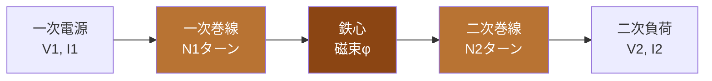
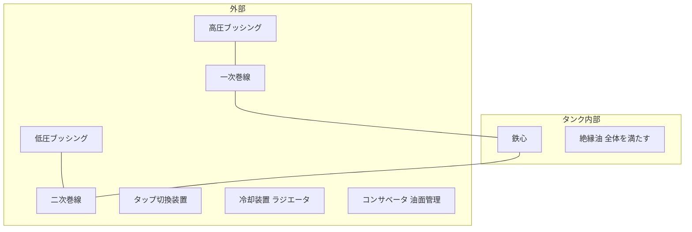

# 変圧器

## 1. 直感的理解

**変圧器の本質**: 巻数比で電圧・電流が逆比例する。磁束を介して一次側から二次側へエネルギーを転送する電気機器。

### なぜ変圧器なしでは長距離送電が不可能だったか

電力 P = VI（単相の場合）。同じ電力を送るなら、電圧を高くすれば電流を小さくできる。

電力損失は P_loss = I²R。電流が半分になれば損失は1/4になる。

例: 100kWを1kmの銅線（抵抗1Ω）で送る場合
- 100V送電: I = 1000A → 損失 = 1000² × 1 = 1,000,000W（送電不能）
- 100kV送電: I = 1A → 損失 = 1² × 1 = 1W（ほぼ無損失）

変圧器があるから高電圧で送り、需要地で低電圧に戻せる。これが電力システムの根幹。

**5秒で思い出す**: V1/V2 = N1/N2 = I2/I1 — 電圧は巻数に比例、電流は巻数に反比例（逆数）。エネルギー保存則から導ける。

---

## 2. 設備を歩く

### 磁気回路の構成

```mermaid
graph LR
    A[一次電源<br/>V1, I1] --> B[一次巻線<br/>N1ターン]
    B --> C[鉄心<br/>磁束φ]
    C --> D[二次巻線<br/>N2ターン]
    D --> E[二次負荷<br/>V2, I2]

    style C fill:#8B4513,color:#fff
    style B fill:#B87333,color:#fff
    style D fill:#B87333,color:#fff
```

### 油入変圧器の全体構成

```mermaid
graph TD
    subgraph 外部
        A[高圧ブッシング] --- B[一次巻線]
        F[低圧ブッシング] --- G[二次巻線]
        H[タップ切換装置]
        I[冷却装置 ラジエータ]
        J[コンサベータ 油面管理]
    end
    subgraph タンク内部
        B --- C[鉄心]
        C --- G
        K[絶縁油 全体を満たす]
    end
```

### 主要機器テーブル

| 機器 | 役割 | ポイント |
|------|------|---------|
| 鉄心 | 磁気回路を形成し磁束を集中させる | ケイ素鋼板を積層して渦電流損を低減 |
| 一次巻線 | 電源側の巻線。磁束を発生させる | 巻数N1が電圧比を決める |
| 二次巻線 | 負荷側の巻線。誘起電圧を取り出す | 巻数N2が二次電圧を決める |
| 絶縁油 | 絶縁と冷却を兼ねる | 鉱物油。PCBは現在使用禁止 |
| ブッシング | 高電圧導体をタンク壁から引き出す貫通絶縁体 | 磁器製またはポリマー製 |
| タップ切換装置 | 二次電圧を調整するため巻数を切り換える | 無電圧切換と負荷時切換がある |
| 冷却装置 | 損失（鉄損＋銅損）で発生した熱を除去 | 自冷/風冷/水冷の種別がある |

---

## 3. 変圧器の種類比較表

| 種類 | 絶縁媒体 | 冷却方式 | 主な用途 | 保守性 |
|------|---------|---------|---------|--------|
| 油入自冷式（ONAN） | 絶縁油 | 自然対流 | 配電用変圧器 | 油管理が必要。定期油分析 |
| 油入風冷式（ONAF） | 絶縁油 | 強制風冷（ファン） | 大容量変電所 | ファン保守が追加 |
| モールド式 | エポキシ樹脂 | 空冷（自然/強制） | 屋内・防爆環境 | 油不要で保守簡単。火災リスク低 |
| ガス絶縁式（GIS内） | SF6ガス | 自然冷却 | 都市部変電所・超高圧 | ガス管理が必要。小型化が最大の利点 |

---

## 4. 公式マップ

### レイヤーA: 基本公式

#### 巻数比（変圧比）

$$\frac{V_1}{V_2} = \frac{N_1}{N_2} = \frac{I_2}{I_1} = a \quad \text{（巻数比 } a\text{）}$$

- $V_1$: 一次電圧 [V]、$V_2$: 二次電圧 [V]
- $N_1$: 一次巻数、$N_2$: 二次巻数
- $I_1$: 一次電流 [A]、$I_2$: 二次電流 [A]

!!! note "電流が巻数に「反比例」する理由"
    変圧器は理想的にはエネルギーを損失なく変換する（入力 = 出力）。一次側の電力 $P_1 = V_1 I_1$ と二次側の電力 $P_2 = V_2 I_2$ が等しいことから、$V_1 I_1 = V_2 I_2$。これを変形すると $I_1/I_2 = V_2/V_1 = N_2/N_1 = 1/a$。電圧が a 倍になれば電流は 1/a 倍になる——エネルギー保存則が出発点。

**電流は逆数**になる点に注意: $a = N_1/N_2$ のとき $I_1/I_2 = 1/a$

#### 等価回路（一次側換算）

二次側の抵抗・リアクタンスを一次側に換算する場合、**巻数比の2乗**をかける。

$$R_2' = a^2 R_2, \quad X_2' = a^2 X_2$$

!!! note "インピーダンス換算が「a²倍」になる理由"
    一次側から見た二次側の等価インピーダンスは $Z_1 = V_1/I_1$。換算後の電圧は $V_1 = aV_2$、換算後の電流は $I_1 = I_2/a$。これを代入すると $Z_1 = aV_2/(I_2/a) = a^2 \cdot (V_2/I_2) = a^2 Z_2$。電圧が a 倍・電流が 1/a 倍になるため、インピーダンスは $a \times a = a^2$ 倍になる。

---

### レイヤーB: 損失・効率・電圧変動率

#### 損失の分類

| 損失の種類 | 別名 | 発生場所 | 負荷依存性 |
|-----------|------|---------|-----------|
| 鉄損 $P_i$ | 無負荷損 | 鉄心 | **一定**（電圧に依存、負荷電流に無関係） |
| 銅損 $P_c$ | 負荷損 | 巻線抵抗 | **電流の2乗に比例**（負荷率の2乗に比例） |

$$P_i = P_{h} + P_{e} \quad \text{（ヒステリシス損＋渦電流損）}$$

$$P_c = I^2 R \quad \propto \text{（負荷率）}^2$$

!!! note "鉄損が「負荷によらず一定」な理由"
    鉄損はヒステリシス損（磁区の向き転換に必要なエネルギー）と渦電流損（鉄心内を循環する誘導電流の損失）の和。どちらも「磁束密度の変化」によって決まり、磁束密度は印加電圧と周波数で決まる（ファラデーの法則: $e = N \cdot d\phi/dt$）。負荷電流が変わっても一次電圧がほぼ一定に保たれる限り、磁束密度は変わらず鉄損も変わらない。これが「無負荷損」とも呼ばれる理由。

#### 効率の計算

$$\eta = \frac{P_{out}}{P_{out} + P_i + P_c} \times 100 \quad [\%]$$

- $P_{out}$: 出力 [W]（= 負荷の消費電力）
- $P_i$: 鉄損（無負荷損）[W]
- $P_c$: 銅損（負荷損）[W]

**負荷率 $\alpha$ のとき:**

$$P_c(\alpha) = \alpha^2 \cdot P_{c(full)}$$

$$\eta(\alpha) = \frac{\alpha \cdot P_{rated} \cos\theta}{\alpha \cdot P_{rated} \cos\theta + P_i + \alpha^2 P_{c(full)}} \times 100$$

#### 最大効率条件

$$\boxed{P_i = \alpha^2 P_{c(full)}}$$

すなわち**鉄損 = 銅損のとき効率最大**。最大効率になる負荷率 $\alpha_m$:

$$\alpha_m = \sqrt{\frac{P_i}{P_{c(full)}}}$$

!!! note "「鉄損＝銅損で効率最大」の数学的根拠"
    効率式を負荷率 α で微分して極値を求める。$\eta(\alpha) \propto \alpha/(\alpha + P_i/P_{rated} + \alpha^2 P_{c}/P_{rated})$。$d\eta/d\alpha = 0$ を解くと条件 $P_i = \alpha^2 P_c$ が得られる。直感的には「固定損（鉄損）= 変動損（銅損）」のときに全損失に対する出力割合が最大になる。これは最適化問題の一般解で「固定コストと可変コストが等しいとき単位あたりコストが最小」と同じ構造。

#### 電圧変動率

$$\varepsilon \approx \varepsilon_r \cos\theta + \varepsilon_x \sin\theta \quad [\%]$$

- $\varepsilon_r = \frac{P_c}{P_{rated}} \times 100$: 抵抗降下百分率（%抵抗）
- $\varepsilon_x$: リアクタンス降下百分率（%リアクタンス）
- $\cos\theta$: 負荷の力率

$$\text{電圧変動率} = \frac{V_{2(no load)} - V_{2(full load)}}{V_{2(full load)}} \times 100 \quad [\%]$$

---

## 5. 解法パターン

### パターン①: 効率計算

**問題のキーワード**: 「出力○kW」「鉄損○W」「銅損○W」「効率を求めよ」

**手順**:

1. 出力 $P_{out}$ を確認（力率が絡む場合は $P_{out} = S \cos\theta$）
2. 鉄損 $P_i$、銅損 $P_c$ を確認
3. $\eta = \frac{P_{out}}{P_{out} + P_i + P_c} \times 100$

**例題**: 定格出力10kW、鉄損200W、銅損300W のとき効率は？

$$\eta = \frac{10000}{10000 + 200 + 300} \times 100 = \frac{10000}{10500} \times 100 \approx 95.2\%$$

---

### パターン②: 最大効率を求める

**問題のキーワード**: 「最大効率」「最大効率となる負荷率」

**手順**:

1. 定格時の鉄損 $P_i$ と銅損 $P_{c(full)}$ を確認
2. 最大効率条件: $P_i = \alpha^2 P_{c(full)}$
3. $\alpha_m = \sqrt{P_i / P_{c(full)}}$ を計算
4. そのときの効率 $\eta_{max}$ を求める（分子 = $\alpha_m P_{rated} \cos\theta$、分母に $P_i + P_i = 2P_i$）

**例題**: 鉄損100W、定格銅損400W のとき最大効率となる負荷率は？

$$\alpha_m = \sqrt{\frac{100}{400}} = \sqrt{0.25} = 0.5 \quad (50\% \text{負荷})$$

!!! warning "「最大効率のとき分母は 2Pi」の罠"
    最大効率条件では $P_i = \alpha_m^2 P_c$ が成立するため、損失の合計 = $P_i + \alpha_m^2 P_c = P_i + P_i = 2P_i$。問題で「最大効率のときの効率値を求めよ」と言われたら、分母に $2P_i$（または $2\alpha_m^2 P_c$）を使う。$P_c$ をそのまま使うと間違いになる。

---

### パターン③: 電圧変動率

**問題のキーワード**: 「%r（抵抗降下率）」「%x（リアクタンス降下率）」「力率」「電圧変動率」

**手順**:

1. %r と %x を確認
2. 力率 $\cos\theta$、$\sin\theta$ を計算
3. $\varepsilon = \varepsilon_r \cos\theta + \varepsilon_x \sin\theta$

**例題**: %r = 2%、%x = 4%、力率0.8（遅れ）のとき電圧変動率は？

$$\varepsilon = 2 \times 0.8 + 4 \times 0.6 = 1.6 + 2.4 = 4.0\%$$

---

### パターン④: 変圧器の並行運転での負荷分担

**問題のキーワード**: 「2台の変圧器を並行運転」「負荷分担」「過負荷にならない最大負荷」

!!! note "並行運転での負荷分担の原理"
    並行運転では2台の変圧器の二次端子が共通母線につながり、負荷電流を分担する。インピーダンスが大きい変圧器ほど分担電流は小さくなる（電流はインピーダンスに反比例）。%インピーダンス（%Z）が異なる変圧器を並行運転すると、負荷分担が容量比と一致せず、どちらかが過負荷になる可能性がある。並行運転の条件は（1）変圧比が等しい（2）%インピーダンスが等しい（3）極性が一致している の3点。

**並行運転の条件**:
1. 変圧比（巻数比）が等しいこと
2. 百分率インピーダンス降下（%Z）が等しいこと
3. 極性（減極性/加極性）が一致していること
4. 相回転が一致していること（三相の場合）

---

## 6. 引っかけパターン

!!! warning "引っかけ①：鉄損が負荷電流で変化すると誤解する"
    鉄損（無負荷損）は印加電圧と周波数で決まる。負荷が変化しても鉄損は変わらない。変化するのは銅損（負荷損）。銅損 ∝ I² ∝ 負荷率²。「負荷が増えたから損失が増えた」という問題文では、増えたのは銅損であり鉄損ではない。

!!! warning "引っかけ②：効率最大 = 全日効率最大 と混同する"
    瞬時効率最大（$P_i = P_c$ の条件）は特定の負荷率で成立する。全日効率は1日24時間の負荷変動を積分した概念。

    $$\eta_{day} = \frac{\sum P_{out} \cdot t}{\sum P_{out} \cdot t + P_i \cdot 24h + \sum P_c \cdot t} \times 100$$

    軽負荷の時間が長い場合は鉄損を小さくした変圧器が有利（鉄損は24時間ずっとかかり続けるため）。

!!! warning "引っかけ③：無電圧切換を「停止不要」と誤解する"
    タップ切換装置の「無電圧切換（オフロードタップチェンジャー）」は**変圧器を停止してから**切り換える。停止不要なのは「負荷時タップ切換装置（オンロードタップチェンジャー）」。名称の「無電圧」は「電圧が印加されていない状態で切り換える」という意味であり、「電圧を中断せずに切り換える」という意味ではない。

!!! warning "引っかけ④：極性が異なる変圧器を並行運転した場合"
    減極性（subtructive polarity）と加極性（additive polarity）が異なる変圧器を並行運転すると、二次側に両電圧の和に相当する電圧が短絡的に印加され、大きな循環電流が流れて事故になる。「並行運転の条件に極性の一致がある」という問題の正誤を問う出題が過去に複数回ある。

---

## 7. 正誤判定の急所

| 文 | 判定 | 解説 |
|---|------|------|
| 変圧器の鉄損は負荷電流の2乗に比例する | **誤** | 鉄損は一定（電圧・周波数依存）。電流の2乗に比例するのは銅損 |
| 最大効率条件は鉄損＝銅損 | **正** | $P_i = \alpha^2 P_{c(full)}$ のとき効率最大 |
| 変圧器の二次側に換算した一次抵抗は $a^2$ 倍 | **正** | $R_1' = a^2 R_1$（一次換算の逆、二次換算は $R_1/a^2$） |
| 油入変圧器の絶縁油はPCBが使われている | **誤** | PCBは毒性問題で現在使用禁止。現在は鉱物油または植物油 |
| 変圧器の並行運転の条件に「極性が一致すること」がある | **正** | 極性が異なると循環電流が流れ事故となる |
| 全日効率最大は瞬時効率最大の負荷率と同じ条件で達成される | **誤** | 全日効率は24時間の負荷パターンによって決まり、異なる概念 |
| タップ切換装置で無電圧切換は変圧器を停止させずに行える | **誤** | 無電圧切換は停止が必要。停止不要なのは負荷時タップ切換装置 |
| モールド変圧器は絶縁油が不要なため屋内設置に適している | **正** | 油漏れリスクがなく防火・保守の観点で屋内に有利 |

---

## 8. 出題実績

> 出題数約27問。効率計算・最大効率・並行運転の計算問題が頻出。論説では変圧器の種類・タップ切換が問われる。

| 年度 | 問 | タイトル | 問題タイプ | 難易度 |
|------|---|---------|----------|--------|
| R07下 | 問6 | 避雷器に使用される素子とその特徴 | 論説 | ★★☆☆☆ |
| R07上 | 問6 | ガス絶縁開閉装置の特徴 | 論説 | ★☆☆☆☆ |
| R06下 | 問6 | 調相設備接続による無効電力の調整 | 論説 | ★★☆☆☆ |
| R06下 | 問7 | 計器用変成器の取扱い上の注意点 | 論説 | ★★☆☆☆ |
| R06上 | 問16 | 変圧器に設置する遮断器の定格遮断電流と負荷分担 | 計算 | ★★★☆☆ |
| R05下 | 問6 | 変圧器のY-Y結線の特徴 | 論説 | ★★☆☆☆ |
| R05上 | 問13 | 変圧器並行運転時の過負荷容量 | 計算 | ★★☆☆☆ |
| R05上 | 問16 | 三相変圧器二次側の遮断器定格遮断電流 | 計算 | ★★☆☆☆ |
| R04下 | 問6 | 三相変圧器の百分率リアクタンス導出 | 計算 | ★★☆☆☆ |
| R04下 | 問7 | 変圧器の結線方式の違いと特性 | 論説 | ★★☆☆☆ |
| R04上 | 問16 | 変圧器に設置する遮断器の定格遮断電流 | 計算 | ★★★☆☆ |
| R03 | 問7 | 変電所の計器用変成器 | 論説 | ★☆☆☆☆ |
| R03 | 問9 | 変圧器故障時の過負荷運転 | 計算 | ★★★☆☆ |
| R02 | 問7 | 真空遮断器の特徴及び動作メカニズム | 論説 | ★★☆☆☆ |
| R01 | 問8 | 保護継電器の動作時間 | 計算 | ★★★★★ |
| H30 | 問7 | 変圧器の保全・診断 | 論説 | ★★★★☆ |
| H30 | 問12 | 変圧器のV結線方式 | 計算 | ★★★☆☆ |
| H28 | 問16 | 事故時に流れる電流 | 計算 | ★★★★☆ |
| H26 | 問6 | 配電用変電所の容量 | 計算 | ★★★★☆ |

!!! note "R08出題予測"
    R03以降、変圧器の効率・最大効率の単独計算問題が少ない（関連計算は遮断器定格や並行運転に組み込まれる傾向）。R08では「変圧器の効率・最大効率（単独計算）」または「V結線の出力・利用率（H30以来の周期）」が有力。並行運転での負荷分担計算も直近2年（R05上・R06上）で出ており継続の可能性あり。

---

## 関連ページ

- [変圧器の損失と効率（深掘り）](henatsuki-loss.md) — 全日効率・年間損失電力量・更新経済性評価（法規 B 問題 R04下問12 対策含む）
- [架空送電線路](kakuu-souden.md) — 送電電圧と変圧の関係
- [配電線路](haiden.md) — 配電変圧器
- [開閉装置・保護継電器](kaihei-hogo.md) — 変圧器保護リレー
- [電力系統・需給運用](denryoku-keitou.md) — 系統内の変圧器
