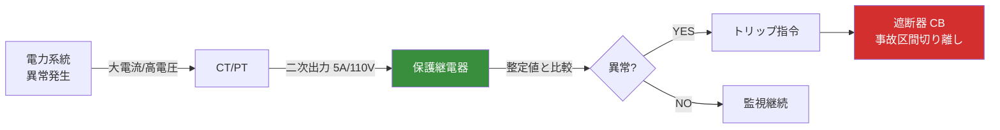
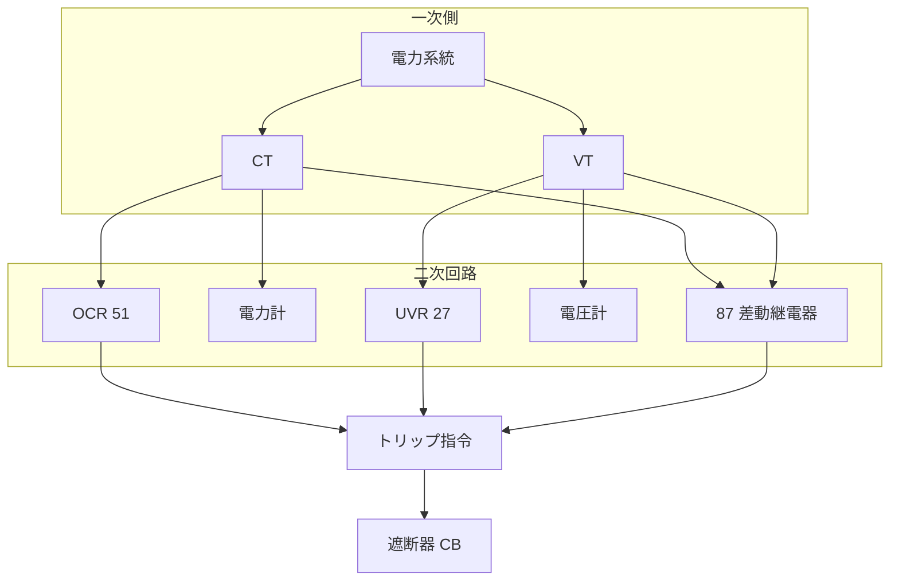

# 保護継電器

!!! success "🎯 このページで得点できる問題"
    本ページを通読すると、過去問で次の論点に答えられるようになる：

    - **主要継電器の略称・JIS 番号・用途**：OCR(51) / OCGR(51G) / DGR(67G) / UVR(27) / OVR(59) / 87 / 21
    - **動作特性**：**定限時**（時間一定）と **反限時**（電流大→動作早い）の違いと採用理由
    - **差動継電器（87）の原理**：入力電流と出力電流の差で内部故障を検出
    - **DGR の特殊性**：電流の **大きさ** だけでなく **方向（位相）** も判定
    - **CT・PT との連携**：継電器は CT・PT の二次出力を入力源として動作

    各論点の詳細は §3 比較表・§4 動作特性・§5 整定の考え方へ。

!!! note "🗺️ 棲み分けマップ"
    **本ページ＝保護継電器**：異常を **検出して指令を出す** 装置（OCR/OCGR/DGR/UVR/OVR/87/21）。継電器の動作原理・整定・選定。

    **[遮断器・断路器（CB・DS）](shadanki.md)**：本ページの継電器が「切れ」と指令する **実行側**。

    **[計器用変成器（VT・CT）](keiki-hensei.md)**：継電器の **入力センサー**。継電器は CT/VT の二次出力を見て判定する。

    **[開閉装置・保護継電器（hub）](kaihei-hogo.md)**：3 ページの全体俯瞰・出題実績インデックス。

## 1. 直感的理解

**保護継電器の本質**: 系統の異常（短絡・地絡・過電圧・過電流等）を **CT・PT 経由で検出** し、**遮断器（CB）に「切れ」の指令** を出す装置。系統保護の頭脳。

### 役割フロー



**5 秒で思い出す**: 継電器は **「センサーが運んだ信号で判定し、CB に指令する」** 装置。自身は電流を切らない。

### 整定値（setting）という概念

継電器は「**整定値**」と呼ばれる動作の閾値を持つ。例えば OCR の整定値が二次 4 A なら、CT 二次に 4 A 以上流れた瞬間（または時限後）にトリップ。

整定値は **現場で調整可能**で、系統条件・負荷変動・上下流継電器の協調を考えて設定する。

---

## 2. 設備を歩く

### CT/VT → 継電器 → CB の信号フロー



複数の継電器が同じ CT・VT の二次出力を共有することが多い。**CT 負担**（接続継電器の合計 VA）が定格を超えないよう注意（→ [計器用変成器ページ §4 レイヤー C](keiki-hensei.md#4)）。

---

## 3. 保護継電器の比較表（最重要）

| 継電器 | 略称 | JIS番号 | 検出対象 | 動作条件 | 主な用途 |
|-------|------|---------|---------|---------|---------|
| **過電流継電器** | OCR | 51 | 過電流（短絡等） | 整定値以上の電流 | 線路・変圧器の短絡保護 |
| **地絡過電流継電器** | OCGR | 51G | 地絡電流 | 地絡電流が整定値以上 | 非接地系の地絡保護 |
| **地絡方向継電器** | DGR | 67G | 地絡の方向 | 地絡電流の流入方向判定 | 自家用構内の地絡・波及防止 |
| **不足電圧継電器** | UVR | 27 | 電圧低下 | 電圧が整定値以下 | 停電検出・系統解列 |
| **過電圧継電器** | OVR | 59 | 電圧上昇 | 電圧が整定値以上 | 単独運転防止・地絡検出（接地形 VT 経由） |
| **差動継電器** | 87 | 87 | 変圧器・発電機内部故障 | 入出力電流の差 | 変圧器・発電機の内部保護 |
| **距離継電器** | 21 | 21 | 線路インピーダンス | インピーダンス整定値以下 | 長距離送電線の保護 |

!!! note "JIS 番号は ANSI/IEEE デバイス番号と共通"
    51（過電流）・87（差動）・21（距離）等の番号は **米国 ANSI/IEEE C37.2** のデバイス番号で、国際標準。試験では番号と日本語名・略称を結びつけて問われる。

---

## 4. 動作特性（定限時・反限時・差動原理）

### 定限時 vs 反限時（OCR）

| 特性 | 動作時間 | 採用理由 |
|------|---------|---------|
| **定限時特性** | 整定値超の電流の大きさに関わらず **一定の時限** でトリップ | 動作時間が読みやすい・上下流継電器の協調が容易 |
| **反限時特性** | 電流が大きいほど **短い時間** でトリップ（反比例的） | 重大事故ほど早期遮断＝系統への影響最小化 |

!!! note "なぜ反限時特性が必要か（因果理解）"
    事故電流が大きい＝事故の深刻度が高い＝早期に遮断すべき。という論理に合致する動作特性。
    系統への影響が大きい事故ほど迅速に遮断できる。線路の OCR では反限時特性が一般的。

### 差動継電器（87）の原理

```
入力電流（CT1） ─┐
                  ├→ 差動比較 → 差が整定値超 → トリップ
出力電流（CT2） ─┘

正常時：入力≒出力 → 差≒0 → 動作しない
内部故障時：入力≠出力 → 差大 → 動作してトリップ
```

!!! note "差動継電器が変圧器内部故障を検出できる理由"
    変圧器が正常動作している場合、一次側電流と二次側電流は変圧比に従って一定の比率を保つ。差動継電器は両者の差を監視しており、正常時は差≒0。
    内部故障（巻線間短絡・地絡等）が発生すると、故障電流の一部が変圧器内部を短絡経路で流れ、一次・二次の電流比が崩れる。この「差」を検出してトリップする。**外部短絡では一次・二次の差が出ないため誤動作しない**（保護範囲が変圧器内部に限定）。

### 距離継電器（21）の原理

CT・VT の入力から **インピーダンス Z = V/I** を計算し、整定値以下なら事故とみなしてトリップ。

- **整定値**：保護したい線路のインピーダンスに対応する値
- **動作領域**：通常 R-X 平面（インピーダンス図）上の円・四角形・多角形で表現
- **段階保護**：1 段（瞬時）・2 段（短時限）・3 段（長時限）の3段で広い範囲をカバー

### DGR（地絡方向継電器）の特殊性

DGR は **電流の大きさ＋方向（位相）** の両方を判定する。これにより：

- **自構内の地絡** ⇒ 地絡電流の方向が「構内向き」 ⇒ **動作**
- **隣接回路の地絡** ⇒ 地絡電流の方向が「構外向き」 ⇒ **不動作**（波及防止）

DGR の入力は ZCT（零相電流）＋EVT（零相電圧）のセット（→ [計器用変成器 §3](keiki-hensei.md#3)）。

---

## 5. 整定の考え方

### OCR の整定（時限協調）

直列に複数の OCR が並ぶ系統では、**下流が先に動作・上流が後で動作** する時限差をつける（**時限協調**）。

```
上流 OCR (時限 0.6s)
   ↓
下流 OCR (時限 0.3s)
   ↓
事故点
```

下流の OCR が先にトリップして事故区間だけを切り離し、上流の健全区間は通電継続。下流が動作失敗した場合のバックアップとして上流が動作。

### DGR の整定

- **電流整定**：地絡電流の最小予想値より小さく
- **方向整定**：自構内方向のみ動作するよう位相基準を設定
- **時限整定**：上位（系統側）の DGR と協調

### 87（差動）の整定

- **不平衡電流許容値**：CT 誤差・タップ位置による差を吸収する余裕
- **比率差動特性**：負荷電流に比例して動作感度を変える（外部事故時の誤動作防止）

---

## 5.5 解法パターン

### 解法パターン①：継電器の略称・JIS 番号・用途を結びつける（R06上問8型）

**典型問題**：「次の保護継電器の名称と JIS 番号の組合せのうち、誤っているものを選べ」

**判別マトリクス**

| 略称 | JIS番号 | 検出対象 | 引っかけ筆頭 |
|---|---|---|---|
| **OCR** | **51** | 過電流（短絡） | 「OCR は地絡保護」→ 誤（地絡は OCGR / DGR） |
| **OCGR** | **51G** | 地絡電流の大きさのみ | 「OCGR は方向判定する」→ 誤（方向判定は DGR） |
| **DGR** | **67G** | 地絡の **大きさ＋方向（位相）** | 「DGR は大きさだけ」→ 誤 |
| **UVR** | **27** | 不足電圧 | 「UVR は過電圧」→ 誤（過電圧は OVR / 59） |
| **OVR** | **59** | 過電圧 | 「OVR は過電流」→ 誤（過電流は OCR / 51） |
| **87** | **87** | 変圧器・発電機内部故障 | 「87 は外部短絡でも動作」→ 誤 |
| **21** | **21** | 線路インピーダンス | 「21 は物理距離で動作」→ 誤（V/I のインピーダンス） |

→ JIS 番号は ANSI/IEEE C37.2 と共通。**51（過電流）・87（差動）・21（距離）** の 3 つは暗記必須。

### 解法パターン②：差動（87）と距離（21）の動作原理を判別（R04上問8型）

**典型問題**：「差動継電器と距離継電器の動作原理に関する記述として、適切なものを選べ」

**判別基準（2軸対比）**

| 観点 | 差動継電器（87） | 距離継電器（21） |
|---|---|---|
| **入力** | 2 つの CT（一次・二次 または 両端） | CT + VT（電流と電圧） |
| **判定指標** | 入出力電流の **差** | V/I の **インピーダンス** |
| **保護範囲** | 内部のみ（外部短絡は不動作） | 整定値以下のインピーダンス区間 |
| **誤動作モード** | CT 誤差・タップ位置→比率差動特性で抑制 | 電圧低下・電力動揺→3 段時限で抑制 |
| **主な対象** | 変圧器・発電機 | 長距離送電線 |

→ **「差で見る vs インピーダンスで見る」** が一行整理の決め手。87 は外部短絡で動作しない（保護範囲限定）が頻出ひっかけ。

### 解法パターン③：定限時・反限時の特性を判別（OCR論点）

**典型問題**：「過電流継電器の動作特性として、電流が大きいほど動作時間が短くなる特性の名称を答えよ」

**判別基準**

| 特性 | 動作時間と電流の関係 | 採用場面 |
|---|---|---|
| **定限時特性** | 整定値超なら **一定時間**でトリップ | 上下流の時限協調が容易 |
| **反限時特性** | 電流大 → 動作時間 **短** | 重大事故ほど早期遮断（線路 OCR の主流） |
| **瞬時特性** | 整定値超で **即時**トリップ | 大電流事故の高速遮断（87 と併用） |

→ 「電流大→時間短」は **反限時**。逆に「電流に関わらず一定時間」は **定限時**。両者の取り違えは引っかけ⑤と直結。

### 解法パターン④：保護継電器方式の総合判別（R01問8型）

**典型問題**：「電力系統の保護継電器方式に関する記述として、誤っているものを選べ」

**判別チェックリスト**

1. **OCR の時限協調** = 下流先動作・上流バックアップ（下流時限 < 上流時限）
2. **差動継電器（87）** = 内部故障のみ動作（外部短絡では一次・二次の差が出ない）
3. **距離継電器（21）** = インピーダンス（V/I）で判定（物理距離ではない）
4. **DGR の方向判定** = ZCT（零相電流）＋ EVT（零相電圧）の組合せで自構内/構外を仕分け
5. **段階保護** = 距離継電器は 1 段（瞬時）・2 段（短時限）・3 段（長時限）

→ 5 つの基準のいずれかに違反する選択肢が「誤り」。**保護範囲の誤認**と **方向判定の有無**が出題の 7 割。

---

## 6. 引っかけパターン

### ① OCR と OCGR の混同

| 誤った記述 | 正しい記述 |
|---|---|
| 「OCR は地絡電流を検出する」 | **誤**：OCR は **過電流**（短絡等）。地絡は **OCGR**（51G）または **DGR**（67G） |

### ② DGR の動作条件

| 誤った記述 | 正しい記述 |
|---|---|
| 「DGR は電流の大きさだけで地絡を判定する」 | **誤**：電流の大きさに加え **方向（位相）** も判定する |

### ③ 差動継電器の保護範囲

| 誤った記述 | 正しい記述 |
|---|---|
| 「差動継電器（87）は変圧器の外部短絡でも動作する」 | **誤**：87 は **内部故障のみ**動作。外部短絡では一次・二次の差が出ない |

### ④ 距離継電器の動作

| 誤った記述 | 正しい記述 |
|---|---|
| 「距離継電器は事故点までの物理的距離で動作する」 | **誤**：**インピーダンス**（V/I）で動作。長さに比例するが直接の距離測定ではない |

### ⑤ 反限時と定限時の取り違え

| 誤った記述 | 正しい記述 |
|---|---|
| 「定限時特性は電流が大きいほど早く動作する」 | **誤**：定限時は **一定時間**。電流が大きいほど早いのは **反限時** |

---

## 7. 正誤判定の急所

| 文章 | 正誤 | 解説 |
|------|------|------|
| 「差動継電器は変圧器の内部故障を検出する」 | **正** | 87 が変圧器の巻線内部故障の主保護 |
| 「OCR の反限時特性は電流が大きいほど短時間で動作する」 | **正** | 重大事故ほど早期遮断の論理 |
| 「距離継電器は事故点までのインピーダンスで動作する」 | **正** | 事故点までのインピーダンスが整定値以下になると動作 |
| 「地絡方向継電器（DGR）は電流の大きさだけで地絡を判定する」 | **誤** | 電流の大きさに加え **方向（位相）** も判定 |
| 「OCR は地絡保護に用いる継電器である」 | **誤** | OCR は過電流（短絡）保護。地絡は OCGR / DGR |
| 「差動継電器は外部短絡でも誤動作する」 | **誤** | 外部短絡では一次・二次の差が出ないため誤動作しない |
| 「UVR は電圧が整定値以下になったとき動作する」 | **正** | 不足電圧継電器（27） |
| 「OVR は電圧が整定値以上になったとき動作する」 | **正** | 過電圧継電器（59） |
| 「定限時特性は電流が大きいほど早く動作する」 | **誤** | 定限時は **一定時間**。反限時の説明と混同 |
| 「JIS 番号 87 は差動継電器である」 | **正** | ANSI/IEEE C37.2 と共通の番号体系 |
| 「DGR の入力には ZCT と EVT を用いる」 | **正** | 零相電流と零相電圧の両方で方向判定 |
| 「OCR は時限協調により上流より下流を早く動作させる」 | **正** | 下流先動作・上流バックアップが時限協調の原則 |

---

## 8. 出題実績

| 年度 | 問 | 出題内容 | 問題タイプ | 難易度 |
|------|---|---------|----------|--------|
| R06上 | 問8 | 保護継電器の種類と用途 | 穴埋 | ★★★☆☆ |
| R04上 | 問8 | 距離継電器と差動継電器の動作原理 | 論説 | ★★★★☆ |
| R01 | 問8 | 保護継電器方式の種類 | 論説 | ★★★★☆ |

> 詳細解説: [電験王 開閉・保護カテゴリ](https://denken-ou.com/denryoku/?cat=kaiheihogo)

!!! note "R08 予測"
    保護継電器単独の論点は **4-7年周期** の番外ポジション（R06上・R04上・R01）。R08 では DGR の方向判定／反限時特性／差動原理／距離継電器の段階保護のいずれかが論説で出る可能性。OCR・OCGR は遮断器ページの出題実績（問 8 枠）にも頻出するため横断学習推奨。

---

## 関連ページ

- [遮断器・断路器（CB・DS）](shadanki.md) — 継電器のトリップ指令を受ける実行側
- [計器用変成器（VT・CT）](keiki-hensei.md) — 継電器の入力センサー（CT/VT/ZCT/EVT）
- [開閉装置・保護継電器（hub）](kaihei-hogo.md) — 3 ページの全体俯瞰・出題実績インデックス
- [変圧器](henatsuki.md) — 差動継電器 87 の保護対象
- [架空送電線路](kakuu-souden.md) — 距離継電器 21 の適用先
- [自家用受電設備の地絡保護](jikayou-chiraku.md) — DGR・もらい事故防止の応用編（需要家側）
