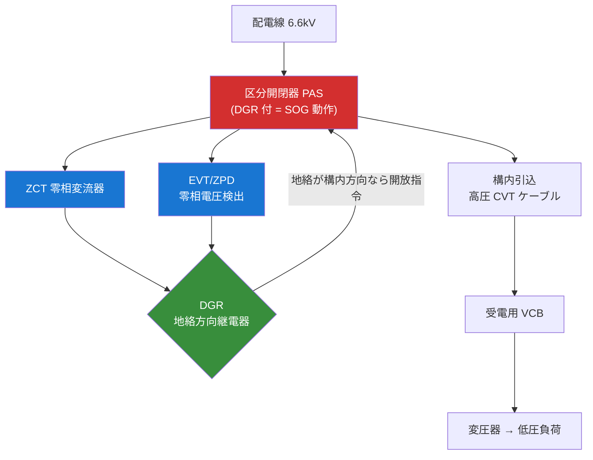
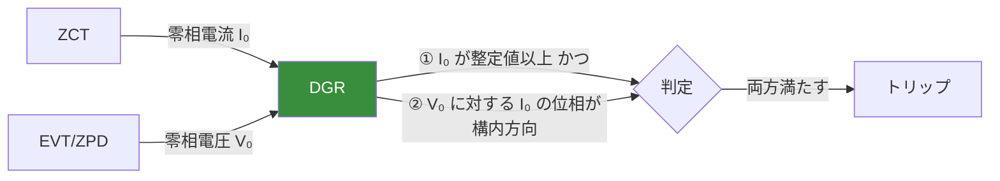
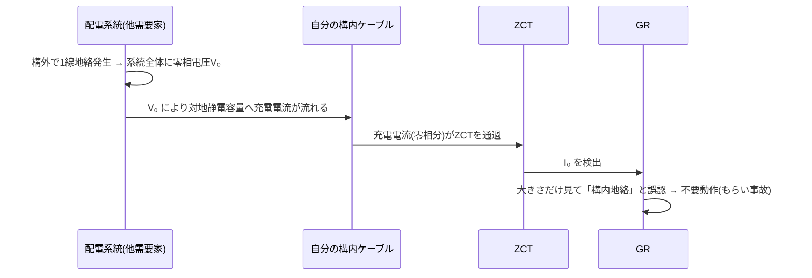
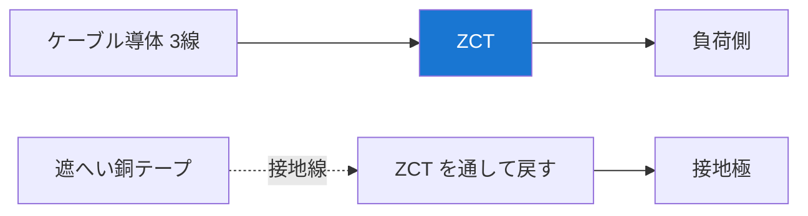

# 自家用受電設備の地絡保護（GR・DGR・もらい事故防止）

!!! success "🎯 このページで得点できる問題"
    本ページを通読すると、過去問で次の論点に答えられるようになる：

    - **GR と DGR の使い分け**：単純な **GR（地絡過電流のみ）** と **DGR（大きさ＋方向）** の違いと、なぜ高圧受電では DGR が必要か
    - **もらい事故（波及事故）の防止原理**：構内ケーブルの **対地静電容量** が大きいと、構外（系統側）地絡でも GR が誤動作する → 方向判定する DGR で防ぐ
    - **ZCT・EVT の役割**：ZCT＝**零相電流 I₀**、EVT＝**零相電圧 V₀**。DGR はこの 2 つの **位相関係** で地絡の方向を判定
    - **高圧ケーブルの対地静電容量**：架空電線より桁違いに大きい → 構内の地絡電流（充電電流分）が大きくなる
    - **CVT 遮へい銅テープの接地**：接地線を **ZCT に通すか通さないか** で地絡検出の正否が決まる（実務最頻出ミス）
    - **地絡電流の大きさと位相**：$I_g=\sqrt{I_{gr}^2+I_{gc}^2}$、位相 $\theta=\tan^{-1}(I_{gc}/I_{gr})$

    各論点の詳細は §3 GR vs DGR・§4 もらい事故・§5 公式マップへ。

!!! note "🗺️ 棲み分けマップ"
    **本ページ＝自家用受電設備（需要家側）の地絡保護**：高圧受電設備（PAS・キュービクル）の **GR・DGR・ZCT・EVT** と、**もらい事故（波及事故）** の防止という需要家固有の論点を扱う。

    **[保護継電器](hogo-keiden.md)**：継電器一般（OCR/DGR/87/21）の動作原理・整定。本ページは「自家用受電の地絡保護」に特化した応用編。

    **[計器用変成器（VT・CT）](keiki-hensei.md)**：ZCT・EVT・残留回路など **センサーそのもの** の取扱い詳細。

    **[地中送電・電力ケーブル](chichuu-souden.md)**：**対地静電容量が大きい理由**（導体–遮へい間が近い）の母体。本ページの「構内ケーブルで地絡電流が大きい」はこの帰結。

    **使い分け**：継電器一般 → 保護継電器／センサー詳細 → 計器用変成器／需要家の地絡保護と波及事故 → 本ページ。

## 1. 直感的理解

**自家用受電設備の地絡保護の本質**: 高圧で受電する需要家（工場・ビル）で **構内の地絡を検出して受電用遮断器を切る** だけでなく、**自分の事故を電力会社の配電系統に波及させない（＝もらい事故を起こさない・受けない）** ことが目的。

```
電力会社の配電線 ──[PAS/区分開閉器]── 需要家構内
                                         │
                          地絡検出: ZCT(零相電流) + EVT(零相電圧)
                                         │
                                  DGR が方向判定 → VCB/PAS を切る
```

!!! note "なぜ単純な GR では足りないのか（因果理解）"
    高圧受電では構内に **高圧ケーブル（CVT 等）** が引き回される。ケーブルは **対地静電容量が大きい**（→ [地中送電 §1](chichuu-souden.md)）ため、**構外（系統側）の地絡** が起きると、その零相電圧を受けて **構内ケーブルの対地静電容量を通る充電電流** が ZCT に流れる。
    大きさだけを見る GR（地絡過電流継電器）はこれを「構内地絡」と誤認し、**健全な自家用設備が不必要に遮断される**（＝もらい事故）。これを防ぐため、**電流の大きさに加え位相（方向）を判定する DGR** で「電流が構内へ向かうか／系統へ向かうか」を仕分ける。

**5 秒で思い出す**: GR は大きさだけ → ケーブルの充電電流で **もらい事故**。DGR は大きさ＋方向 → 構外地絡では不動作で **波及・もらいを防ぐ**。

---

## 2. 設備を歩く

### 高圧受電設備の単線結線図（地絡保護の骨格）



- **PAS（区分開閉器）**：電柱上の引込口に設置。**GR 付 PAS／DGR 付 PAS** とし、構内地絡時に **自動で開放**して系統への波及を防ぐ（ただし PAS は遮断器ではないため、地絡電流を確認後 **無電圧で開放** する SOG 動作）。
- **ZCT（零相変流器）**：三相一括で鉄心を通し **零相電流 I₀（=地絡電流相当）** を検出。
- **EVT/ZPD（接地形計器用変圧器／零相電圧検出器）**：**零相電圧 V₀** を検出。DGR の方向判定の基準位相を与える。
- **VCB（真空遮断器）**：受電用遮断器。継電器の指令で実際に電流を遮断する実行側。

### DGR の入力 2 系統（大きさ＋方向）



!!! note "GR と DGR の入力の違い"
    **GR（地絡過電流継電器）= ZCT のみ**（I₀ の大きさだけ）。
    **DGR（地絡方向継電器）= ZCT + EVT**（I₀ の大きさ ＋ V₀ との位相関係）。
    EVT が付くか付かないかが GR と DGR の見分けの第一歩。

---

## 3. GR と DGR の比較表（最重要）

| 項目 | GR（地絡過電流継電器・OCGR/51G） | DGR（地絡方向継電器・67G） |
|---|---|---|
| **入力センサー** | ZCT のみ | ZCT ＋ EVT/ZPD |
| **判定要素** | 零相電流 I₀ の **大きさ** だけ | I₀ の **大きさ ＋ 位相（方向）** |
| **構外地絡（系統側）** | ケーブル充電電流で **誤動作しうる** | **不動作**（電流が構外方向と判定） |
| **構内地絡** | 動作 | 動作 |
| **もらい事故防止** | ✕（できない） | ◯（方向判定で防ぐ） |
| **適用** | 構内ケーブルが短い小規模設備 | **ケーブルこう長が長い／対地静電容量が大きい設備** |
| **コスト** | 安い（EVT 不要） | 高い（EVT/ZPD が必要） |

!!! warning "出題の核心：なぜ DGR が必要か"
    「構内の高圧ケーブルが長い（対地静電容量が大きい）ほど、構外地絡時に GR が誤動作しやすい」
    → だから **方向判定する DGR** を用いる、という因果が穴埋・論説の頻出論点。

---

## 4. もらい事故（波及事故）のメカニズム

### 構外地絡時に GR が誤動作する流れ



!!! note "もらい事故の正体"
    自分の構内では地絡が起きていないのに、**他者・系統側の地絡が作る零相電圧** によって、**自分のケーブルの対地静電容量を流れる充電電流** を GR が拾ってしまう現象。構内ケーブルが長い（C 大）ほど充電電流が大きく、誤動作しやすい。

### DGR がもらい事故を防ぐ理由（位相で仕分け）

| 地絡の場所 | I₀ の向き（V₀ 基準） | DGR の判定 |
|---|---|---|
| **構内地絡** | 系統 → 構内（地絡点）へ電流が向かう | **動作**（トリップ） |
| **構外地絡** | 構内（ケーブル C）→ 系統へ充電電流が向かう | **不動作** |

→ 構外地絡では電流の向きが「構外向き（充電電流）」になるため、**位相で除外**できる。これが DGR がもらい事故を防ぐ原理。

---

## 5. 公式マップ

### レイヤーA: 高圧ケーブルの対地静電容量と地絡電流

!!! note "対地静電容量に流れる地絡電流（容量分）"
    $$I_{gc} = 2\pi f \, C_3 \, E \quad [\text{A}]$$

    - $f$: 周波数 [Hz]
    - $C_3$: **3 線一括の対地静電容量** [F]
    - $E$: 事故前の **対地電圧** [V]（＝相電圧 $V/\sqrt{3}$）

    **なぜこの式か**: 1 線地絡が起きると健全相の対地電圧が上昇し、各相の対地静電容量を通じて充電電流が大地へ流れる。これがケーブル分の地絡電流（容量分）。$I_c=\omega CV$ の充電電流と同型で、ケーブルの $C$ が大きいほど大きくなる。

!!! note "なぜ高圧ケーブルで地絡電流が大きいか（地中送電からの帰結）"
    高圧ケーブル（CVT 等）は導体と遮へい層の距離が **数 mm** と非常に近く、対地静電容量が架空電線に比べ桁違いに大きい（→ [地中送電 §5](chichuu-souden.md)）。したがって **構内ケーブルが長いほど、対地静電容量に流れる地絡電流（充電電流分）が大きく** なり、もらい事故のリスクが上がる。

### レイヤーB: 地絡電流の大きさと位相

非接地系（高圧配電）の 1 線地絡電流は **抵抗分** と **容量分** のベクトル合成：

$$I_g = \sqrt{I_{gr}^2 + I_{gc}^2} \quad [\text{A}]$$

- $I_{gr}$: 抵抗分（EVT の制限抵抗・地絡抵抗を流れる成分）
- $I_{gc}$: 容量分（対地静電容量を流れる成分 $=2\pi f C_3 E$）

地絡電流の位相（零相電圧 $V_0$ に対する進み角）：

$$\theta = \tan^{-1}\left(\frac{I_{gc}}{I_{gr}}\right)$$

!!! note "DGR の位相整定との関係"
    抵抗分 $I_{gr}$ が容量分 $I_{gc}$ より十分大きいと位相 $\theta$ は小さく（ほぼ同相）、DGR の方向判定が安定する。EVT 二次に **制限抵抗** を入れて抵抗分を確保するのは、地絡電流の位相を安定させ DGR を確実に動作させるため。

### レイヤーC: 遮へい層静電容量の考え方

ケーブル 1 条あたりの対地静電容量は同軸コンデンサとして近似でき、絶縁体が薄い（$D/d$ が小さい）ほど大きい：

$$C = \frac{2\pi \varepsilon}{\ln(D/d)} \quad [\text{F/m}]$$

- $D$: 遮へい層（外側電極）径、$d$: 導体径
- 高圧ケーブルは $D/d$ が小さく $C$ が大きい → 地絡電流（容量分）が大きい

---

## 6. CVT 遮へい銅テープの接地と ZCT の関係（実務頻出）

!!! danger "最頻出ミス：接地線を ZCT に通すか通さないか"
    CVT（高圧ケーブル）の **遮へい銅テープの接地線** を ZCT の **どちら側で処理するか** によって、地絡検出が **正しく動いたり・動かなかったり** する。実務でも試験でも狙われる。

### 正しい接地（ZCT 負荷側で接地し、接地線を ZCT に通し返す）



!!! note "なぜ接地線を ZCT に通し返すのか（因果理解）"
    遮へい層には、健全時でもケーブルの **対地静電容量を通る充電電流（遮へい電流）** が流れている。この電流は ZCT を **行き（導体側）** に通過するので、接地線を ZCT に **通さず** に接地すると、ZCT は充電電流分を「残留＝地絡」と誤検出してしまう。

    接地線を **ZCT の窓に通し返して** 接地すると、行きの充電電流と帰りの接地電流が ZCT 内で **打ち消し合い（ベクトル和≒0）**、ZCT は真の地絡電流だけを検出できる。

| 接地方法 | ZCT が見る電流 | 結果 |
|---|---|---|
| 接地線を **ZCT に通し返す**（正） | 充電電流が相殺 → 真の地絡分のみ | **正常検出** |
| 接地線を **ZCT を通さず**接地（誤） | 充電電流分が残留 | **誤動作・不検出** |

→ 「**遮へいの接地線は ZCT を貫通させて（通し返して）から接地する**」が結論。ケーブルヘッドの接地処理の定番論点。

---

## 7. 解法パターン

### 解法パターン①：GR と DGR を見分ける（EVT の有無）

**典型問題**：「高圧受電設備の地絡保護に関する記述として誤っているものを選べ」

**判別基準**

| 着眼点 | GR | DGR |
|---|---|---|
| EVT/ZPD | なし | **あり** |
| 判定 | 大きさのみ | 大きさ＋方向 |
| もらい事故 | 防げない | **防げる** |

→ 「EVT があるか」「方向判定するか」「もらい事故を防げるか」の 3 点セットで判断。

### 解法パターン②：もらい事故の因果を説明する

**典型問題**：「構内ケーブルが長い高圧受電設備で DGR を用いる理由を述べよ」

**模範の筋道**
1. 高圧ケーブルは対地静電容量が大きい
2. 構外地絡時、零相電圧で充電電流が ZCT を流れる
3. GR は大きさだけ見て誤動作（もらい事故）
4. DGR は位相（方向）で構外地絡を除外できる
5. ∴ ケーブルこう長が長いほど DGR が必要

### 解法パターン③：地絡電流（容量分）の計算

**典型問題**：「対地静電容量 $C_3=0.3\,\mu\text{F}$、6.6 kV 非接地系、$f=50$ Hz のとき容量分地絡電流は」

**手順**
```
Step1: 対地電圧 E = 6600/√3 ≒ 3810 V
Step2: ω = 2πf = 2π×50 = 314 rad/s
Step3: I_gc = ωC₃E = 314 × 0.3×10⁻⁶ × 3810 ≒ 0.36 A
```

### 解法パターン④：地絡電流の合成と位相

**典型問題**：「抵抗分 $I_{gr}=0.5$ A、容量分 $I_{gc}=0.36$ A のときの地絡電流の大きさと位相」

**手順**
```
大きさ: I_g = √(0.5² + 0.36²) = √(0.25+0.130) ≒ 0.62 A
位相  : θ = tan⁻¹(0.36/0.5) ≒ 36°（V₀ に対する進み）
```

---

## 8. 引っかけパターン

### ① GR でもらい事故を防げると誤認

| 誤った記述 | 正しい記述 |
|---|---|
| 「GR（地絡過電流継電器）は構外地絡で誤動作せず、もらい事故を防げる」 | **誤**：GR は大きさだけ。方向判定する **DGR** でないと防げない |

### ② DGR の入力を ZCT だけと誤認

| 誤った記述 | 正しい記述 |
|---|---|
| 「DGR は ZCT の零相電流だけで方向を判定する」 | **誤**：方向判定には **EVT/ZPD の零相電圧 V₀** が基準として必要 |

### ③ 高圧ケーブルの対地静電容量を「小さい」と誤認

| 誤った記述 | 正しい記述 |
|---|---|
| 「構内の高圧ケーブルは架空電線より対地静電容量が小さいので地絡電流は小さい」 | **誤**：ケーブルは導体–遮へい間が近く **C が大きい** → 地絡電流（容量分）は **大きい** |

### ④ 遮へい接地線を ZCT に通さないと誤認

| 誤った記述 | 正しい記述 |
|---|---|
| 「ケーブル遮へいの接地線は ZCT を通さずに最短で接地するのがよい」 | **誤**：充電電流分を相殺するため **ZCT に通し返してから接地** する。通さないと誤動作・不検出 |

### ⑤ PAS を遮断器と誤認

| 誤った記述 | 正しい記述 |
|---|---|
| 「GR 付 PAS は地絡電流をそのまま遮断する遮断器である」 | **誤**：PAS は負荷開閉器であり地絡電流の遮断能力はない。地絡を検出後 **無電圧で開放（SOG 動作）** する |

---

## 9. 正誤判定の急所

| 文章 | 正誤 | 解説 |
|------|------|------|
| 「DGR は零相電流の大きさと、零相電圧に対する位相で地絡方向を判定する」 | **正** | ZCT(I₀)＋EVT(V₀) の位相で構内/構外を仕分け |
| 「GR は ZCT のみ、DGR は ZCT と EVT を入力とする」 | **正** | EVT の有無が GR/DGR の分かれ目 |
| 「構内ケーブルが長いほどもらい事故のリスクが高い」 | **正** | 対地静電容量が大きく充電電流が増えるため |
| 「もらい事故は自構内の地絡が原因で起こる」 | **誤** | **構外（系統・他者）地絡** が作る零相電圧が原因 |
| 「高圧ケーブルの対地静電容量は架空電線より小さい」 | **誤** | 導体–遮へい間が近く **大きい** |
| 「ケーブル遮へいの接地線は ZCT を貫通させてから接地する」 | **正** | 充電電流分を相殺し真の地絡のみ検出 |
| 「GR 付 PAS は地絡電流を直接遮断できる」 | **誤** | PAS は開閉器。SOG 動作で無電圧開放 |
| 「容量分地絡電流は $I_{gc}=2\pi f C_3 E$ で求まる」 | **正** | 充電電流 $\omega CV$ と同型 |
| 「地絡電流は抵抗分と容量分のベクトル和である」 | **正** | $I_g=\sqrt{I_{gr}^2+I_{gc}^2}$ |
| 「EVT 二次の制限抵抗は地絡電流の位相を安定させ DGR を確実動作させるためにある」 | **正** | 抵抗分を確保して位相を整える |

---

## 10. 出題実績

> 📚 横断一覧: [分野別一覧（該当分野）](../kakomon/by-field.md#haiden) ／ [年度別一覧](../kakomon/by-year.md)

| 年度 | 問 | 出題内容 | 問題タイプ | 難易度 |
|------|---|---------|----------|--------|
| R06上 | 問8 | 保護継電器の種類と用途（DGR を含む） | 穴埋 | ★★★☆☆ |

> 自家用受電設備の地絡保護（GR/DGR・もらい事故）は **電力科目の保護継電器枠（問 8）** と、**法規の自家用電気工作物・保安管理** の双方で問われる横断領域。
>
> 詳細解説: [電験王 開閉・保護カテゴリ](https://denken-ou.com/denryoku/?cat=kaiheihogo)

!!! note "R08 予測"
    DGR の方向判定原理（ZCT＋EVT）・もらい事故防止・高圧ケーブルの対地静電容量と地絡電流の関係は、保護継電器の論説枠で出題される可能性が高い。法規（自家用受電・保安）と合わせて横断学習すると得点効率が高い。

---

## 関連ページ

- [保護継電器](hogo-keiden.md) — 継電器一般（OCR/DGR/87/21）の動作原理・整定
- [計器用変成器（VT・CT）](keiki-hensei.md) — ZCT・EVT・残留回路など零相検出センサーの詳細
- [地中送電・電力ケーブル](chichuu-souden.md) — 対地静電容量が大きい理由・充電電流の母体
- [配電線路](haiden.md) — 高圧配電系統と需要家受電の位置づけ
- [遮断器・断路器（CB・DS）](shadanki.md) — VCB・PAS など実行側
