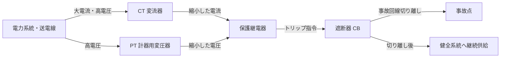

# 🔌 開閉装置・保護継電器

> 電力系統の「交通整理と救急体制」。故障を検出して系統から瞬時に切り離す仕組みが試験の核心。

!!! warning "⚠️ 未確認"
    このページはv0.5ドラフトです。数値・公式は参考書で確認してください。

---

## 🧠 直感的理解

3つの役割分担をアナロジーで理解する：

| 機器 | アナロジー | 実際の役割 |
|------|-----------|-----------|
| **CT・PT**（計器用変成器） | センサー・監視カメラ | 大電流・高電圧を計器用の小さな値に変換して検出 |
| **保護継電器** | 判断装置・救急隊指令 | 異常を検出して「切れ」の指令を発する |
| **遮断器（CB）** | 実際に切る刃 | 指令を受けて負荷電流・事故電流を実際に遮断する |
| **断路器（DS）** | 工事用バルブ | 無負荷時のみ開放（保守・点検用） |

**操作順序（最重要）**：
- **投入時**：DS（断路器）→ CB（遮断器）の順
- **開放時**：CB（遮断器）→ DS（断路器）の順

理由：DSは電流が流れている状態で開放できないため、必ず先にCBで電流を切ってからDSを開ける。

---

## 🏭 設備を歩く（保護システムの流れ）



**検出から遮断までの時間**：数十〜数百ミリ秒（高速遮断が求められる）

---

## 🔧 開閉装置の比較表（最重要）

| 機器 | 略称 | 負荷電流遮断 | 事故電流遮断 | 機能 | 用途・特記 |
|------|------|:-----------:|:-----------:|------|-----------|
| **断路器** | DS | × | × | 無負荷時のみ開放可能 | 保守・点検時の電路分離 |
| **遮断器** | CB | ○ | ○ | 負荷電流・事故電流の両方遮断 | 系統保護の中心機器 |
| **負荷開閉器** | LBS | ○ | × | 負荷電流は開放可能 | 事故電流は遮断不可 |
| **高圧交流負荷開閉器** | PAS | ○ | × | 柱上設置 | 高圧需要家の引込口 |
| **地絡継電器付き開閉器** | UGS | ○ | × | 地絡検出機能内蔵 | 地中線引込・波及事故防止 |

!!! danger "断路器の誤操作は厳禁"
    負荷電流が流れている状態でDSを開放すると**アーク放電**が発生し、機器破損・感電の危険がある。必ずCBで電流を遮断してからDSを操作すること。

---

## ⚡ 遮断器の種類比較

| 種類 | 略称 | 消弧媒体 | 特徴 | 主な用途 |
|------|------|---------|------|---------|
| **油遮断器** | OCB | 絶縁油 | 旧来型・火災リスクあり | 既存設備の一部に残存 |
| **空気遮断器** | ABB/ACB | 圧縮空気 | 騒音大・大型 | 大容量変電所（旧来型） |
| **ガス遮断器** | GCB/GIS | SF₆ガス | 絶縁性能が高い・小型化可能 | 都市型変電所・GIS（ガス絶縁開閉装置） |
| **真空遮断器** | VCB | 真空 | 保守容易・環境負荷小・小型 | **変電所・工場の主流** |

!!! tip "現在の主流"
    新設備は **VCB（真空遮断器）** または **GCB（SF₆ガス遮断器）** が主流。GISは複数機器を一体化したガス絶縁の総合開閉装置。

**GIS（ガス絶縁開閉装置）**：CB・DS・LA等を金属容器に収め、SF₆ガスで絶縁。コンパクト・高信頼性・都市部変電所に最適。

---

## 🛡️ 保護継電器の比較表（最重要）

| 継電器 | 略称 | JIS番号 | 検出対象 | 動作条件 | 主な用途 |
|-------|------|---------|---------|---------|---------|
| **過電流継電器** | OCR | 51 | 過電流（短絡等） | 整定値以上の電流 | 線路・変圧器の短絡保護 |
| **地絡過電流継電器** | OCGR | 51G | 地絡電流 | 地絡電流が整定値以上 | 非接地系の地絡保護 |
| **地絡方向継電器** | DGR | 67G | 地絡の方向 | 地絡電流の流入方向判定 | 自家用構内の地絡・波及防止 |
| **不足電圧継電器** | UVR | 27 | 電圧低下 | 電圧が整定値以下 | 停電検出・系統解列 |
| **過電圧継電器** | OVR | 59 | 電圧上昇 | 電圧が整定値以上 | 単独運転防止・地絡検出 |
| **差動継電器** | 87 | 87 | 変圧器内部故障 | 入出力電流の差 | 変圧器・発電機の内部保護 |
| **距離継電器** | 21 | 21 | 線路インピーダンス | インピーダンス整定値以下 | 長距離送電線の保護 |

### 差動継電器（87）の原理

```
入力電流（CT1） ─┐
                  ├→ 差動比較 → 差が整定値超 → トリップ
出力電流（CT2） ─┘

正常時：入力≒出力 → 差≒0 → 動作しない
内部故障時：入力≠出力 → 差大 → 動作してトリップ
```

### CT・PT の変成比

| 変成器 | 変成比 | 変換内容 |
|-------|-------|---------|
| **CT**（変流器） | 一次電流 / 二次電流 = 変流比 | 大電流（例：1000A）→ 5A（計器用） |
| **PT**（計器用変圧器） | 一次電圧 / 二次電圧 = 変圧比 | 高電圧（例：6600V）→ 110V（計器用） |

!!! warning "CTの二次側開放禁止"
    CTの二次側を開放すると異常高電圧が発生し危険。PTと逆の注意事項。

---

## 💡 勘違いTOP3

**1. 断路器（DS）は「無負荷でないと開放できない」**
「断路器は事故電流を遮断できる」という選択肢は誤り。DSは電流ゼロ（無負荷）のときのみ安全に操作できる。電流遮断は遮断器（CB）の役割。

**2. 投入・開放の操作順序を逆に覚えない**
- 投入：**DS先 → CB後**（先に道を開けてからスイッチON）
- 開放：**CB先 → DS後**（先にスイッチOFFしてから道を閉じる）
「開放時はCB→DS」を確実に覚える。逆にするとアーク事故の原因。

**3. GISはSF₆ガス絶縁（空気絶縁ではない）**
GIS（Gas Insulated Switchgear）はSF₆（六フッ化硫黄）ガスを封入した気密容器。空気絶縁より絶縁性能が約3倍高く、コンパクト化が可能。

---

## ⚡ 正誤判定の急所

| 文章 | 正誤 | 解説 |
|------|------|------|
| 「断路器は事故電流を遮断できる」 | **誤** | 断路器は電流遮断能力なし。遮断器（CB）が担当 |
| 「真空遮断器の消弧媒体は真空である」 | **正** | VCBは真空中でアークを消弧する |
| 「差動継電器は変圧器の内部故障を検出する」 | **正** | 87番継電器が変圧器の巻線内部故障の主保護 |
| 「遮断器投入時はCB→DSの順で操作する」 | **誤** | 投入時は**DS→CB**の順。開放時がCB→DS |
| 「GISは圧縮空気を絶縁媒体に使用する」 | **誤** | GISはSF₆（六フッ化硫黄）ガスを使用 |
| 「距離継電器は送電線の事故点のインピーダンスで動作する」 | **正** | 事故点までのインピーダンスが整定値以下になると動作 |
| 「CTの二次側を開放しても問題ない」 | **誤** | 二次側開放により異常高電圧が発生し危険 |
| 「地絡方向継電器（DGR）は電流の大きさだけで地絡を判定する」 | **誤** | 電流の大きさに加え**方向（位相）**も判定する |

---

## 📊 出題実績

| 年度 | 問 | タイトル | 問題タイプ | 難易度 |
|------|---|---------|----------|--------|
| R07下 | 問8 | 変電所の機器に関する記述 | 論説 | ★★★☆☆ |
| R07上 | 問8 | 変電所の遮断器・断路器・保護継電器 | 穴埋 | ★★★☆☆ |
| R06下 | 問8 | 変電所における遮断器の種類と特徴 | 論説 | ★★★★☆ |
| R06上 | 問8 | 保護継電器の種類と用途 | 穴埋 | ★★★☆☆ |
| R05下 | 問8 | GISに使用される断路器と遮断器の操作順序 | 論説 | ★★☆☆☆ |
| R05上 | 問8 | 変電所で使用する機器の特徴 | 穴埋 | ★★☆☆☆ |
| R04下 | 問8 | CTとVTの特徴と二次側開放禁止 | 論説 | ★★★☆☆ |
| R04上 | 問8 | 距離継電器と差動継電器の動作原理 | 論説 | ★★★★☆ |
| R03 | 問8 | 真空遮断器とGIS（SF₆）の特徴比較 | 穴埋 | ★★★☆☆ |
| R02 | 問8 | 開閉機器の種類と特徴 | 論説 | ★★☆☆☆ |
| R01 | 問8 | 保護継電器方式の種類 | 論説 | ★★★★☆ |

> 詳細解説: [電験王 開閉・保護カテゴリ](https://denken-ou.com/denryoku/?cat=kaiheihogo)

!!! info "学習の優先順位"
    1. **断路器 vs 遮断器の違い**（遮断能力の有無）
    2. **投入・開放の操作順序**（DS→CB / CB→DS）
    3. **主要継電器の略称と用途**（OCR・DGR・87・21）
    4. **GISはSF₆ガス**（空気絶縁との混同に注意）
    5. CTの二次側開放禁止
