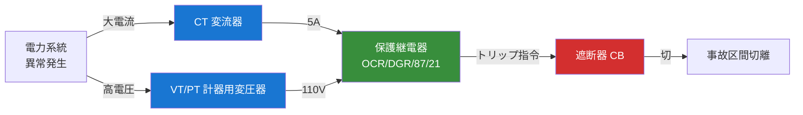

# 開閉装置・保護継電器（hub）

> 電力系統の「**センサー → 判断 → 切る**」3 段を俯瞰する hub ページ。詳細は機能別の 3 ページに分離。

!!! note "🗺️ 棲み分けマップ（v2.0 で 3 分割）"
    | ページ | 役割 | 機能位置 |
    |---|---|---|
    | **[計器用変成器（VT・CT）](keiki-hensei.md)** | センサー（VT・CT・ZCT・EVT） | 系統信号を縮小して取り出す |
    | **[保護継電器](hogo-keiden.md)** | 判断装置（OCR・DGR・87・21 等） | 異常を検出してトリップ指令を出す |
    | **[遮断器・断路器](shadanki.md)** | 実行装置（CB・DS・LBS・PAS・UGS） | 指令を受けて実際に電流を切る |
    | **本ページ（hub）** | 全体俯瞰・学習ガイド・出題実績インデックス | 3 ページの繋がりを掴む |

    !!! tip "v2.0 で分離した理由"
        旧 v1.0 は遮断器（実行）と保護継電器（判断）を 1 ページに混在させていたが、`feedback_protection_device_terminology`（遮断器とリレー検出器は機能的に必ず分離する）に従い v2.0 で 3 ページに分離。学習者の誤読リスクを減らし、各テーマで合格基準の深さに到達できる構造にした。

---

## 全体フロー（センサー → 判断 → 切る）

```mermaid
graph LR
    A[電力系統<br/>異常発生] -->|大電流| B[CT 変流器]
    A -->|高電圧| C[VT/PT 計器用変圧器]
    B -->|5A| D[保護継電器<br/>OCR/DGR/87/21]
    C -->|110V| D
    D -->|トリップ指令| E[遮断器 CB]
    E -->|切| F[事故区間切離]

    click B "keiki-hensei.html" "計器用変成器ページへ"
    click C "keiki-hensei.html" "計器用変成器ページへ"
    click D "hogo-keiden.html" "保護継電器ページへ"
    click E "shadanki.html" "遮断器ページへ"

    style B fill:#1976d2,color:#fff
    style C fill:#1976d2,color:#fff
    style D fill:#388e3c,color:#fff
    style E fill:#d32f2f,color:#fff
```

**検出から遮断までの時間**：数十〜数百ミリ秒（高速遮断が求められる）

---

## 3 役割の分担表

| 役割 | アナロジー | 機能 | 代表機器 | 詳細ページ |
|---|---|---|---|---|
| **センサー** | 監視カメラ | 系統の電流・電圧を計器用に縮小 | CT・VT・ZCT・EVT | [計器用変成器](keiki-hensei.md) |
| **判断装置** | 救急隊指令 | 異常を検出して「切れ」を指令 | OCR・DGR・87・21 等 | [保護継電器](hogo-keiden.md) |
| **実行装置** | 高速シャッター | 負荷電流・事故電流を実際に遮断 | CB・DS・LBS 等 | [遮断器・断路器](shadanki.md) |

---

## 学習ガイド（どこから読むか）

### 初学者向け（順序学習）

1. **本ページ（hub）** で全体フローを把握
2. **[計器用変成器](keiki-hensei.md)** でセンサー側の取扱い（CT 開放禁止／VT 短絡禁止）
3. **[遮断器・断路器](shadanki.md)** で実行側（DS→CB 順序／GIS の絶縁媒体）
4. **[保護継電器](hogo-keiden.md)** で判断側（定限時・反限時／差動原理）

### 直前対策（頻出論点直撃）

| 論点 | 出題頻度 | 該当ページ |
|---|---|---|
| CT 二次開放禁止 | ★★★ | [計器用変成器 §5](keiki-hensei.md#5) |
| DS→CB の操作順序 | ★★★ | [遮断器 §1](shadanki.md#1) |
| GIS の絶縁媒体 = SF₆ | ★★★ | [遮断器 §5](shadanki.md#5) |
| DGR は方向も判定 | ★★☆ | [保護継電器 §4](hogo-keiden.md#4) |
| 差動継電器（87）の保護範囲 | ★★☆ | [保護継電器 §4](hogo-keiden.md#4) |

---

## 出題実績インデックス（hub 視点）

| 年度 | 問 | 出題内容 | 該当ページ |
|------|---|---------|---------|
| R07下 | 問8 | 変電所の機器に関する記述 | [遮断器](shadanki.md#8) |
| R07上 | 問8 | 変電所の遮断器・断路器・保護継電器 | [遮断器](shadanki.md#8) ＋ [保護継電器](hogo-keiden.md) |
| R06下 | 問8 | 変電所における遮断器の種類と特徴 | [遮断器](shadanki.md#8) |
| **R06下** | **問7** | **計器用変成器の取扱い上の注意点** | **[計器用変成器](keiki-hensei.md#8)** |
| R06上 | 問8 | 保護継電器の種類と用途 | [保護継電器](hogo-keiden.md#8) |
| R05下 | 問8 | GIS に使用される断路器と遮断器の操作順序 | [遮断器](shadanki.md#8) |
| R05上 | 問8 | 変電所で使用する機器の特徴 | [遮断器](shadanki.md#8) |
| **R05上** | **問7** | **変電所の計器用変成器** | **[計器用変成器](keiki-hensei.md#8)** |
| R04下 | 問8 | CT と VT の特徴と二次側開放禁止 | [計器用変成器](keiki-hensei.md#8)（センサー） |
| R04上 | 問8 | 距離継電器と差動継電器の動作原理 | [保護継電器](hogo-keiden.md#8) |
| R03 | 問8 | 真空遮断器と GIS（SF₆）の特徴比較 | [遮断器](shadanki.md#8) |
| **R03** | **問7** | **変電所の計器用変成器** | **[計器用変成器](keiki-hensei.md#8)** |
| R02 | 問8 | 開閉機器の種類と特徴 | [遮断器](shadanki.md#8) |
| R01 | 問8 | 保護継電器（OCR）の動作時間（計算） | [保護継電器](hogo-keiden.md#8) |

> 詳細解説: [電験王 開閉・保護カテゴリ](https://denken-ou.com/denryoku/?cat=kaiheihogo)

!!! note "頻度サマリ"
    - **問 8 枠**（遮断器・継電器系）：毎年確実に出題（R01〜R07 で 11 問）
    - **問 7 枠**（計器用変成器）：R03・R05 上・R06 下で 3 年連続出題 → 固定論点化
    - 合計 **14 問 / 5 年** が hub 配下のテーマで、電力科目の **約 1/3 を占める最重要領域**

---

## 関連ページ

- [計器用変成器（VT・CT）](keiki-hensei.md) — センサー側詳細
- [保護継電器](hogo-keiden.md) — 判断側詳細（OCR/DGR/87/21）
- [遮断器・断路器（CB・DS）](shadanki.md) — 実行側詳細
- [変圧器](henatsuki.md) — 差動継電器 87 の保護対象
- [架空送電線路](kakuu-souden.md) — 距離継電器 21 の適用先
