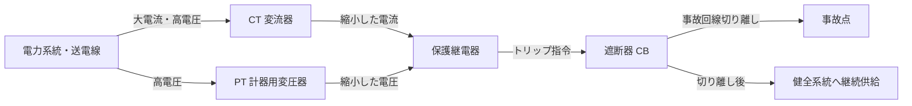

# 🔌 開閉装置・保護継電器

> 電力系統の「交通整理と救急体制」。故障を検出して系統から瞬時に切り離す仕組みが試験の核心。

---

## 🧠 直感的理解

3つの役割分担をアナロジーで理解する：

| 機器 | アナロジー | 実際の役割 |
|------|-----------|-----------|
| **CT・PT**（計器用変成器） | センサー・監視カメラ | 大電流・高電圧を計器用の小さな値に変換して検出 |
| **保護継電器** | 判断装置・救急隊指令 | 異常を検出して「切れ」の指令を発する |
| **遮断器（CB）** | 実際に切る刃 | 指令を受けて負荷電流・事故電流を実際に遮断する |
| **断路器（DS）** | 工事用バルブ | 無負荷時のみ開放（保守・点検用） |

**操作順序（最重要）**：
- **投入時**：==DS（断路器）→ CB（遮断器）の順==
- **開放時**：==CB（遮断器）→ DS（断路器）の順==

!!! note "なぜDS→CBの順で投入するのか（因果理解）"
    断路器（DS）は**電流遮断能力を持たない**。DSの接触子はアーク消弧機能を持たないため、電流が流れた状態で開放するとアーク放電が持続し機器を破損する。  
    投入時：まずDSを閉じて回路を形成し、その後CBを閉じる。電流はCBが入った瞬間から流れ始めるため、DSはゼロ電流の状態で操作できる。  
    開放時：先にCBを開いて電流をゼロにしてからDSを開く。逆にするとDSがアーク電流を遮断しようとして焼損する。

---

## 🏭 設備を歩く（保護システムの流れ）


```mermaid
graph LR
    A[電力系統・送電線] -->|大電流・高電圧| B[CT 変流器]
    A -->|高電圧| C[PT 計器用変圧器]
    B -->|縮小した電流| D[保護継電器]
    C -->|縮小した電圧| D
    D -->|トリップ指令| E[遮断器 CB]
    E -->|事故回線切り離し| F[事故点]
    E -->|切り離し後| G[健全系統へ継続供給]
```

**検出から遮断までの時間**：数十〜数百ミリ秒（高速遮断が求められる）

---

## 🔧 開閉装置の比較表（最重要）

| 機器 | 略称 | 負荷電流遮断 | 事故電流遮断 | 機能 | 用途・特記 |
|------|------|:-----------:|:-----------:|------|-----------|
| **断路器** | DS | × | × | 無負荷時のみ開放可能 | 保守・点検時の電路分離 |
| **遮断器** | CB | ○ | ○ | 負荷電流・事故電流の両方遮断 | 系統保護の中心機器 |
| **負荷開閉器** | LBS | ○ | × | 負荷電流は開放可能 | 事故電流は遮断不可 |
| **高圧交流負荷開閉器** | PAS | ○ | × | 柱上設置 | 高圧需要家の引込口 |
| **地絡継電器付き開閉器** | UGS | ○ | × | 地絡検出機能内蔵 | 地中線引込・波及事故防止 |

!!! warning "【頻出引っかけ】断路器（DS）の誤操作"
    「断路器は電流を遮断できる」→ **誤り**。断路器には電流遮断能力がない。  
    負荷電流が流れた状態でDSを開放するとアーク放電が発生し、機器破損・感電の危険がある。  
    必ずCBで電流を遮断してからDSを操作すること。試験では「断路器で事故電流を遮断した」という記述は誤り。

---

## ⚡ 遮断器の種類比較

| 種類 | 略称 | 消弧媒体 | 特徴 | 主な用途 |
|------|------|---------|------|---------|
| **油遮断器** | OCB | 絶縁油 | 旧来型・火災リスクあり | 既存設備の一部に残存 |
| **空気遮断器** | ABB/ACB | 圧縮空気 | 騒音大・大型 | 大容量変電所（旧来型） |
| **ガス遮断器** | GCB/GIS | SF₆ガス | 絶縁性能が高い・小型化可能 | 都市型変電所・GIS（ガス絶縁開閉装置） |
| **真空遮断器** | VCB | 真空 | 保守容易・環境負荷小・小型 | ==**変電所・工場の主流**== |

!!! note "GIS・VCBが主流になった物理的理由"
    **VCB（真空遮断器）**: 真空中では気体分子がないためアークを維持できず、電流がゼロになる瞬間に消弧する。保守が少なく、油も不要で環境負荷が小さい。  
    **GIS（ガス絶縁開閉装置）**: SF₆ガスは空気の約3倍の絶縁耐力を持つ。高絶縁性により機器をコンパクト化でき、都市部の狭い敷地に建設できる。CB・DS・LA等を1つの金属容器に収めた一体型設備。

!!! warning "【頻出引っかけ】GISの絶縁媒体"
    「GISは圧縮空気を絶縁媒体に使用する」→ **誤り**。GISはSF₆（六フッ化硫黄）ガスを使用。空気遮断器（ACB）が圧縮空気を使用する。混同注意。

---

## 🛡️ 保護継電器の比較表（最重要）

| 継電器 | 略称 | JIS番号 | 検出対象 | 動作条件 | 主な用途 |
|-------|------|---------|---------|---------|---------|
| **過電流継電器** | OCR | 51 | 過電流（短絡等） | 整定値以上の電流 | 線路・変圧器の短絡保護 |
| **地絡過電流継電器** | OCGR | 51G | 地絡電流 | 地絡電流が整定値以上 | 非接地系の地絡保護 |
| **地絡方向継電器** | DGR | 67G | 地絡の方向 | 地絡電流の流入方向判定 | 自家用構内の地絡・波及防止 |
| **不足電圧継電器** | UVR | 27 | 電圧低下 | 電圧が整定値以下 | 停電検出・系統解列 |
| **過電圧継電器** | OVR | 59 | 電圧上昇 | 電圧が整定値以上 | 単独運転防止・地絡検出 |
| **差動継電器** | 87 | 87 | 変圧器内部故障 | 入出力電流の差 | 変圧器・発電機の内部保護 |
| **距離継電器** | 21 | 21 | 線路インピーダンス | インピーダンス整定値以下 | 長距離送電線の保護 |

!!! note "OCRの定限時・反限時特性（因果理解）"
    **定限時特性**: 整定値を超えた電流の大きさに関わらず、一定の時限（遅延時間）後にトリップする。電流が大きくても小さくても同じ時間で動作。  
    **反限時特性**: 電流が大きいほど短い時間でトリップする（電流と動作時間が反比例の関係）。  
    なぜ反限時特性が必要か→ 事故電流が大きい＝事故の深刻度が高い＝早期に遮断すべき、という論理に合致する。系統への影響が大きい事故ほど迅速に遮断できる。

### 差動継電器（87）の原理

```
入力電流（CT1） ─┐
                  ├→ 差動比較 → 差が整定値超 → トリップ
出力電流（CT2） ─┘

正常時：入力≒出力 → 差≒0 → 動作しない
内部故障時：入力≠出力 → 差大 → 動作してトリップ
```

!!! note "差動継電器が変圧器内部故障を検出できる理由"
    変圧器が正常動作している場合、一次側電流と二次側電流は変圧比に従って一定の比率を保つ。差動継電器は両者の差を監視しており、正常時は差≒0。  
    内部故障（巻線間短絡・地絡等）が発生すると、故障電流の一部が変圧器内部を短絡経路で流れ、一次・二次の電流比が崩れる。この「差」を検出してトリップする。外部短絡では一次・二次の差が出ないため誤動作しない。

### CT・PT の変成比

| 変成器 | 変成比 | 変換内容 |
|-------|-------|---------|
| **CT**（変流器） | 一次電流 / 二次電流 = 変流比 | 大電流（例：1000A）→ 5A（計器用） |
| **PT**（計器用変圧器） | 一次電圧 / 二次電圧 = 変圧比 | 高電圧（例：6600V）→ 110V（計器用） |

!!! warning "【頻出引っかけ】CTの二次側開放禁止"
    「CTの二次側を開放しても問題ない」→ **誤り**。  
    CTは一次電流（大電流）を強制的に流す電流源として動作する。二次側を開放すると一次電流を磁化電流として全量使用しようとし、鉄心が磁気飽和して**異常高電圧が二次側に発生**する。PTとは逆の注意事項。PTは二次側短絡禁止。CT・PTを混同した出題が頻繁に出る。

!!! warning "【頻出引っかけ】DGRの動作条件"
    「地絡方向継電器（DGR）は電流の大きさだけで地絡を判定する」→ **誤り**。  
    DGRは**電流の大きさと方向（位相）の両方**を判定する。方向を判定することで、自構内の地絡か隣接回路の地絡かを区別し、不要動作（波及事故）を防ぐことができる。

---

## 📊 出題実績

| 年度 | 問 | 出題内容 | 問題タイプ | 難易度 |
|------|---|---------|----------|--------|
| R07下 | 問8 | 変電所の機器に関する記述 | 論説 | ★★★☆☆ |
| R07上 | 問8 | 変電所の遮断器・断路器・保護継電器 | 穴埋 | ★★★☆☆ |
| R06下 | 問8 | 変電所における遮断器の種類と特徴 | 論説 | ★★★★☆ |
| R06上 | 問8 | 保護継電器の種類と用途 | 穴埋 | ★★★☆☆ |
| R05下 | 問8 | GISに使用される断路器と遮断器の操作順序 | 論説 | ★★☆☆☆ |
| R05上 | 問8 | 変電所で使用する機器の特徴 | 穴埋 | ★★☆☆☆ |
| R04下 | 問8 | CTとVTの特徴と二次側開放禁止 | 論説 | ★★★☆☆ |
| R04上 | 問8 | 距離継電器と差動継電器の動作原理 | 論説 | ★★★★☆ |
| R03 | 問8 | 真空遮断器とGIS（SF₆）の特徴比較 | 穴埋 | ★★★☆☆ |
| R02 | 問8 | 開閉機器の種類と特徴 | 論説 | ★★☆☆☆ |
| R01 | 問8 | 保護継電器方式の種類 | 論説 | ★★★★☆ |

> 詳細解説: [電験王 開閉・保護カテゴリ](https://denken-ou.com/denryoku/?cat=kaiheihogo)

---

## ⚡ 正誤判定の急所

| 文章 | 正誤 | 解説 |
|------|------|------|
| 「断路器は事故電流を遮断できる」 | **誤** | 断路器は電流遮断能力なし。遮断器（CB）が担当 |
| 「真空遮断器の消弧媒体は真空である」 | **正** | VCBは真空中でアークを消弧する |
| 「差動継電器は変圧器の内部故障を検出する」 | **正** | 87番継電器が変圧器の巻線内部故障の主保護 |
| 「遮断器投入時はCB→DSの順で操作する」 | **誤** | 投入時は**DS→CB**の順。開放時がCB→DS |
| 「GISは圧縮空気を絶縁媒体に使用する」 | **誤** | GISはSF₆（六フッ化硫黄）ガスを使用 |
| 「距離継電器は送電線の事故点のインピーダンスで動作する」 | **正** | 事故点までのインピーダンスが整定値以下になると動作 |
| 「CTの二次側を開放しても問題ない」 | **誤** | 二次側開放により異常高電圧が発生し危険 |
| 「地絡方向継電器（DGR）は電流の大きさだけで地絡を判定する」 | **誤** | 電流の大きさに加え**方向（位相）**も判定する |

---

## 🎓 学習の優先順位

1. **断路器 vs 遮断器の違い**（遮断能力の有無）
2. **投入・開放の操作順序**（DS→CB / CB→DS）
3. **主要継電器の略称と用途**（OCR・DGR・87・21）
4. **GISはSF₆ガス**（空気絶縁との混同に注意）
5. CTの二次側開放禁止（PTとの違い）

---

## 関連ページ

- [計器用変成器（VT・CT）](keiki-hensei.md) — CT・PT の取扱い・極性・残留回路（本ページの「センサー側」を独立解説）
- [変圧器](henatsuki.md) — 差動継電器87の保護対象、変圧器内部故障
- [架空送電線路](kakuu-souden.md) — 距離継電器21の適用、送電線保護
