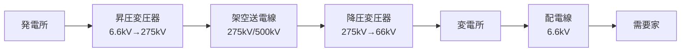
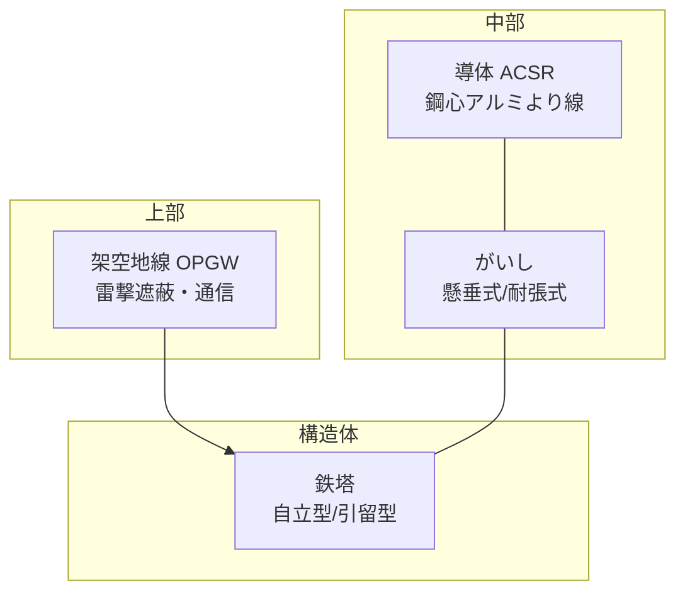

# 架空送電線路

## 1. 直感的理解

**架空送電線路の本質**: 電線は完全な導体ではない。電流が流れると抵抗Rで電圧降下が起き、リアクタンスXでも位相ずれによる電圧降下が起きる。結果として**送電端と受電端の電圧が異なる**。

### 高電圧送電のメリット

電力 $P = \sqrt{3} V_L I_L \cos\theta$（三相）

同じ電力を送るなら、電圧を高くすれば電流 $I$ が小さくなる。

電力損失 $P_{loss} = 3I^2 R$。電流が1/10になれば損失は1/100。

だから送電線は275kV・500kVの超高圧で送り、変電所で降圧して配電する。

### 電圧降下のイメージ

```
送電端 Vs ──[R+jX]── 受電端 Vr
              ↑
        ここで電圧が下がる
```

> **5秒で思い出す**
>
> **送電端電圧 Vs = 受電端電圧 Vr + 電圧降下 ΔV**
>
> ΔV の中身は「抵抗成分（力率に比例）＋リアクタンス成分（無効成分に比例）」

---

## 2. 設備を歩く

### 送電システム全体



### 架空送電線路の構成要素



### 主要機器テーブル

| 機器 | 正式名・略称 | 役割 | ポイント |
|------|-------------|------|---------|
| 導体 | ACSR（鋼心アルミより線） | 電流を流す | 鋼心で強度確保、外周アルミで導電。表皮効果でアルミ部を有効活用 |
| がいし | 懸垂がいし / 耐張がいし | 導体と鉄塔を電気的に絶縁し機械的に支持 | 電圧階級に応じて連結数が変わる（1連あたり約10kV） |
| 鉄塔 | 自立型・引留型 | 送電線を空中に支持 | 基礎部は鉄筋コンクリート。耐風・耐雪設計 |
| 架空地線 | OPGW（光ファイバ複合架空地線） | 直撃雷から導体を保護。通信回線も兼ねる | 鉄塔頂部に設置。遮蔽角を小さくするほど保護効果大 |
| 誘導障害防止設備 | 中和変流器・連結方式 | 通信線への電磁誘導障害を低減 | 大電流が流れる送電線は通信線に誘起電圧を発生させる |

---

## 3. 送電線の電気的特性

| パラメータ | 記号 | 意味 | 短距離線路 | 長距離線路 |
|-----------|------|------|-----------|-----------|
| 抵抗 | R [Ω] | 導体の電気抵抗。電力損失の原因 | 必ず考慮 | 必ず考慮 |
| リアクタンス | X [Ω] | 電流の位相遅れによる電圧降下 | 必ず考慮 | 必ず考慮 |
| サセプタンス | B [S] | 線路の対地静電容量による充電電流 | 無視可（100km以下） | 考慮必須 |
| コンダクタンス | G [S] | コロナ損・漏れ電流 | 通常無視 | 通常無視 |

**短距離モデル（集中定数）**: R と X のみで計算（電験3種の主戦場）

**長距離モデル（分布定数）**: R・X・B を分布定数として扱う（電験3種では概念問題として出題）

---

## 4. 架空送電線路の障害比較表

| 障害 | 種類 | 原因 | 主な対策 |
|------|------|------|---------|
| 雷害 | 直撃雷（ライン側への直撃） | 落雷が導体に直撃 | 架空地線の設置（遮蔽角を小さく） |
| 雷害 | 誘導雷（感応雷） | 落雷の電磁界変化が誘起電圧を発生 | 避雷器（アレスタ）の設置 |
| 雷害 | 逆フラッシオーバー | 鉄塔の大地抵抗が高く、雷撃後に塔電位が上昇してがいしが絶縁破壊 | 接地抵抗低減（埋設地線） |
| コロナ障害 | コロナ放電 | 導体表面の電界がコロナ臨界電界を超える | 太い導体・多導体方式・コロナリング |
| 振動 | 微風振動 | 弱風でカルマン渦が生じ導体が上下振動 | ストックブリッジダンパの設置 |
| 振動 | ギャロッピング | 着雪した導体が強風で大振幅振動 | オフセット架線・スペーサ |
| 塩害 | 塩分汚損フラッシオーバー | 塩分付着でがいし表面が導電化 | 耐塩がいし・シリコーン塗布・洗浄 |
| スリート | スリートジャンプ | 着氷雪が一斉脱落して導体が跳ね上がる | オフセット配置（上下相を互い違いに） |
| フラッシオーバー | 雷サージによる絶縁破壊 | 雷サージ電圧ががいし連の絶縁強度を超える | 避雷器・不平衡絶縁 |

---

## 5. 公式マップ（最重要）

### レイヤーA: 電圧降下と電力損失

#### 三相3線式の電圧降下

$$\boxed{\Delta V = \sqrt{3} \cdot I (R\cos\theta + X\sin\theta) \quad [V]}$$

- $I$: 線電流 [A]
- $R$: 1線あたりの抵抗 [Ω]
- $X$: 1線あたりのリアクタンス [Ω]
- $\cos\theta$: 受電端の力率、$\sin\theta = \sqrt{1-\cos^2\theta}$

送電端電圧（線間）:

$$V_s = V_r + \Delta V$$

#### 単相2線式の電圧降下

$$\Delta V = 2I(R\cos\theta + X\sin\theta) \quad [V]$$

往復2線分の降下なので係数が **2**。三相の $\sqrt{3}$ との違いに注意。

#### 電力損失

$$P_{loss} = 3I^2 R \quad [W] \quad \text{（三相3線式）}$$

$$P_{loss} = 2I^2 R \quad [W] \quad \text{（単相2線式）}$$

電力損失は「電流の2乗に比例」「抵抗に比例」。力率には直接関係しない（電流値の中に力率が反映されている）。

---

### レイヤーB: 効率・電圧降下率・フェランチ効果

#### 送電効率

$$\eta = \frac{P_r}{P_s} \times 100 = \frac{P_r}{P_r + P_{loss}} \times 100 \quad [\%]$$

- $P_r$: 受電端電力 [W]
- $P_s$: 送電端電力 [W]

#### 百分率電圧降下率

$$\delta = \frac{\Delta V}{V_r} \times 100 \quad [\%]$$

#### フェランチ効果

**定義**: 軽負荷時・無負荷時に受電端電圧が送電端電圧より**高くなる**現象。

**原因**: 送電線の対地静電容量（サセプタンスB）により充電電流が流れる。この充電電流（進み電流）がリアクタンスで電圧上昇を引き起こす。

**対策**: 分路リアクトル（シャントリアクトル）を設置して進み電流を吸収する。

> フェランチ効果は「電圧降下の逆方向」という感覚と逆なので要注意。長い送電線や地中ケーブル（静電容量が大）で発生しやすい。

---

## 6. 解法パターン（最重要）

### パターン①: 三相3線式の電圧降下計算

**見分け方**: 「三相3線式」「送電端・受電端の電圧差」「力率」が与えられている

**手順**:

```
Step 1: 受電端電力・電圧・力率から線電流 I を求める
        P_r = √3 × V_r × I × cosθ
        → I = P_r / (√3 × V_r × cosθ)

Step 2: 電圧降下を計算
        ΔV = √3 × I × (R cosθ + X sinθ)

Step 3: 送電端電圧を求める
        Vs = Vr + ΔV
```

**例題**: 三相3線式、受電端電圧 Vr = 66kV、受電電力 20MW、力率 0.8（遅れ）、R = 10Ω、X = 15Ω のとき送電端電圧は？

$$I = \frac{20 \times 10^6}{\sqrt{3} \times 66 \times 10^3 \times 0.8} = \frac{20 \times 10^6}{91,455} \approx 218.7 \text{ A}$$

$$\sin\theta = \sqrt{1 - 0.8^2} = 0.6$$

$$\Delta V = \sqrt{3} \times 218.7 \times (10 \times 0.8 + 15 \times 0.6) = \sqrt{3} \times 218.7 \times 17 \approx 6,439 \text{ V} \approx 6.44 \text{ kV}$$

$$V_s = 66 + 6.44 \approx 72.4 \text{ kV}$$

---

### パターン②: 電力損失の計算

**見分け方**: 「線路損失」「電力損失」「銅損」のキーワード

**手順**:

```
Step 1: 受電端電力・電圧・力率から線電流 I を求める（パターン①と同じ）
Step 2: P_loss = 3I²R を計算
Step 3: 送電効率 η = Pr / (Pr + P_loss) × 100 を求める（問われた場合）
```

**重要な落とし穴**: Rは「1線あたりの抵抗」。問題で「1km あたり0.1Ω、線路長 50km」と与えられた場合 R = 0.1 × 50 = 5Ω。「往復」に注意（単相2線式は2Rになる）。

---

### パターン③: 百分率電圧降下率

**見分け方**: 「百分率電圧降下」「%電圧変動」のキーワード

**手順**:

```
Step 1: ΔV を計算（パターン①と同じ手順）
Step 2: δ = ΔV / Vr × 100 [%]
```

**注意**: $V_r$ は線間電圧か相電圧かを統一すること。

---

### パターン④: 三相/単相の判別と係数

| 方式 | 電圧降下 ΔV | 電力損失 $P_{loss}$ |
|------|------------|-------------------|
| 三相3線式 | $\sqrt{3} I(R\cos\theta + X\sin\theta)$ | $3I^2R$ |
| 単相2線式 | $2I(R\cos\theta + X\sin\theta)$ | $2I^2R$ |
| 単相3線式 | $I(R\cos\theta + X\sin\theta)$（片側） | 電圧線2本分 |

---

## 7. 勘違いTOP3

### 勘違い①: 「√3 の位置を間違える」

**誤った式**: $\Delta V = \sqrt{3} I \cdot R \cos\theta + X \sin\theta$（括弧を付け忘れる）

**正しい式**: $\Delta V = \sqrt{3} I (R\cos\theta + X\sin\theta)$

$\sqrt{3}$ は $(R\cos\theta + X\sin\theta)$ の**外側**全体にかかる。括弧を外すと計算が大きく変わる。

### 勘違い②: 「線電流と相電流を混同する」

Y結線: 線電流 = 相電流（$I_L = I_P$）

Δ結線: 線電流 = $\sqrt{3}$ × 相電流（$I_L = \sqrt{3} I_P$）

電圧降下の式で使う $I$ は**線電流**。問題がΔ結線の場合は相電流から線電流に変換する。

### 勘違い③: 「フェランチ効果で受電端電圧が低くなると思う」

**誤り。** フェランチ効果では受電端電圧が**高く**なる。

感覚的には「送電端から受電端に向かって電圧が下がる」はずなのに、逆になる現象だから混乱する。

記憶法: 「**フェランチ効果＝充電電流が悪さをして電圧が上がりすぎる現象**」。軽負荷や無負荷の深夜に発生しやすい。

---

## 8. 正誤判定の急所

| 文 | 判定 | 解説 |
|---|------|------|
| 送電線の電力損失は電流の2乗に比例する | **正** | $P_{loss} = 3I^2R$。電流が2倍になると損失は4倍 |
| 架空地線は雷の直撃から導体を守るために設置する | **正** | 遮蔽角を小さくするほど保護効果が高い |
| コロナ障害は電線表面の電界が低い場合に発生する | **誤** | 電界が**高い**（臨界電界を超える）場合に発生する |
| 三相3線式の電圧降下は $\Delta V = \sqrt{3} I R \cos\theta$ である | **誤** | リアクタンス項 $X\sin\theta$ が抜けている。$\Delta V = \sqrt{3}I(R\cos\theta + X\sin\theta)$ |
| フェランチ効果は重負荷時に発生しやすい | **誤** | 軽負荷・無負荷時に発生する。充電電流が支配的になる条件 |
| 微風振動対策にはストックブリッジダンパが使われる | **正** | 導体の振動エネルギーをダンパで吸収する |
| 単相2線式の電圧降下は三相3線式と同じ式で計算できる | **誤** | 単相2線式は $\Delta V = 2I(R\cos\theta + X\sin\theta)$（係数が2） |
| 逆フラッシオーバーの防止には接地抵抗を下げることが有効 | **正** | 鉄塔の接地抵抗を下げると雷撃時の塔電位上昇を抑制できる |

---

## 9. 出題実績

| 年度 | 問番号 | 難易度 | 内容 |
|------|--------|--------|------|
| 2023（R5）上期 | 問7 | 中 | 三相3線式の電圧降下計算（線電流・力率・R・Xが与えられる） |
| 2023（R5）下期 | 問8 | 中 | 送電効率の計算（受電電力・線路損失から効率を求める） |
| 2022（R4）下期 | 問7 | やや難 | 百分率電圧降下率と電力損失の複合計算 |
| 2021（R3）上期 | 問8 | 中 | フェランチ効果の説明と発生条件（正誤判定形式） |
| 2020（R2） | 問8 | 中 | 架空送電線路の障害種類（コロナ・雷害・振動の特徴と対策） |
| 2019（R1） | 問7 | やや難 | 三相3線式送電線路の送電端電圧・電力損失・送電効率の計算 |
| 2018（H30） | 問8 | 中 | ACSR・がいし・架空地線の特徴と役割（知識問題） |
| 2017（H29） | 問7 | 中 | 送電線の電圧降下と電圧降下率の計算（力率改善前後の比較） |

> **出題傾向まとめ**: 電圧降下計算が毎年のように出る最頻出テーマ。特に三相3線式は $\Delta V = \sqrt{3}I(R\cos\theta + X\sin\theta)$ を完全に使いこなせるまで反復練習すること。障害種類（雷害・コロナ・振動）の知識問題も定期的に出る。フェランチ効果は正誤判定問題で狙われやすい。
