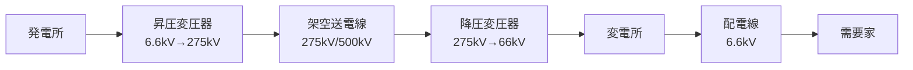
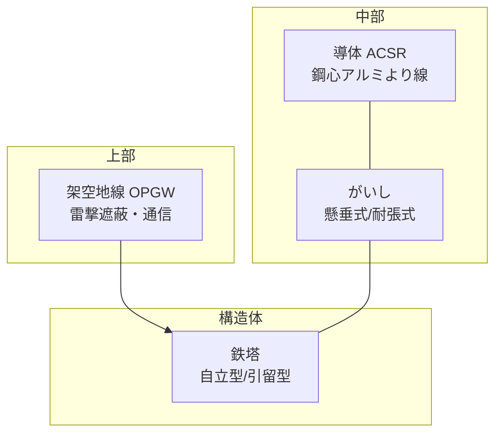

# 架空送電線路

## 1. 直感的理解 {#intuition}

**架空送電線路の本質**: 電線は完全な導体ではない。電流が流れると抵抗Rで電圧降下が起き、リアクタンスXでも位相ずれによる電圧降下が起きる。結果として**送電端と受電端の電圧が異なる**。

### 高電圧送電のメリット

電力 $P = \sqrt{3} V_L I_L \cos\theta$（三相）

同じ電力を送るなら、電圧を高くすれば電流 $I$ が小さくなる。

電力損失 $P_{loss} = 3I^2 R$。電流が1/10になれば損失は1/100。

だから送電線は275kV・500kVの超高圧で送り、変電所で降圧して配電する。

### 電圧降下のイメージ

```
送電端 Vs ──[R+jX]── 受電端 Vr
              ↑
        ここで電圧が下がる
```

送電端電圧 Vs = 受電端電圧 Vr + 電圧降下 ΔV

ΔV の中身は「抵抗成分（力率に比例）＋リアクタンス成分（無効成分に比例）」

---

## 2. 設備を歩く {#walk}

### 送電システム全体


```mermaid
graph LR
    A[発電所] --> B[昇圧変圧器<br/>6.6kV→275kV]
    B --> C[架空送電線<br/>275kV/500kV]
    C --> D[降圧変圧器<br/>275kV→66kV]
    D --> E[変電所]
    E --> F[配電線<br/>6.6kV]
    F --> G[需要家]
```

### 架空送電線路の構成要素


```mermaid
graph TD
    subgraph 上部
        A[架空地線 OPGW<br/>雷撃遮蔽・通信]
    end
    subgraph 中部
        B[導体 ACSR<br/>鋼心アルミより線]
        C[がいし<br/>懸垂式/耐張式]
    end
    subgraph 構造体
        D[鉄塔<br/>自立型/引留型]
    end
    A --> D
    B --- C
    C --- D
```

### 主要機器テーブル

| 機器 | 正式名・略称 | 役割 | ポイント |
|------|-------------|------|---------|
| 導体 | ACSR（鋼心アルミより線） | 電流を流す | 鋼心で強度確保、外周アルミで導電。表皮効果でアルミ部を有効活用 |
| がいし | 懸垂がいし / 耐張がいし | 導体と鉄塔を電気的に絶縁し機械的に支持 | 電圧階級に応じて連結個数が変わる（1個あたり約10〜15kV分担） |
| 鉄塔 | 自立型・引留型 | 送電線を空中に支持 | 基礎部は鉄筋コンクリート。耐風・耐雪設計 |
| 架空地線 | OPGW（光ファイバ複合架空地線） | 直撃雷から導体を保護。通信回線も兼ねる | 鉄塔頂部に設置。遮蔽角を小さくするほど保護効果大 |
| 誘導障害防止設備 | 中和変流器・連結方式 | 通信線への電磁誘導障害を低減 | 大電流が流れる送電線は通信線に誘起電圧を発生させる |

---

## 3. 送電線の電気的特性

| パラメータ | 記号 | 意味 | 短距離線路 | 長距離線路 |
|-----------|------|------|-----------|-----------|
| 抵抗 | R [Ω] | 導体の電気抵抗。電力損失の原因 | 必ず考慮 | 必ず考慮 |
| リアクタンス | X [Ω] | 電流の位相遅れによる電圧降下 | 必ず考慮 | 必ず考慮 |
| サセプタンス | B [S] | 線路の対地静電容量による充電電流 | 無視可（100km以下） | 考慮必須 |
| コンダクタンス | G [S] | コロナ損・漏れ電流 | 通常無視 | 通常無視 |

!!! note "短距離モデルと長距離モデルの使い分け"
    電験3種の計算問題は**集中定数（R・Xのみ）**が主戦場。サセプタンスBは100km以下では無視できる。無視できる根拠は「線路の対地静電容量による充電電流は線路長が短いほど小さく、電圧降下への寄与が十分小さいから」。長距離（超高圧・長距離幹線）では充電電流が無視できなくなり、フェランチ効果など特有の現象が現れる。

**短距離モデル（集中定数）**: R と X のみで計算（電験3種の主戦場）

**長距離モデル（分布定数）**: R・X・B を分布定数として扱う（電験3種では概念問題として出題）

---

## 4. 架空送電線路の障害比較表 {#comparison}

| 障害 | 種類 | 原因 | 主な対策 |
|------|------|------|---------|
| 雷害 | 直撃雷（ライン側への直撃） | 落雷が導体に直撃 | 架空地線の設置（遮蔽角を小さく） |
| 雷害 | 誘導雷（感応雷） | 落雷の電磁界変化が誘起電圧を発生 | 避雷器（アレスタ）の設置 |
| 雷害 | 逆フラッシオーバー | 鉄塔の大地抵抗が高く、雷撃後に塔電位が上昇してがいしが絶縁破壊 | 接地抵抗低減（埋設地線） |
| コロナ障害 | コロナ放電 | 導体表面の電界がコロナ臨界電界を超える | 太い導体・多導体方式・コロナリング |
| 振動 | 微風振動 | 弱風でカルマン渦が生じ導体が上下振動 | ストックブリッジダンパの設置 |
| 振動 | ギャロッピング | 着雪した導体が強風で大振幅振動 | オフセット架線・スペーサ |
| 塩害 | 塩分汚損フラッシオーバー | 塩分付着でがいし表面が導電化 | 耐塩がいし・シリコーン塗布・洗浄 |
| スリート | スリートジャンプ | 着氷雪が一斉脱落して導体が跳ね上がる | オフセット配置（上下相を互い違いに） |
| フラッシオーバー | 雷サージによる絶縁破壊 | 雷サージ電圧ががいし連の絶縁強度を超える | 避雷器・不平衡絶縁 |

!!! note "コロナ放電が起きる物理的理由"
    導体表面の電界強度が空気の絶縁破壊電界（約30kV/cm）を超えると、周囲の空気がイオン化されてコロナ放電が発生する。電界強度は「導体表面から外側に向かって反比例（1/r）で減少」するため、導体の半径が小さいほど（細い導体ほど）同じ電圧でも表面電界が高くなる。多導体方式や太い導体を使う理由は「単位長さあたりの等価半径を大きくして表面電界を下げる」ことにある。

!!! note "逆フラッシオーバーが起きる物理的理由"
    通常のフラッシオーバーは「導体（高電位）→がいし→鉄塔（接地）」方向に絶縁破壊が進む。逆フラッシオーバーは**鉄塔の接地抵抗が高い**場合に生じる。落雷 → 鉄塔に雷電流が流れる → 塔基部で電位上昇（V = 雷電流 × 接地抵抗）→ 塔電位が導体電位を上回る → 「鉄塔（高電位）→ がいし → 導体」方向にフラッシオーバー。対策が「接地抵抗の低減」である理由がここにある。

!!! tip "🎯 避雷器（合格基準対応ナビ）"
    避雷器そのものの素子原理・特性は **R07下問6**（5 年で 1 問）の単独出題実績がある。本ページでは雷害対策の文脈で登場するが、合格基準では次の 2 観点を押さえれば足りる：

    1. **ZnO（酸化亜鉛）素子の非直線性抵抗** → [電気材料 §3 ZnO 素子](denki-zairyou.md#zno)
    2. **設置位置（変電所周辺機器・GIS 内蔵）** → [遮断器 §5 GIS](shadanki.md#gis)（GIS 一体型に LA 含む）

    本領域は 5 年 1 問の番外ポジションのため独立ページは設けず、雷害対策セクションと電気材料ページの ZnO 記述で必要十分。

---

## 5. 公式マップ（最重要） {#formula-map}

### レイヤーA: 電圧降下と電力損失

#### 三相3線式の電圧降下

$$\boxed{\Delta V = \sqrt{3} \cdot I (R\cos\theta + X\sin\theta) \quad [V]}$$

- $I$: 線電流 [A]
- $R$: 1線あたりの抵抗 [Ω]
- $X$: 1線あたりのリアクタンス [Ω]
- $\cos\theta$: 受電端の力率、$\sin\theta = \sqrt{1-\cos^2\theta}$

送電端電圧（線間）:

$$V_s = V_r + \Delta V$$

!!! note "電圧降下式の√3と(Rcosθ + Xsinθ)の導出"
    正確には送電端電圧（相電圧基準）は $V_s = \sqrt{(V_r + I(R\cos\theta + X\sin\theta))^2 + (I(X\cos\theta - R\sin\theta))^2}$ で、電圧降下 $\Delta V = V_s - V_r$。第2項（虚部＝リアクタンス横成分）は $V_r$ に比べ十分小さいため無視すると、実用近似式 $\Delta V \approx \sqrt{3}I(R\cos\theta + X\sin\theta)$（線間換算）が得られる。$R\cos\theta$ は有効電力成分による降下、$X\sin\theta$ は無効電力成分による降下を表す。

#### 単相2線式の電圧降下

$$\Delta V = 2I(R\cos\theta + X\sin\theta) \quad [V]$$

往復2線分の降下なので係数が **2**。三相の $\sqrt{3}$ との違いに注意。

#### 電力損失

$$P_{loss} = 3I^2 R \quad [W] \quad \text{（三相3線式）}$$

$$P_{loss} = 2I^2 R \quad [W] \quad \text{（単相2線式）}$$

!!! note "電力損失が力率と直接関係しない理由"
    $P_{loss} = 3I^2 R$ には cosθ が入っていないが、これは「力率が無関係」という意味ではない。同じ有効電力Pを送る場合、力率が低いと電流Iが大きくなる（$I = P / (\sqrt{3}VL\cos\theta)$）。その大きな電流が $I^2 R$ の損失を増やす。力率の影響は「電流Iの中に織り込まれている」ため、損失式そのものには cosθ が陽に現れない。

---

### レイヤーB: 効率・電圧降下率・フェランチ効果

#### 送電効率

$$\eta = \frac{P_r}{P_s} \times 100 = \frac{P_r}{P_r + P_{loss}} \times 100 \quad [\%]$$

- $P_r$: 受電端電力 [W]
- $P_s$: 送電端電力 [W]

#### 百分率電圧降下率

$$\delta = \frac{\Delta V}{V_r} \times 100 \quad [\%]$$

#### フェランチ効果

**定義**: 軽負荷時・無負荷時に受電端電圧が送電端電圧より**高くなる**現象。

!!! note "フェランチ効果が起きる物理的理由"
    長い送電線や地中ケーブルは対地静電容量（サセプタンスB）が大きく、負荷がない（または軽負荷の）状態でも静電容量への充電電流（進み電流）が流れる。この**進み電流**がリアクタンスXを通過すると「電圧上昇（+jX）」の方向に作用する。つまり受電端 → 送電端の方向に電圧が下がるのではなく、逆に受電端の電圧が押し上げられる。深夜の軽負荷時や地中ケーブルが長い系統で特に問題になり、**分路リアクトル（シャントリアクトル）**を接続して進み電流を吸収・打ち消す対策が取られる。

**対策**: 分路リアクトル（シャントリアクトル）を設置して進み電流を吸収する。

---

## 6. 解法パターン（最重要） {#patterns}

### パターン①: 三相3線式の電圧降下計算

**見分け方**: 「三相3線式」「送電端・受電端の電圧差」「力率」が与えられている

**手順**:

```
Step 1: 受電端電力・電圧・力率から線電流 I を求める
        P_r = √3 × V_r × I × cosθ
        → I = P_r / (√3 × V_r × cosθ)

Step 2: 電圧降下を計算
        ΔV = √3 × I × (R cosθ + X sinθ)

Step 3: 送電端電圧を求める
        Vs = Vr + ΔV
```

**例題**: 三相3線式、受電端電圧 Vr = 66kV、受電電力 20MW、力率 0.8（遅れ）、R = 10Ω、X = 15Ω のとき送電端電圧は？

$$I = \frac{20 \times 10^6}{\sqrt{3} \times 66 \times 10^3 \times 0.8} = \frac{20 \times 10^6}{91,455} \approx 218.7 \text{ A}$$

$$\sin\theta = \sqrt{1 - 0.8^2} = 0.6$$

$$\Delta V = \sqrt{3} \times 218.7 \times (10 \times 0.8 + 15 \times 0.6) = \sqrt{3} \times 218.7 \times 17 \approx 6,439 \text{ V} \approx 6.44 \text{ kV}$$

$$V_s = 66 + 6.44 \approx 72.4 \text{ kV}$$

---

### パターン②: 電力損失の計算

**見分け方**: 「線路損失」「電力損失」「銅損」のキーワード

**手順**:

```
Step 1: 受電端電力・電圧・力率から線電流 I を求める（パターン①と同じ）
Step 2: P_loss = 3I²R を計算
Step 3: 送電効率 η = Pr / (Pr + P_loss) × 100 を求める（問われた場合）
```

!!! warning "Rの定義を誤解する引っかけ"
    Rは「1線あたりの抵抗」。問題で「1kmあたり0.1Ω、線路長50km」と与えられた場合 R = 0.1 × 50 = 5Ω。三相3線式でも「往復」分を足してはいけない（3I²Rの「3」がすでに3線分の損失を意味している）。単相2線式のみ往復（2R）を意識する。

---

### パターン③: 百分率電圧降下率

**見分け方**: 「百分率電圧降下」「%電圧変動」のキーワード

**手順**:

```
Step 1: ΔV を計算（パターン①と同じ手順）
Step 2: δ = ΔV / Vr × 100 [%]
```

**注意**: $V_r$ は線間電圧か相電圧かを統一すること。

---

### パターン④: 三相/単相の判別と係数

| 方式 | 電圧降下 ΔV | 電力損失 $P_{loss}$ |
|------|------------|-------------------|
| 三相3線式 | $\sqrt{3} I(R\cos\theta + X\sin\theta)$ | $3I^2R$ |
| 単相2線式 | $2I(R\cos\theta + X\sin\theta)$ | $2I^2R$ |
| 単相3線式 | $I(R\cos\theta + X\sin\theta)$（片側） | $2I^2R$（電圧線2本分。平衡負荷なら中性線電流0） |

---

### パターン⑤: たるみ（弛度）と実長 {#sag}

**見分け方**: 「たるみ」「弛度」「電線の実長」「支持点間の水平張力」のキーワード

!!! note "重要公式：たるみと実長"
    $$D = \frac{WS^2}{8T} \quad [\mathrm{m}] \qquad L = S + \frac{8D^2}{3S} \quad [\mathrm{m}]$$

    | 記号 | 意味 | 単位 |
    |------|------|------|
    | D | たるみ（弛度） | m |
    | W | 電線1 mあたりの合成荷重（自重＋氷雪＋風圧） | N/m |
    | S | 径間（支持点間の水平距離） | m |
    | T | 電線の**水平張力**（最低点の張力） | N |
    | L | 電線の実長 | m |

    - たるみは **径間の2乗に比例**、**張力に反比例**
    - 実長は径間よりわずかに長いだけ（$\frac{8D^2}{3S}$ は小さい補正項）

**因果で理解する**：気温が上がる → 電線が熱膨張して実長Lが増える → たるみDが増える → 地上高が下がる（電線は張力が緩む）。逆に冬は張力が増して断線リスクが上がる。氷雪付着はWを増やしてたるみと張力の両方を増加させる。

**手順**:

```
Step 1: 合成荷重 W を求める（自重＋氷雪荷重は代数和、風圧荷重は直角方向なので √(縦²＋横²)）
Step 2: D = WS²/(8T) に代入
Step 3: 実長を問われたら L = S + 8D²/(3S)
```

**例題**: 径間250 m、電線の合成荷重20 N/m、水平張力25 kNのときのたるみと実長は?

→ D = 20 × 250² / (8 × 25,000) = 1,250,000 / 200,000 = **6.25 m**
→ L = 250 + 8 × 6.25² / (3 × 250) = 250 + 312.5 / 750 = 250 + 0.42 = **約250.4 m**

!!! warning "落とし穴"
    - **Tは水平張力**（電線最低点の張力）。支持点の張力ではない
    - 分母は **8T**（「4T」「2T」との取り違えが典型誤答）
    - 実長の増分はわずか（径間250 mでも数十cm）。「たるみ6 mなら実長も6 m増」は誤り
    - 風圧荷重は自重と**直交**するのでベクトル合成（単純加算しない）

---

## 7. 引っかけパターン {#traps}

!!! warning "引っかけ①：√3 の括弧の外し忘れ"
    **誤った式**: $\Delta V = \sqrt{3} I \cdot R \cos\theta + X \sin\theta$（括弧を付け忘れる）

    **正しい式**: $\Delta V = \sqrt{3} I (R\cos\theta + X\sin\theta)$

    $\sqrt{3}$ は $(R\cos\theta + X\sin\theta)$ の**外側全体**にかかる。括弧を外すと計算が大きく変わる。試験では選択肢の数値差が大きいため誤りに気づきやすいが、途中式での見落としに注意。

!!! warning "引っかけ②：フェランチ効果で受電端電圧が低くなると誤解する"
    感覚的には「送電端から受電端に向かって電圧が下がる」はずなのに、フェランチ効果では逆に受電端電圧が高くなる。「軽負荷・無負荷時」「長距離線路・地中ケーブル」という条件がキーワード。進み電流（充電電流）が原因であることを理解していないと誤答する。

!!! warning "引っかけ③：コロナ放電が「低電界」で起きると誤解する"
    コロナ放電は導体表面の電界が**高い**（臨界電界を超える）場合に発生する。「コロナ = 高電圧 = 危険」という感覚からは正しい方向性だが、「電界が低い場合に発生する」という誤りの選択肢で引っかかるパターンがある。

!!! warning "引っかけ④：線電流と相電流を混同する"
    Y結線: 線電流 = 相電流（$I_L = I_P$）

    Δ結線: 線電流 = $\sqrt{3}$ × 相電流（$I_L = \sqrt{3} I_P$）

    電圧降下の式で使う $I$ は**線電流**。問題がΔ結線の場合は相電流から線電流に変換する。

---

## 8. 正誤判定の急所 {#tf-points}

| 文 | 判定 | 解説 |
|---|------|------|
| 送電線の電力損失は電流の2乗に比例する | **正** | $P_{loss} = 3I^2R$。電流が2倍になると損失は4倍 |
| 架空地線は雷の直撃から導体を守るために設置する | **正** | 遮蔽角を小さくするほど保護効果が高い |
| コロナ障害は電線表面の電界が低い場合に発生する | **誤** | 電界が**高い**（臨界電界を超える）場合に発生する |
| 三相3線式の電圧降下は $\Delta V = \sqrt{3} I R \cos\theta$ である | **誤** | リアクタンス項 $X\sin\theta$ が抜けている。$\Delta V = \sqrt{3}I(R\cos\theta + X\sin\theta)$ |
| フェランチ効果は重負荷時に発生しやすい | **誤** | 軽負荷・無負荷時に発生する。充電電流が支配的になる条件 |
| 微風振動対策にはストックブリッジダンパが使われる | **正** | 導体の振動エネルギーをダンパで吸収する |
| 単相2線式の電圧降下は三相3線式と同じ式で計算できる | **誤** | 単相2線式は $\Delta V = 2I(R\cos\theta + X\sin\theta)$（係数が2） |
| 逆フラッシオーバーの防止には接地抵抗を下げることが有効 | **正** | 鉄塔の接地抵抗を下げると雷撃時の塔電位上昇を抑制できる |

---

## 9. 出題実績 {#exam}

> 📚 横断一覧: [分野別一覧（該当分野）](../kakomon/by-field.md#souden) ／ [年度別一覧](../kakomon/by-year.md)

> 出題数約45問。論説が中心で、計算は電圧降下・電力損失が主体。

| 年度 | 問 | タイトル | 問題タイプ | 難易度 |
|------|---|---------|----------|--------|
| R07下 | 問8 | 架空送電線路の振動及び落雷に関連する設備 | 論説 | ★★★☆☆ |
| R07下 | 問9 | 架空送電線路の雷による過電圧とその対策 | 論説 | ★★★☆☆ |
| R07下 | 問11 | 直流送電の交流送電と比較した特徴 | 論説 | ★★☆☆☆ |
| R07上 | 問8 | 架空送電線路の構成部品 | 論説 | ★★★☆☆ |
| R07上 | 問9 | 架空送電線路に発生する誘導障害 | 論説 | ★☆☆☆☆ |
| R06下 | 問8 | がいしの塩害とその対策 | 論説 | ★★★☆☆ |
| R06上 | 問8 | 送電線に発生する振動とその対策 | 論説 | ★★★★☆ |
| R06上 | 問9 | 電力系統に現れる過電圧の種類と対策 | 論説 | ★★★☆☆ |
| R05下 | 問8 | 架空送電線路の構成要素 | 論説 | ★★☆☆☆ |
| R05下 | 問9 | 送電線路に施設する架空地線 | 穴埋 | ★☆☆☆☆ |
| R05上 | 問9 | 送電線に発生するコロナ損 | 穴埋 | ★★☆☆☆ |
| R04下 | 問8 | 架空送電線路の構成要素 | 論説 | ★★☆☆☆ |
| R04上 | 問10 | 送電線の各振動の発生原因と名称 | 穴埋 | ★★★☆☆ |
| R03 | 問10 | 架空送電線のがいしの塩害及びその対策 | 穴埋 | ★★★☆☆ |
| R02 | 問6 | 架空送電線路における振動及び落雷対策 | 論説 | ★★★☆☆ |
| R02 | 問10 | 架空送電線路の線路定数とその考え方 | 穴埋 | ★★★☆☆ |
| R01 | 問9 | 架空送電線の構成部品 | 論説 | ★★★☆☆ |
| R01 | 問10 | コロナ放電によるコロナ損 | 穴埋 | ★★★☆☆ |
| H30 | 問9 | 架空送電線の多導体方式 | 論説 | ★★★☆☆ |
| H28 | 問8 | 誘導障害 | 論説 | ★★★★☆ |
| H26 | 問8 | 架空送電線路の雷害対策 | 論説 | ★★★☆☆ |
| H25 | 問8 | 架空送電線路の構成要素 | 論説 | ★★★★☆ |

!!! note "R08出題予測"
    R07で振動・雷害が連続出題。R08ではコロナ（R05上以来未出題）か、塩害（R06下出題済みで間が空く）の論説が有力。計算問題は電圧降下（三相3線式の基本パターン）が毎年のように問われており継続濃厚。

---

## 関連ページ

- [地中送電](chichuu-souden.md) — 架空vs地中の比較
- [開閉装置・保護継電器](kaihei-hogo.md) — 送電線保護
- [電気材料](denki-zairyou.md) — 電線材料
- [変圧器](henatsuki.md) — 変電設備との接続
