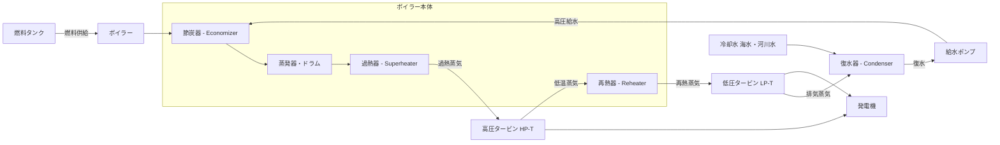

# 🔥 火力発電

> 燃料の化学エネルギーを熱→蒸気→回転→電気に変換する。熱効率η = 3600/H_r が試験の核心。

!!! warning "⚠️ 未確認"
    このページはv0.5ドラフトです。教科書との照合は未完了。数値・公式は参考書で確認してください。

---

## 🧠 直感的理解

火力発電の変換チェーンは3段階：

```
化学エネルギー（燃料）→ 熱エネルギー（ボイラー）→ 機械エネルギー（タービン）→ 電気エネルギー（発電機）
```

この各段階で必ずロス（損失）が発生する。熱効率とは「入れた燃料エネルギーのうち何%が電気になったか」の指標。

**アナロジー**：燃料 = 食料、蒸気 = 体内エネルギー、タービン = 筋肉、発電機 = 仕事。食べたカロリーのうち実際の仕事に使えるのは一部だけ——それが熱効率。

**数値感**：
- 昔の汽力発電：熱効率 35〜40%
- 現代のコンバインドサイクル：熱効率 **55〜60%以上**（世界最高水準）
- 電力1 kWhの熱量換算：3,600 kJ（1 kWh = 3,600 kJ は必ず覚える）

!!! tip "5秒で思い出す"
    ==**η = 3600 / H_r　「熱消費率の逆数が熱効率」**==

    H_r [kJ/kWh]：1 kWh発電するのに消費した熱量。小さいほど高効率。

---

## 🏭 設備を歩く



**主要機器テーブル**

| 機器名 | 役割 | 試験で問われるポイント |
|--------|------|----------------------|
| ボイラー | 燃料を燃焼して水を加熱・蒸気化 | 貫流ボイラー（高圧大容量）vs 自然循環 |
| **節炭器**（エコノマイザー） | 排ガスの熱で給水を予熱（省エネ） | 「排ガスで給水予熱」→ **正** |
| **過熱器**（スーパーヒーター） | 飽和蒸気をさらに加熱して過熱蒸気に | タービン入口温度を上げて熱効率向上 |
| **再熱器**（リヒーター） | 高圧タービン通過後の湿り蒸気を再加熱 | 再熱サイクルの核心部品；湿分除去 |
| **給水加熱器** | 抽気蒸気で給水を予熱（再生サイクル） | 「抽気」「再生」キーワード |
| 高圧タービン（HP） | 高温高圧蒸気で回転力を得る | 再熱後、中圧・低圧タービンへ |
| 低圧タービン（LP） | 再熱蒸気でさらに仕事をとる | 排気は復水器へ |
| **復水器** | 排気蒸気を冷却して水に戻す | 真空を保つことで圧力差を大きくする；冷却水が必要 |
| 給水ポンプ | 復水を高圧側に送り返す | 循環ループの完結；消費動力は小さい |
| 空気予熱器 | 排ガスで燃焼用空気を予熱 | 節炭器と同様の排熱回収 |

!!! note "現場の視点"
    復水器の真空度を高く保つことが熱効率改善の重要ポイント。真空度が下がる（背圧が上がる）とタービン出口圧が上がり、圧力差が小さくなって仕事量が減る。冷却水温度が上がる夏場は熱効率が低下する理由がここにある。

---

## ⚖️ 熱サイクルの比較表

| サイクル | 構成 | 熱効率の向上ポイント | 出題ポイント |
|---------|------|-------------------|-------------|
| **ランキンサイクル** | ボイラー→タービン→復水器→給水ポンプ（基本） | 基本形。改善なし | 基準として把握 |
| **再熱サイクル** | 高圧タービン後に再熱器で再加熱→低圧タービン | 蒸気温度を再度上げることで湿分を減らし、タービン効率を向上 | 「再熱器」「湿分防止」「2段タービン」 |
| **再生サイクル** | 途中タービンから蒸気を抽出して給水を予熱（給水加熱器） | ボイラー入口水温を高め、ボイラーへの供給熱量を削減 | 「抽気」「給水加熱器」「熱量節約」 |
| **再熱再生サイクル** | 再熱＋再生の組み合わせ | 両方の効果を得る。現代の大型火力発電はほぼこれ | 「実際の大型発電所」「最も高効率な汽力」 |
| **コンバインドサイクル** | ガスタービン排熱で蒸気タービンも動かす（GTCC） | ガスタービン（高温域）＋蒸気タービン（低温域）で広い温度範囲を活用 | 熱効率55〜60%超、起動時間が短い |

> **熱効率の大小順**（目安）：コンバインド > 再熱再生 > 再生 ≒ 再熱 > ランキン

---

## ⚖️ 発電方式の比較表

| 発電方式 | 熱効率 | 起動時間 | 燃料 | 主な用途 |
|---------|--------|---------|------|---------|
| **汽力発電**（蒸気タービン） | 35〜42% | 長い（数時間〜） | 石炭・重油・LNG | ベース負荷 |
| **ガスタービン発電** | 25〜35% | 非常に短い（数分） | LNG・軽油 | ピーク対応・緊急電源 |
| **コンバインドサイクル（GTCC）** | 55〜60%+ | 短〜中程度（30分〜） | LNG | ミドル〜ベース負荷 |
| **ディーゼル発電** | 35〜45% | 非常に短い（数秒〜分） | 軽油・重油 | 非常用電源・離島 |

!!! note "コンバインドサイクルが高効率な理由"
    ガスタービン（850〜1500℃の高温）→ 排ガス（600〜650℃）→ 排熱回収ボイラー（HRSG）→ 蒸気タービン（低温域まで活用）という流れで、捨てていた高温排熱を回収して二重に仕事をさせる。カルノー効率の観点では、使える温度差（高温源 - 低温源）が大きいほど効率が高くなる原理と一致する。

---

## 🔍 公式の意味マップ

### レイヤーA：熱効率の基本

**発電端熱効率**
```
η_gen = P_gen / Q_in = 3600 / H_r
```
- P_gen：発電機出力 [kW]
- Q_in：ボイラー入熱（燃料消費による熱量）[kJ/s = kW]
- H_r：熱消費率 [kJ/kWh]（1 kWh発電するのに消費した熱量）
- 3600：1 kWh = 3,600 kJ の変換定数

**熱消費率 H_r の計算**
```
H_r = Q_in_total / E  [kJ/kWh]
```
E：発電電力量 [kWh]、Q_in_total：総入熱 [kJ]

**燃料消費量**
```
B = Q_in_total / H_l  [kg/h]  または  [m³/h]
```
H_l：燃料の低発熱量 [kJ/kg]

### レイヤーB：発電端・送電端の区別

**発電端効率**：発電機端子での出力をベースにした効率

**送電端効率**：所内消費電力を引いた送電電力をベースにした効率
```
η_send = (P_gen - P_aux) / Q_in = η_gen × (1 - L_aux)
```
- P_aux：所内消費電力 [kW]
- L_aux = P_aux / P_gen：所内率

**所内率の典型値**：汽力発電 3〜7%、ガスタービン 1〜3%

**年間発電電力量**
```
E = P_rated × T × η_plant  [kWh]
```
T：年間運転時間 [h]、設備利用率 = E / (P_rated × 8760)

### レイヤーC：熱消費率と熱効率の関係性

| 熱消費率 H_r [kJ/kWh] | 熱効率 η [%] |
|----------------------|-------------|
| 10,000 | 36.0% |
| 9,000 | 40.0% |
| 8,000 | 45.0% |
| 7,200 | 50.0% |
| 6,000 | 60.0% |

> H_r が小さいほど高効率（少ない熱で多くの電気を作る）。**逆数の関係**であることを意識する。

---

## 🛤️ 解法パターン

### パターン①: 熱効率から発電電力量を求める

**見分け方**：燃料消費量・発熱量・熱効率が与えられ、発電量または発電電力を問われる

**手順**：
1. 総入熱 Q_in = 燃料消費量 × 低発熱量 [kJ]
2. 発電端出力 P = Q_in × η / 3600 [kW]（時間単位に注意）
3. または E = Q_in × η / 3600 [kWh]（電力量として求める場合）

**例題**：LNG 1,000 kg/h、低発熱量 50,000 kJ/kg、η=0.50
→ Q_in = 1,000 × 50,000 = 50,000,000 kJ/h = 13,889 kW（÷3600）
→ P = 13,889 × 0.50 = **6,944 kW ≒ 6.9 MW**

---

### パターン②: 燃料消費量を求める

**見分け方**：発電電力（量）と熱効率が与えられ、燃料消費量を問われる

**手順**：
1. 熱消費率から総入熱を求める：Q_in = P × H_r [kJ/h]（または E × H_r）
2. 燃料消費量 B = Q_in / H_l [kg/h]

**例題**：発電出力 100 MW、η=0.40、石炭の低発熱量 25,000 kJ/kg
→ H_r = 3,600 / 0.40 = 9,000 kJ/kWh
→ Q_in = 100,000 × 9,000 = 900,000,000 kJ/h
→ B = 900,000,000 / 25,000 = **36,000 kg/h = 36 t/h**

---

### パターン③: 送電端効率を求める

**見分け方**：所内消費電力（または所内率）が与えられ、送電端効率を問われる

**手順**：
1. 送電端電力 = 発電電力 - 所内消費電力
2. η_send = 送電端電力 / 総入熱 × 3600
3. または η_send = η_gen × (1 - 所内率)

**例題**：発電端効率 40%、所内率 5%
→ η_send = 0.40 × (1 - 0.05) = 0.40 × 0.95 = **38%**

---

## 🕳️ 勘違いTOP3

### 1. 発電端効率 vs 送電端効率の違い

よくある誤り：「発電端と送電端は同じ」「どちらも同じ公式で計算できる」

**正しくは**：
- **発電端**：発電機出力 / 入熱（所内消費を含む）
- **送電端**：(発電機出力 - 所内消費) / 入熱（電力会社が売る電力ベース）

送電端の方が **必ず低い**。問題文に「所内消費電力」や「所内率」が出てきたら送電端を問われていると判断する。

### 2. 熱消費率と熱効率の逆数関係

よくある誤り：「熱消費率が大きいほど高効率」「H_r = η × 3600」

**正しくは**：
- η = 3600 / H_r（η は H_r の逆数に比例）
- H_r が**小さい**ほど高効率（少ない熱で同じ電力を作れる）
- **覚え方**：「消費率が低いほど燃費が良い（車の燃費と同じ感覚）」

### 3. コンバインドサイクルが高効率な理由を正確に説明できない

よくある誤り：「2つのタービンを使うから」「ガスと蒸気を両方使うから」（原因ではなく現象の説明）

**本質**：
- 熱力学的にはカルノー効率 η = 1 - T_cold/T_hot が基本
- ガスタービン単独では高温（1300℃+）から中温（600℃+）の熱を使う
- 捨てていた中温側の排熱（600℃）を蒸気タービンが回収し低温（50℃以下）まで使う
- 結果として**全体としての T_hot〜T_cold の温度差を最大化**している

---

## 📝 正誤判定の急所

| 文 | 正誤 | 解説 |
|----|------|------|
| 節炭器は燃焼ガスの熱で給水を予熱する | **正** | エコノマイザー。排ガスの熱エネルギーを回収する |
| 再熱サイクルは給水加熱器で給水を予熱する | **誤** | 給水加熱器は「再生サイクル」。再熱は高圧タービン後の蒸気を再加熱する |
| 熱消費率が大きいほど熱効率は高い | **誤** | 逆数の関係：η = 3600/H_r。H_r 小さい → η 大きい |
| コンバインドサイクルの熱効率は汽力発電より高い | **正** | 排熱回収により55〜60%以上を達成（汽力は35〜42%） |
| 送電端効率は発電端効率より高い | **誤** | 所内消費電力分だけ送電端効率の方が低い |
| 復水器は蒸気を水に戻し圧力差を確保する役割がある | **正** | 真空を保つことでタービン前後の圧力差を最大化する |
| ガスタービン発電は起動時間が長く緊急電源に不向きである | **誤** | ガスタービンは起動が速い（数分）。緊急・ピーク用途に適する |
| 過熱器はタービン通過後の蒸気を再加熱する | **誤** | 過熱器はボイラー内で飽和蒸気を過熱蒸気にする。再加熱は「再熱器」 |

---

## 📊 出題実績

| 年度 | 問 | 難易度 | 形式 | 何が問われたか |
|------|---|--------|------|-------------|
| R3 | 2 | ★★☆ | 計算 | 熱消費率から熱効率・燃料消費量を算定 |
| R2 | 3 | ★★☆ | 計算 | 送電端効率（所内消費電力を差し引く） |
| R1 | 2 | ★☆☆ | 正誤 | 熱サイクルの種類（再熱・再生の区別） |
| H30 | 1 | ★★★ | 計算 | コンバインドサイクルの効率と発電量 |
| H29 | 3 | ★★☆ | 正誤 | 火力発電所機器の名称・役割（節炭器・過熱器） |

> ⚠️ 詳細は [電験王](https://denken-ou.com/denryoku/) の火力カテゴリを参照。年度・問番号は照合が必要。

---

## 🔗 関連テーマ

- [水力発電](suiryoku.md) — P=9.8QHηと対比して「効率の向き」を整理
- [原子力発電](genshiryoku.md) — ランキンサイクルは共通。熱効率30〜35%と低い理由（低温蒸気使用）
- [電力系統・需給運用](denryoku-keitou.md) — ベース・ミドル・ピーク負荷と発電方式の対応関係
