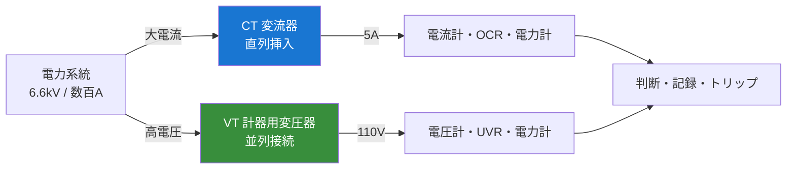
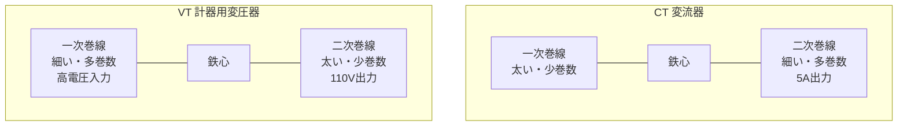

# 計器用変成器（VT・CT）

!!! success "🎯 このページで得点できる問題"
    本ページを通読すると、過去問で次の論点に答えられるようになる：

    - **計器用変成器の総称**：「計器用変成器」＝ **VT**（計器用変圧器）＋ **CT**（変流器）の総称
    - **接続方式の違い**：VT は **並列**（高インピーダンス負荷）／CT は **直列**（低インピーダンス負荷）
    - **二次側の禁則**：VT は **二次短絡 NG**／CT は **二次開放 NG**（左右対称・混同最多）
    - **CT 二次開放が危険な理由**：一次電流が全量励磁電流化 → 鉄心磁気飽和 → **二次に異常高電圧**発生
    - **残留回路**：3 つの CT 二次を Y 結線にして中性線で取り出すと **零相電流（3I₀）** が得られる
    - **極性記号**：一次側 K-L／二次側 k-l。同極性端子 K と k が同方向の磁束を発生
    - **誤差**：比誤差（変成比のずれ）と位相誤差（位相のずれ）。負担（burden）が大きいほど誤差増

    各論点の詳細は §4 公式マップ・§6 引っかけパターンへ。

!!! note "🗺️ 棲み分けマップ"
    **本ページ＝計器用変成器（VT・CT）**：計器用変成器の **総称概念・接続・極性・誤差・残留回路** の全体俯瞰と頻出論点。**5 年で 3 問**（R03 / R05 上 / R06 下）の継続出題枠で、合格水準の必須テーマ。

    **[開閉装置・保護継電器](kaihei-hogo.md)**：CT・VT を **検出端** として用いる継電器側の話（OCR / DGR / 87 / 21 等）。本ページは「センサーそのもの」の取扱い、kaihei-hogo は「センサーが運ぶ信号で判断する装置」を扱う。

    **[変圧器](henatsuki.md)**：CT・VT は構造的に小型変圧器そのもの。鉄心・巻線・励磁電流・磁気飽和の根本原理は変圧器ページの理解が前提になる（巻数比・励磁特性は henatsuki §4）。

    **使い分け**：センサー機器そのものを学ぶ → 本ページ／継電器の整定・動作 → kaihei-hogo／基本原理の電磁気 → henatsuki。

## 1. 直感的理解 {#intuition}

**計器用変成器の本質**: 系統の **大電流・高電圧**をそのままでは計器・継電器で測れない（焼損・絶縁破壊）。**安全な小さい値（5 A・110 V）に縮小**して計器・継電器に渡す。

### 「計器用変成器」という用語の混乱を先に解く

| 表記 | 内容 | 用途 |
|------|------|------|
| **計器用変成器** | **総称**（VT と CT の総称） | 試験文ではこの言葉単独でも頻出 |
| **計器用変圧器（VT または PT）** | 高電圧 → 110 V 等の **電圧変成** | 電圧計・電力計・電圧継電器の入力 |
| **変流器（CT）** | 大電流 → 5 A 等の **電流変成** | 電流計・電力計・電流継電器の入力 |

!!! note "VT と PT の違い（用語問題）"
    **VT**（Voltage Transformer）と **PT**（Potential Transformer）は同じものを指す。JIS では VT が正式表記だが、現場では PT も併用される。試験文で「PT」「計器用変圧器」「VT」のどれが出ても同じ機器を指していると判断してよい。

### なぜ「縮小」が必要か（因果理解）

電力系統では電圧 6.6 kV〜500 kV、電流 数百〜数千 A が日常的に流れる。これを直接計器・継電器に入れると次の問題が起きる：

- **電圧側**：計器の絶縁が破れる。人体が触れる端子部分が高電圧になる
- **電流側**：計器の巻線が瞬時に焼損する

そこで「**変圧器の原理**で電圧を 110 V に下げる」「**変圧器の原理**で電流を 5 A に下げる」器具が必要になった。これが計器用変成器。

**5 秒で思い出す**: VT = 高電圧用センサー（並列・110 V 取出）／CT = 大電流用センサー（直列・5 A 取出）。VT は短絡 NG・CT は開放 NG。

---

## 2. 設備を歩く {#walk}

### 系統内の配置



### CT・VT の物理構造



!!! note "CT の一次巻線が「太く少巻数」な理由"
    CT の一次は **系統の主回路そのもの**を流す。数百〜数千 A の負荷電流が定常的に流れるため、導体は太く、巻数は 1 ターン〜数ターンで済む（貫通形 CT は鉄心に電線を 1 回通すだけ＝ 1 ターン）。二次は計器側で 5 A しか流さないため細く・多く巻ける。

### 主要諸元テーブル

| 項目 | CT（変流器） | VT（計器用変圧器） |
|------|---|---|
| **目的** | 大電流を計器用 5 A に変換 | 高電圧を計器用 110 V に変換 |
| **接続方式** | **直列**（主回路に挿入） | **並列**（線間または対地） |
| **一次側** | 大電流・低電圧（線路に直列） | 高電圧・小電流（線路に並列） |
| **二次定格** | 通常 **5 A**（一部 1 A） | 通常 **110 V**（線間または相電圧 110/√3） |
| **負荷側 インピーダンス** | **低い**（電流計・OCR 内部抵抗） | **高い**（電圧計・電圧コイル） |
| **二次側の禁則** | **開放 NG**（高電圧発生・焼損） | **短絡 NG**（過電流・焼損） |
| **接地** | 二次側 1 点接地 | 二次側 1 点接地（人身保護） |

---

## 3. 計器用変成器の種類比較表 {#comparison}

### CT（変流器）の種別

| 種類 | 構造 | 主用途 | 特記 |
|------|------|--------|------|
| **巻線形 CT** | 一次・二次とも巻線を巻く | 一般配電・低電流用 | 巻数比で変流比を設計可能 |
| **貫通形 CT** | 鉄心に主回路導体を 1 回通す（一次は 1 ターン） | 大電流系統・主回路 | 構造が単純で堅牢 |
| **ブッシング CT** | 変圧器・遮断器のブッシング部に内蔵 | 主変圧器・GIS | 設置スペース不要 |
| **零相変流器（ZCT）** | 三相一括で鉄心を通し、和電流を検出 | 地絡保護（DGR / OCGR） | 通常時 ΣI ≒ 0 ／地絡時 ΣI ≠ 0 |

### VT（計器用変圧器）の種別

| 種類 | 構造 | 主用途 | 特記 |
|------|------|--------|------|
| **単相 VT** | 単相変圧器を 1〜3 台組合せ | 一般配電・線間電圧測定 | 二相結線・三相結線で運用 |
| **三相 VT** | 三相変圧器を 1 台で構成 | 中電圧配電・経済性重視 | 単台で済む |
| **コンデンサ形 VT（CVT）** | コンデンサ分圧＋誘導性結合 | 超高圧 (66 kV〜) | 鉄心 VT より絶縁設計が容易 |
| **接地形計器用変圧器（EVT / GPT）** | 三相 VT の中性点接地で零相電圧検出 | 非接地系の地絡検出 | 一次は Y 接地・二次は開放Δで V₀ 出力 |

!!! note "ZCT と EVT の関係（因果理解）"
    **ZCT** は **零相電流 I₀** を検出し、**EVT** は **零相電圧 V₀** を検出する。非接地系（高圧配電のΔ系）では地絡時に I₀ と V₀ が同時に発生するため、両者を組み合わせて方向判定（DGR）に使う。地絡方向継電器の入力は ZCT + EVT のセットというのが定石。

---

## 4. 公式マップ {#formula-map}

### レイヤーA: 基本公式

#### 変流比・変圧比

$$\text{変流比 } K_n = \frac{I_1}{I_2} = \frac{N_2}{N_1} \quad\text{（CT）}$$

$$\text{変圧比 } K_v = \frac{V_1}{V_2} = \frac{N_1}{N_2} \quad\text{（VT）}$$

- $I_1, V_1$: 一次側（系統側）
- $I_2, V_2$: 二次側（計器側）
- $N_1, N_2$: 一次・二次の巻数

!!! warning "CT と VT で巻数比の向きが逆"
    CT は **一次電流が大** → 一次巻数を **少なく**して二次に小電流を出す（$N_1 < N_2$）。  
    VT は **一次電圧が大** → 一次巻数を **多く**して二次に低電圧を出す（$N_1 > N_2$）。  
    変成比の式は「電流は巻数の逆比・電圧は巻数の順比」という変圧器一般式そのもの。

#### 計器側電流・電圧の換算（試験頻出）

$$I_1 = I_2 \times K_n \quad\text{（例: 二次計器が 4 A・変流比 200/5 なら一次 } I_1 = 4 \times 40 = 160 \text{ A）}$$

$$V_1 = V_2 \times K_v \quad\text{（例: 二次計器が 100 V・変圧比 6600/110 なら一次 } V_1 = 100 \times 60 = 6000 \text{ V）}$$

### レイヤーB: 接続・極性

#### 接続方式（最頻出）

| 項目 | CT | VT |
|------|---|---|
| **主回路への接続** | **直列** | **並列** |
| **二次計器への接続** | **直列**（電流計・電流コイル） | **並列**（電圧計・電圧コイル） |
| **二次負荷の性質** | **低インピーダンス**（電流コイル） | **高インピーダンス**（電圧コイル） |

#### 極性記号

| 端子 | 一次側 | 二次側 |
|------|--------|--------|
| **同極性端子** | K | k |
| **反対側端子** | L | l |

同時刻に **K → 一次** に流れ込む電流方向と、**k → 二次** から流れ出す電流方向が **同じ向きの磁束**を作る。電力計・差動継電器など **方向を読む装置**は極性を間違えると逆動作する。

### レイヤーC: 誤差（負担と誤差の関係）

#### 比誤差・位相誤差

| 誤差 | 定義 | 主な原因 |
|------|------|---------|
| **比誤差** $\varepsilon$ | $\dfrac{K_n I_2 - I_1}{I_1} \times 100$ ［%］ | 励磁電流分の損失 |
| **位相誤差** $\delta$ | 二次電流（電圧）の位相と一次電流（電圧）の位相のずれ | 鉄損・励磁電流 |

#### 負担（burden）と誤差

二次側に接続する計器・継電器のインピーダンスを **負担**（burden）と呼ぶ［VA］。

- **負担が大きい**（多数の計器を接続）→ 二次電流による磁束減少が大きく **誤差増大**
- **負担が定格を超える**と階級（精度等級）を保証できない

!!! warning "CT の場合の負担管理"
    OCR・電流計・電力計を多数接続すると **CT 負担超過**で精度が落ちる。さらに重要なのは、二次回路に絶対に **開放部を作らない**こと（次節）。

### レイヤーD: 残留回路（零相電流検出）

#### Y 結線残留回路

```
    a相CT ─┐
    b相CT ─┼─ 残留回路（中性線）→ DGR / OCGR
    c相CT ─┘
```

3 相それぞれの CT 二次を Y 結線にして中性線を取り出すと、その線には **3 相の和電流 = 3 I₀**（零相電流の 3 倍）が流れる。

- **平衡時**：$\vec{I_a} + \vec{I_b} + \vec{I_c} = 0$ → 残留回路に電流流れず
- **地絡時**：1 相に地絡電流加算 → $\vec{I_a} + \vec{I_b} + \vec{I_c} \neq 0$ → 残留回路に **3 I₀** が流れる

!!! note "ZCT との違い"
    **残留回路**は **3 つの相 CT** の二次を組み合わせて零相電流を検出する。**ZCT**（零相変流器）は **三相一括で 1 個の鉄心**を通して直接零相電流を検出する。前者は既設の相 CT を利用できる経済性、後者は精度が高く小電流の地絡も検出できる利点がある。

---

## 5. 解法パターン {#patterns}

### 解法パターン①：変流比・変圧比から一次値を求める

**典型問題**：「変流比 400/5 の CT を使い、二次電流計が 3.5 A を示した。一次電流はいくらか」

**手順**
1. 変流比 $K_n = 400/5 = 80$
2. 一次電流 $I_1 = I_2 \times K_n = 3.5 \times 80 = 280$ A

→ **試験では小数の掛け算で計算ミス**が多い。「比は一次/二次」を必ず確認。

### 解法パターン②：CT 二次回路を絶対に開放してはいけない

**典型問題**：「CT 二次回路の計器を取り外す際の正しい手順を選べ」

**手順**
1. **必ず二次端子を短絡してから**計器を取り外す（CT には専用の短絡端子板がある）
2. 計器を交換した後、**短絡を解除**して通電状態に戻す
3. 短絡したまま放置しても **過電流にはならない**（むしろ安全側）

!!! danger "間違えると焼損・人身事故"
    通電中の CT 二次を不用意に開放すると **数千 V の高電圧**が二次に発生し、絶縁破壊・感電・焼損につながる。これは試験論点としても実務安全としても最頻出。

### 解法パターン③：VT 二次回路を絶対に短絡してはいけない

**典型問題**：「VT 二次回路の計器を取り外す際の注意点を選べ」

**手順**
1. **必ず一次側を停止**してから二次を触る、または **二次ヒューズを抜く**
2. 通電中の VT 二次を短絡すると **過大短絡電流**で巻線焼損
3. CT の禁則（開放 NG）と **左右対称**で混同しやすい

!!! warning "VT 二次の保護"
    実機の VT 二次にはヒューズが入っている。万一短絡してもヒューズが先に切れて巻線を守る。試験文では「VT 二次を直接短絡してよい」は誤り。

### 解法パターン④：残留回路から地絡電流を読む

**典型問題**：「3 つの相 CT 二次を Y 結線した残留回路に 0.6 A の電流が流れた。CT の変流比が 200/5 のとき、地絡電流はいくらか」

**本質（最短ルート）**：残留回路電流はそもそも二次側の $3I_0$。これを変流比 $K_n$ 倍すれば一次側の $3I_0$＝一線地絡電流になる。

$$I_g = 3I_0(\text{一次}) = (\text{残留回路電流}) \times K_n = 0.6 \times 40 = 24\ \text{A}$$

**段階を追う場合**（同じ答えになる）
1. 残留回路電流 = $3I_0$（二次値）= 0.6 A
2. 二次零相電流 $I_0(\text{二次}) = 0.6 / 3 = 0.2$ A
3. 変流比 $K_n = 200/5 = 40$
4. 一次零相電流 $I_0 = 0.2 \times 40 = 8$ A
5. 一線地絡電流 $I_g = 3 I_0 = 24$ A

→ ÷3 と ×3 は相殺するので、**「残留回路電流 × 変流比」で一発**。

### 解法パターン⑤：取扱い注意の総合判別

**典型問題**（R06 下問 7 型）：「計器用変成器の取扱いに関する記述として誤っているものを選べ」

**判別基準**
- VT の二次は **並列**接続・**短絡 NG**
- CT の二次は **直列**接続・**開放 NG**
- 接地は **二次側 1 点**（多点接地は循環電流発生）
- 計器負担は定格 VA を超えない

→ 4 つの基準のうち 1 つでも違反する選択肢が「誤り」。出題は **接続方向の取り違え** と **二次禁則の取り違え** が大半。

### 解法パターン⑥：極性を間違えると装置が逆動作する

**典型問題**：「単相電力計を CT・VT 経由で接続する場合の極性を答えよ」

**手順**
1. CT の K 端子と電力計の電流端子の極性側（±）を一致させる
2. VT の K 端子と電力計の電圧端子の極性側（±）を一致させる
3. 極性が逆だと電力指示値が **負になる**または **指示が誤った値**になる
4. 差動継電器（87）では極性ミスが **誤動作**につながる

---

## 5.5 自問ブロック（Recall 想起練習）

セクションを閉じる前に自問してみよう。答えられない項目があれば該当 §へ戻る。

??? question "Q1: 「計器用変成器」とは何の総称か"
    **VT（計器用変圧器）と CT（変流器）の総称**。試験文で単独で出ても両者の話と理解する。→ §1

??? question "Q2: CT と VT、それぞれ二次側の禁則は何か"
    **CT は二次開放 NG**（異常高電圧発生）／**VT は二次短絡 NG**（過電流焼損）。左右対称で覚える。→ §5 パターン②③

??? question "Q3: CT 二次の負担は高インピーダンスか低インピーダンスか"
    **低インピーダンス**。電流計・電流コイルは内部抵抗が小さい。VT は逆に **高インピーダンス**。→ §4 レイヤー B

??? question "Q4: 3 つの相 CT 二次を Y 結線で取り出す回路の名称は"
    **残留回路**。中性線には 3 I₀（零相電流の 3 倍）が流れる。地絡保護に使う。→ §4 レイヤー D

??? question "Q5: CT 二次回路の計器を交換する手順は"
    **必ず二次端子を短絡してから計器を取り外す**。専用の短絡端子板を使う。→ §5 パターン②

??? question "Q6: 極性端子 K と k はどういう関係か"
    **同極性端子**。K に流れ込む一次電流の方向と k から流れ出す二次電流の方向が同じ向きの磁束を作る。電力計・差動継電器で極性ミスは誤動作の原因。→ §4 レイヤー B

---

## 6. 引っかけパターン {#traps}

### ① VT と CT の接続方式の取り違え

| 誤った記述 | 正しい記述 | 根拠 |
|---|---|---|
| 「CT は主回路に並列接続する」 | **直列接続** | CT は主回路の電流をそのまま測るので直列に挿入する |
| 「VT は主回路に直列接続する」 | **並列接続** | VT は線間または対地に並列で電圧を取り出す |

### ② 二次禁則の左右対称取り違え

| 誤った記述 | 正しい記述 | 根拠 |
|---|---|---|
| 「CT 二次は短絡してはならない」 | **短絡してよい**（むしろ安全） | CT 二次は通常運転中 5 A 以下しか流れず短絡しても過電流にならない |
| 「VT 二次は開放してはならない」 | **開放してよい**（短絡が NG） | VT は二次無負荷でも問題なし。短絡が NG |

### ③ CT 二次開放の害が「電流」と誤認

| 誤った記述 | 正しい記述 | 根拠 |
|---|---|---|
| 「CT 二次を開放すると過大電流が流れて焼損する」 | **過大電圧**が発生して焼損する | 一次電流が全量励磁電流化 → 鉄心磁気飽和 → 二次に異常高電圧 |

### ④ 計器用変成器 ＝ 変圧器のみと誤認

| 誤った記述 | 正しい記述 | 根拠 |
|---|---|---|
| 「計器用変成器とは計器用変圧器（VT）のことである」 | **VT と CT の総称** | JIS では「計器用変成器」は VT・CT 両方を含む上位概念 |

### ⑤ ZCT と CT の混同

| 誤った記述 | 正しい記述 | 根拠 |
|---|---|---|
| 「ZCT は短絡電流を検出する」 | **零相電流（地絡電流）**を検出する | ZCT は三相一括で鉄心を通し、和電流（地絡時のみ非ゼロ）を取り出す |

---

## 7. 正誤判定の急所 {#tf-points}

| 文章 | 正誤 | 解説 |
|------|------|------|
| 「計器用変成器は VT と CT の総称である」 | **正** | JIS 用語。試験文で「計器用変成器」単独で出ても両者の話 |
| 「VT は二次側を並列接続し、CT は二次側を直列接続する」 | **正** | 二次側で計器・継電器との接続方法も VT 並列／CT 直列 |
| 「CT の二次側を開放しても問題ない」 | **誤** | 鉄心磁気飽和で異常高電圧が発生し焼損・感電の危険 |
| 「VT の二次側を短絡しても問題ない」 | **誤** | 過大短絡電流で巻線焼損。CT と左右対称の禁則 |
| 「CT は二次側に低インピーダンス負荷を接続する」 | **正** | 電流計・電流コイル（内部抵抗小） |
| 「VT は二次側に高インピーダンス負荷を接続する」 | **正** | 電圧計・電圧コイル（内部抵抗大） |
| 「3 つの相 CT 二次を Y 結線した残留回路には常に零電流が流れる」 | **誤** | **平衡時のみ零**。地絡時は 3 I₀ が流れる |
| 「ZCT は三相それぞれの相電流を個別に検出する」 | **誤** | ZCT は **三相一括**で和電流（零相電流）を検出 |
| 「CT の K 端子と二次の k 端子は同極性である」 | **正** | 同方向の磁束を発生する同極性端子 |
| 「計器用変成器の二次側は接地しない方が安全である」 | **誤** | 二次側 1 点接地が原則（一次・二次間絶縁破壊時の人身保護） |
| 「CT 二次の計器交換時はそのまま端子を外してよい」 | **誤** | **必ず二次端子を短絡してから**取り外す |
| 「コンデンサ形 VT（CVT）は超高圧系統で使用される」 | **正** | 66 kV〜の超高圧で鉄心 VT より絶縁設計が容易 |

---

## 8. 出題実績 {#exam}

> 📚 横断一覧: [分野別一覧（該当分野）](../kakomon/by-field.md#henden) ／ [年度別一覧](../kakomon/by-year.md)

| 年度 | 問 | 出題内容 | 問題タイプ | 難易度 |
|------|---|---------|----------|--------|
| **R06下** | **問7** | 計器用変成器の取扱い上の注意点 | 穴埋 | ★★☆☆☆ |
| **R05上** | **問7** | 変電所の計器用変成器 | 穴埋 | ★☆☆☆☆ |
| **R03** | **問7** | 変電所の計器用変成器 | 穴埋 | ★☆☆☆☆ |

→ **R01〜R07 で 3 問出題（5 年で 3 問・変圧器ハブと同水準の頻出枠）**

> 詳細解説:  
> [R06下問7（電験王）](https://denken-ou.com/denryokur6-2-7/)・[R05上問7（電験王）](https://denken-ou.com/denryokur5-1-7/)・[R03問7（電験王）](https://denken-ou.com/denryokur3-7/)

!!! note "R08 予測"
    R06 下・R05 上・R03 の 3 年連続出題実績から、計器用変成器は **問 7 枠の固定論点**になりつつある。R08 でも **取扱い注意（開放禁止／短絡禁止／接地）** の穴埋・論説が継続出題される見込み。

---

## 関連ページ

- [保護継電器](hogo-keiden.md) — CT・VT 出力を入力とする OCR / DGR / 87 / 21 の整定・動作論
- [遮断器・断路器（CB・DS）](shadanki.md) — 継電器のトリップ指令を受ける実行側
- [開閉装置・保護継電器（hub）](kaihei-hogo.md) — 3 ページの全体俯瞰・出題実績インデックス
- [変圧器](henatsuki.md) — CT・VT の電磁原理（巻数比・励磁電流・磁気飽和）の母体
- [架空送電線路](kakuu-souden.md) — 距離継電器・差動継電器が監視する送電線側
- [自家用受電設備の地絡保護](jikayou-chiraku.md) — ZCT・EVT を用いた DGR・もらい事故防止の応用
- [頻出計算パターン集](../reference/calc-patterns.md) — 変流比・残留回路の計算手順
