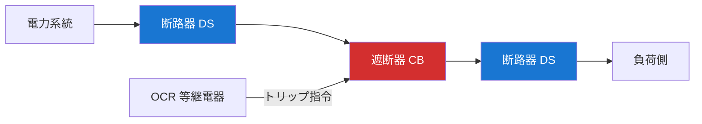
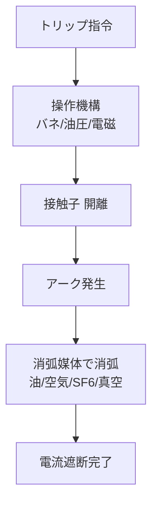

# 遮断器・断路器（CB・DS）

!!! success "🎯 このページで得点できる問題"
    本ページを通読すると、過去問で次の論点に答えられるようになる：

    - **DS と CB の役割分担**：DS=無負荷時の電路分離／CB=負荷電流・事故電流の遮断
    - **操作順序**：**投入時 DS → CB**／**開放時 CB → DS**（逆は焼損）
    - **遮断器の種類**：OCB・ABB・GCB（GIS）・VCB の **消弧媒体と主流変遷**
    - **GIS の絶縁媒体**：SF₆ガス（圧縮空気と混同最多）
    - **VCB が主流の理由**：真空中はアーク維持不可・保守容易・環境負荷小

    各論点の詳細は §3 開閉装置の比較・§4 遮断器の種類・§5 消弧物理へ。

!!! note "🗺️ 棲み分けマップ"
    **本ページ＝遮断器・断路器（CB・DS）**：負荷電流・事故電流を **実際に切る**機器の物理・種類・操作順序。

    **[保護継電器](hogo-keiden.md)**：異常を **検出して指令を出す**側（OCR・DGR・87 等）。本ページの遮断器に「切れ」を送る装置。

    **[計器用変成器（VT・CT）](keiki-hensei.md)**：継電器の入力源となる **センサー**。3 つは「センサー → 判断 → 切る」の機能順序で繋がる。

    **[開閉装置・保護継電器（hub）](kaihei-hogo.md)**：3 つを俯瞰する hub。全体フロー・出題実績インデックスはこちら。

## 1. 直感的理解 {#intuition}

**遮断器の本質**: 電力系統で **電流を強制的に止める** 機器。負荷電流（正常）も事故電流（異常）も両方遮断できるのが遮断器（CB）、無負荷時の電路分離専用が断路器（DS）。

### 役割分担表（最重要）

| 機器 | アナロジー | 負荷電流遮断 | 事故電流遮断 |
|---|---|:-:|:-:|
| **断路器（DS）** | 工事用バルブ（電気が来ていないことの確認用） | ✕ | ✕ |
| **遮断器（CB）** | 高速シャッター（電気が流れていても切れる） | ○ | ○ |
| **負荷開閉器（LBS）** | 通常用バルブ（事故時は使えない） | ○ | ✕ |

### 操作順序（最頻出論点）

- **投入時**：==DS → CB の順==（先にDS閉→その後CB閉）
- **開放時**：==CB → DS の順==（先にCB開→その後DS開）

!!! note "なぜ DS→CB の順で投入するのか（因果理解）"
    断路器（DS）は **電流遮断能力を持たない**。DS の接触子はアーク消弧機能を持たないため、電流が流れた状態で開放するとアーク放電が持続し機器を破損する。

    **投入時**：まず DS を閉じて回路を形成し、その後 CB を閉じる。電流は CB が入った瞬間から流れ始めるため、DS はゼロ電流の状態で操作できる。

    **開放時**：先に CB を開いて電流をゼロにしてから DS を開く。逆にすると DS がアーク電流を遮断しようとして焼損する。

**5 秒で思い出す**: 「**入**は **D→C**・**切**は **C→D**」と覚える（投入＝DSが先・開放＝CBが先）。

---

## 2. 設備を歩く {#walk}

### 系統内の配置

CB の前後に DS を配置するのが標準。保守時には CB を開放してから両端の DS を開き、保守区間を完全に系統から切り離す。

### 遮断器の物理構造（共通）

接触子が開離した瞬間に **アーク** が発生する。これをどう消弧するかで遮断器の種類が決まる（§4）。

---

## 3. 開閉装置の比較表（最重要） {#comparison}

| 機器 | 略称 | 負荷電流遮断 | 事故電流遮断 | 機能 | 用途・特記 |
|------|------|:-----------:|:-----------:|------|-----------|
| **断路器** | DS | × | × | 無負荷時のみ開放可能 | 保守・点検時の電路分離 |
| **遮断器** | CB | ○ | ○ | 負荷電流・事故電流の両方遮断 | 系統保護の中心機器 |
| **負荷開閉器** | LBS | ○ | × | 負荷電流は開放可能 | 事故電流は遮断不可 |
| **高圧交流負荷開閉器** | PAS | ○ | × | 柱上設置 | 高圧需要家の引込口 |
| **地絡継電器付き開閉器** | UGS | ○ | × | 地絡検出機能内蔵 | 地中線引込・波及事故防止 |

!!! warning "【頻出引っかけ】断路器（DS）の誤操作"
    「断路器は電流を遮断できる」→ **誤り**。断路器には電流遮断能力がない。
    負荷電流が流れた状態で DS を開放するとアーク放電が発生し、機器破損・感電の危険がある。
    必ず CB で電流を遮断してから DS を操作すること。試験では「断路器で事故電流を遮断した」という記述は誤り。

!!! note "LBS・PAS・UGS は「事故電流は切れない」点で共通"
    LBS・PAS・UGS は **負荷電流は開放できる** が **事故電流は遮断不可**。事故電流は CB に任せる構成が前提。
    UGS は地絡検出機能を内蔵するが、検出後に遮断するのではなく **波及事故防止のため自家用引込を切り離す** という役割（地絡電流そのものを切るのは系統側の CB）。

---

## 4. 遮断器の種類比較

| 種類 | 略称 | 消弧媒体 | 特徴 | 主な用途 | 主流度 |
|------|------|---------|------|---------|:--:|
| **油遮断器** | OCB | 絶縁油 | 旧来型・火災リスクあり | 既存設備の一部に残存 | × 旧式 |
| **空気遮断器** | ABB / ACB | 圧縮空気 | 騒音大・大型 | 大容量変電所（旧来型） | × 旧式 |
| **ガス遮断器** | GCB / GIS | SF₆ガス | 絶縁性能が高い・小型化可能 | 都市型変電所・GIS | ○ 主流 |
| **真空遮断器** | VCB | 真空 | 保守容易・環境負荷小・小型 | ==**変電所・工場の主流**== | ◎ 主流 |

### 主流変遷の歴史（背景理解）

OCB（戦前〜1970年代）→ ABB（〜1980年代）→ GCB/VCB（1990年代〜現在）の順で主流が移行。理由は **消弧性能・小型化・環境負荷** の3軸。

---

## 5. 消弧物理（GIS・VCB が主流になった理由） {#gis}

!!! note "VCB（真空遮断器）"
    **真空中では気体分子がないためアークを維持できず**、電流がゼロになる瞬間に消弧する。保守が少なく、油も不要で環境負荷が小さい。接触子の摩耗も小さく、開閉寿命が長い。

!!! note "GIS（ガス絶縁開閉装置）"
    SF₆ガスは空気の約 **3倍の絶縁耐力**を持つ。高絶縁性により機器をコンパクト化でき、都市部の狭い敷地に建設できる。CB・DS・LA（避雷器）等を1つの金属容器に収めた **一体型設備** で、保守時の手間が大幅に削減される。

!!! warning "【頻出引っかけ】GIS の絶縁媒体"
    「GIS は圧縮空気を絶縁媒体に使用する」→ **誤り**。GIS は **SF₆（六フッ化硫黄）ガス** を使用。圧縮空気を使用するのは **空気遮断器（ABB）**。混同最多。

!!! warning "SF₆ガスの環境問題"
    SF₆は **温室効果が CO₂ の約 23,500 倍**（IPCC 第5次評価 AR5・GWP100）と非常に高い。漏洩防止・回収・再使用の管理が国際的に厳格化されている。試験では直接問われにくいが、近年の論点として頭の片隅に。

---

## 5.5 解法パターン {#patterns}

### 解法パターン①：DS と CB の操作順序を選ぶ（R05下問8型）

**典型問題**：「GIS に使用される断路器と遮断器について、停電作業時の操作順序として正しいものを選べ」

**判別基準**

| 場面 | 正解 | 根拠 |
|---|---|---|
| **投入時** | DS → CB | DS が無電流で操作される（電流は CB が入った瞬間から流れる） |
| **開放時** | CB → DS | CB で電流ゼロにしてから DS を開く（DS はアーク消弧能力なし） |

→ 「**入は D→C・切は C→D**」を 5 秒で書き出してから選択肢と照合。逆順序の選択肢は **DS焼損** につながる NG パターン。

### 解法パターン②：遮断器の種類と消弧媒体を結びつける（R03問8・R06下問8型）

**典型問題**：「次の遮断器と消弧媒体の組合せのうち、誤っているものを選べ」

**判別マトリクス**

| 略称 | 消弧媒体 | 主流度 | 引っかけ筆頭 |
|---|---|---|---|
| OCB | **絶縁油** | × 旧式 | 「OCB は油で絶縁する」→ 正（消弧も絶縁も油） |
| ABB | **圧縮空気** | × 旧式 | 「ABB は SF₆」→ 誤（GCB と取り違え最多） |
| GCB / GIS | **SF₆ガス** | ○ 主流 | 「GIS は圧縮空気で絶縁」→ 誤（ABB と取り違え） |
| VCB | **真空** | ◎ 主流 | 「VCB は SF₆で消弧」→ 誤（真空中で電流ゼロ点消弧） |

→ **絶縁媒体と消弧媒体は同じか？** という別軸の引っかけも頻出。GIS は SF₆ガスが **絶縁・消弧の両方**を担う。

### 解法パターン③：開閉機器の遮断能力を仕分ける（R02問8型）

**典型問題**：「次の開閉機器のうち、事故電流を遮断できるものを選べ」

**判別基準（負荷電流 / 事故電流の2軸）**

| 機器 | 負荷電流遮断 | 事故電流遮断 | 用途の決め手 |
|---|:-:|:-:|---|
| DS | × | × | 保守時の電路分離（無電流で操作） |
| CB | ○ | ○ | 系統保護の中心（事故電流遮断が役割） |
| LBS | ○ | × | 常時の負荷開閉のみ（事故時は CB に任せる） |
| PAS | ○ | × | 高圧需要家引込（柱上設置） |
| UGS | ○ | × | 地中線引込（地絡検出機能あり・遮断は系統側 CB） |

→ **事故電流が切れるのは CB だけ**。LBS/PAS/UGS は「負荷電流のみ」と即答できれば 90% 正解。

### 解法パターン④：変電所機器の特徴を総合判別（R07下問8・R05上問8型）

**典型問題**：「変電所で使用する機器の特徴に関する記述として、誤っているものを選べ」

**判別チェックリスト**

1. **遮断器** = 負荷・事故電流の両方を切る／**断路器** = 無電流時のみ操作可能（→ §3 比較表）
2. **VCB** = 真空中の電流ゼロ点消弧・保守容易／**GIS** = SF₆ガスでコンパクト化（→ §4 種類比較）
3. **避雷器（LA）** = サージ電圧吸収・常時 OFF（GIS には内蔵される）
4. **計器用変成器** = CT は直列・VT は並列（→ [計器用変成器](keiki-hensei.md)）

→ 4 つの基準のいずれかに違反する選択肢が「誤り」。**操作順序の逆転**と **消弧媒体の取り違え**が出題の 7 割。

---

## 6. 引っかけパターン {#traps}

### ① 断路器の遮断能力

| 誤った記述 | 正しい記述 |
|---|---|
| 「断路器は事故電流を遮断できる」 | **誤**：断路器には電流遮断能力なし |
| 「保守時にまず断路器を開いてから遮断器を開く」 | **誤**：先に CB を開く（電流を切ってから DS） |

### ② 操作順序の取り違え

| 場面 | 正しい順序 | よくある誤り |
|---|---|---|
| 投入時 | **DS → CB** | CB → DS（DS がゼロ電流投入できない） |
| 開放時 | **CB → DS** | DS → CB（DS が事故電流を切ろうとして焼損） |

### ③ GIS の絶縁媒体

| 誤った記述 | 正しい記述 |
|---|---|
| 「GIS は圧縮空気で絶縁する」 | **誤**：SF₆ガスで絶縁。圧縮空気は ABB |

### ④ VCB の消弧媒体

| 誤った記述 | 正しい記述 |
|---|---|
| 「VCB は SF₆ガスで消弧する」 | **誤**：真空で消弧。SF₆ガスは GCB |

---

## 7. 正誤判定の急所 {#tf-points}

| 文章 | 正誤 | 解説 |
|------|------|------|
| 「断路器は事故電流を遮断できる」 | **誤** | 断路器は電流遮断能力なし。遮断器（CB）が担当 |
| 「真空遮断器の消弧媒体は真空である」 | **正** | VCB は真空中でアークを消弧 |
| 「遮断器投入時は CB→DS の順で操作する」 | **誤** | 投入時は **DS→CB**。開放時が CB→DS |
| 「GIS は圧縮空気を絶縁媒体に使用する」 | **誤** | GIS は SF₆（六フッ化硫黄）ガスを使用 |
| 「LBS（負荷開閉器）は事故電流も遮断できる」 | **誤** | 負荷電流のみ。事故電流は CB が必要 |
| 「PAS は高圧需要家の引込口に設置される」 | **正** | 柱上設置の高圧交流負荷開閉器 |
| 「UGS は地絡電流そのものを系統から遮断する」 | **誤** | 地絡検出機能内蔵だが、波及事故防止で自家用を切り離す役割 |
| 「VCB は保守性が高く環境負荷が小さい」 | **正** | 真空シール構造・油不要・SF₆不要 |

---

## 8. 出題実績 {#exam}

> 📚 横断一覧: [分野別一覧（該当分野）](../kakomon/by-field.md#henden) ／ [年度別一覧](../kakomon/by-year.md)

| 年度 | 問 | 出題内容 | 問題タイプ | 難易度 |
|------|---|---------|----------|--------|
| R07下 | 問8 | 変電所の機器に関する記述 | 論説 | ★★★☆☆ |
| R07上 | 問8 | 変電所の遮断器・断路器・保護継電器 | 穴埋 | ★★★☆☆ |
| R06下 | 問8 | 変電所における遮断器の種類と特徴 | 論説 | ★★★★☆ |
| R05下 | 問8 | GIS に使用される断路器と遮断器の操作順序 | 論説 | ★★☆☆☆ |
| R05上 | 問8 | 変電所で使用する機器の特徴 | 穴埋 | ★★☆☆☆ |
| R03 | 問8 | 真空遮断器と GIS（SF₆）の特徴比較 | 穴埋 | ★★★☆☆ |
| R02 | 問8 | 開閉機器の種類と特徴 | 論説 | ★★☆☆☆ |

> 詳細解説: [電験王 開閉・保護カテゴリ](https://denken-ou.com/denryoku/?cat=kaiheihogo)

!!! note "R08 予測"
    遮断器・断路器系は **問 8 の固定論点**。R08 でも操作順序／GIS の絶縁媒体／VCB の特徴／LBS/PAS の遮断能力のいずれかが穴埋・論説で継続出題見込み。

---

## 関連ページ

- [保護継電器](hogo-keiden.md) — CB に「切れ」を指令する側（OCR/DGR/87/21）
- [計器用変成器（VT・CT）](keiki-hensei.md) — 継電器の入力センサー
- [開閉装置・保護継電器（hub）](kaihei-hogo.md) — 3 ページの全体俯瞰・出題実績インデックス
- [変圧器](henatsuki.md) — 主変圧器周辺の保護・引込
