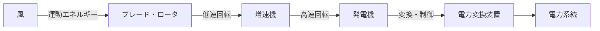

# 🌱 新エネルギー発電

> 太陽・風・水素・地熱などを電力に変換。出力変動が系統に与える影響と、各方式の変換原理が試験頻出。

!!! info "📋 v0.7 — 過去問データ充填済み"
    出題実績（R01〜R07）を充填済み。公式・数値は参考書で必ず確認してください。

---

## 🧠 直感的理解

再生可能エネルギー発電は「何を電力に変換するか」が方式ごとに異なる。共通の課題は**出力変動**。

```
太陽光：光エネルギー → 直流電力（パワコンで交流変換）→ 系統
風  力：風の運動エネルギー → 機械エネルギー → 電力
地  熱：地中の熱エネルギー → 蒸気 → タービン → 電力
燃料電池：化学エネルギー → 直接電力（電気化学反応）
```

**FIT制度（固定価格買取制度）** が普及の原動力。電力会社が一定期間・固定価格で買い取る義務を負う（→買取義務は電力会社側）。

**出力変動と系統安定性**：太陽光・風力は天候依存で出力が変動 → 系統周波数変動の原因 → 蓄電池・揚水発電との組み合わせが重要。

---

## 🏭 設備を歩く

**太陽光発電フロー**


**風力発電フロー**



---

## 🔬 発電方式の比較表（最重要）

| 方式 | 変換原理 | 出力変動 | 設備利用率 | 特徴 | 試験頻出ポイント |
|------|---------|---------|-----------|------|--------------|
| **太陽光** | 光起電力効果（p-n接合） | 大（昼夜・天候） | 約10〜15% | CO₂排出なし・保守容易 | 温度上昇で効率**低下** |
| **風力** | 運動エネルギー変換 | 大（風速依存） | 約20〜30% | P∝v³（風速の3乗） | 3乗依存・誘導発電機 |
| **燃料電池** | 電気化学反応（H₂+O₂→H₂O） | 小（制御可能） | 高い | カルノー効率に非依存 | 蓄電池ではなく発電装置 |
| **地熱** | 地中熱エネルギー→蒸気 | 小（安定） | 約60〜80% | ベースロード向き・立地制限 | 設備利用率が高い |
| **バイオマス** | 燃焼または発酵 | 小（燃料次第） | 中程度 | カーボンニュートラル | CO₂は排出するが中立評価 |
| **潮力・波力** | 海の運動エネルギー | 中（予測可能） | 低め | 技術開発段階 | 概要のみ把握でよい |

---

## ☀️ 太陽光発電の詳細

### 変換原理

**光起電力効果**：p型半導体とn型半導体の接合（p-n接合）に光が当たると電子-正孔対が生成され、内部電界により電流が流れる。

**温度特性（重要）**：
- 温度上昇 → 開放電圧（Voc）**低下** → 最大出力**低下**
- 「温度が高いほど効率が上がる」は誤り（夏は日射量は多いが効率は低下）

### MPPT制御（最大電力点追従）

太陽電池の出力特性（I-V曲線）は日射量・温度で変化する。**MPPT（Maximum Power Point Tracking）制御**で常に最大電力点で動作させる。

### パワーコンディショナ（PCS）の役割

1. DC→AC変換（インバータ）
2. MPPT制御
3. 系統連系保護（単独運転防止・過電圧・過電流保護）
4. 系統への連系条件維持

**設備利用率の計算**：

```
年間発電量[kWh] = 設備容量[kW] × 設備利用率 × 8760[h/年]
例）1,000 kW × 0.12 × 8,760 = 1,051,200 kWh/年
```

---

## 💨 風力発電の詳細

### 風力エネルギーの公式（最重要）

$$P = \frac{1}{2} \rho A v^3$$

| 記号 | 意味 | 単位 |
|------|------|------|
| P | 風力エネルギー（出力） | W |
| ρ | 空気密度 | kg/m³ |
| A | 受風面積（= π r²） | m² |
| v | 風速 | m/s |

!!! warning "風速の3乗に比例（2乗ではない）"
    風速が2倍になると出力は **2³ = 8倍** になる。これは頻出誤答なので注意。

### 発電機の種類

| 種類 | 特徴 | 用途 |
|------|------|------|
| **誘導発電機** | 構造シンプル・低コスト・系統と同期 | 定速風力（旧来型） |
| **同期発電機** | 高効率・励磁制御必要 | 直結型 |
| **可変速発電機（DFIG等）** | 風速変化に対応・最大効率運転 | 現代の主流 |

---

## ⚡ 燃料電池の詳細

### 基本原理

水の電気分解の逆反応：

```
負極（燃料極）：H₂ → 2H⁺ + 2e⁻
正極（空気極）：½O₂ + 2H⁺ + 2e⁻ → H₂O
全体          ：H₂ + ½O₂ → H₂O + 電気エネルギー + 熱エネルギー
```

**カルノー効率の制約を受けない**：熱機関を経由しないため、熱力学的なカルノー効率の上限がない（直接電気化学変換）。

### 燃料電池の種類比較

| 種類 | 電解質 | 動作温度 | 効率 | 用途 |
|------|-------|---------|------|------|
| **PEFC**（固体高分子） | 固体高分子膜 | 60〜90℃ | 35〜45% | 家庭用（エネファーム）・FCV |
| **PAFC**（リン酸） | リン酸 | 150〜220℃ | 35〜45% | 業務用分散電源 |
| **MCFC**（溶融炭酸塩） | 溶融炭酸塩 | 約650℃ | 45〜55% | 大型発電 |
| **SOFC**（固体酸化物） | 固体酸化物 | 700〜1000℃ | 45〜60% | 業務用・コジェネ |

**コジェネレーションとの組み合わせ**：発電と同時に発生する熱（温水・蒸気）を給湯・暖房に利用 → 総合効率80%以上も可能。

---

## 💡 勘違いTOP3

**1. 風力は風速の「3乗」に比例（2乗ではない）**
P = ½ρAv³ の「3乗」を忘れて「2乗」と書くのが典型誤答。風速が2倍で出力は8倍になる。

**2. 燃料電池は「蓄電池」ではなく「発電装置」**
燃料（水素等）を供給し続ける限り発電する。蓄電池は充電した電気エネルギーを放出するが、燃料電池は化学反応で発電する。燃料が切れたら発電停止。

**3. FIT制度の買取義務の主体**
「固定価格での売電ができる」制度だが、買取義務を負うのは**電力会社（一般送配電事業者等）側**。発電事業者が義務を負うのではない。

---

## ⚡ 正誤判定の急所

| 文章 | 正誤 | 解説 |
|------|------|------|
| 「太陽電池の変換効率は温度が上昇すると向上する」 | **誤** | 温度上昇で開放電圧が低下し、効率は**低下**する |
| 「燃料電池はカルノー効率の制約を受けない」 | **正** | 熱機関を経由しない電気化学反応のため |
| 「風力発電の出力は風速の2乗に比例する」 | **誤** | **3乗**に比例（P = ½ρAv³） |
| 「FIT制度では発電事業者が電力会社に買取を強制できる」 | **正** | 電力会社に買取義務が課される |
| 「地熱発電はベースロード電源として利用できる」 | **正** | 出力変動が少なく設備利用率が高い |
| 「燃料電池のSOFCは動作温度が最も低い」 | **誤** | SOFCは700〜1000℃で**最も高い**。最低温はPEFC（60〜90℃） |
| 「バイオマス発電はCO₂を排出しない」 | **誤** | CO₂は排出するが、植物が吸収したCO₂の再放出であるためカーボンニュートラル（排出しないわけではない） |
| 「太陽光発電のMPPT制御は系統の電圧を安定させるための制御である」 | **誤** | MPPTは太陽電池の**最大電力点**を追従するための制御。系統電圧制御は別の機能 |

---

## 📊 出題実績

| 年度 | 問 | タイトル | 問題タイプ | 難易度 |
|------|---|---------|----------|--------|
| R07下 | 問5 | 水力・風力発電用誘導発電機の特徴 | 論説 | ★★★★☆ |
| R07上 | 問5 | バイオマス発電の特徴や性質 | 穴埋 | ★★☆☆☆ |
| R06下 | 問5 | 地熱発電及びバイオマス発電 | 穴埋 | ★★☆☆☆ |
| R06上 | 問5 | 燃料電池の原理や特徴 | 論説 | ★★☆☆☆ |
| R05下 | 問5 | さまざまな分散型電源の特徴 | 論説 | ★★☆☆☆ |
| R05上 | 問5 | 風力発電の特徴 | 論説 | ★★☆☆☆ |
| R04下 | 問5 | 各新エネルギー発電の得失 | 論説 | ★★☆☆☆ |
| R04上 | 問5 | 風力発電の構造と特徴 | 穴埋 | ★★★☆☆ |
| R03 | 問6 | 分散型電源として設置される新エネルギー発電の特徴 | 論説 | ★★☆☆☆ |
| R02 | 問5 | 太陽光発電設備の構成及び特徴 | 穴埋 | ★★★☆☆ |
| H30 | 問5 | 風力発電所の軸出力 | 計算 | — |
| H29 | 問5 | 地熱発電及びバイオマス発電 | 穴埋 | — |

> 詳細解説: [電験王 新エネルギーカテゴリ](https://denken-ou.com/denryoku/?cat=shinene)

!!! info "学習の優先順位"
    1. **風速の3乗比例**（P = ½ρAv³）→ 最頻出誤答
    2. **太陽電池の温度特性**（温度上昇→効率低下）
    3. **燃料電池はカルノー効率に非依存**
    4. 各方式の設備利用率の大小関係（地熱 > 風力 > 太陽光）
