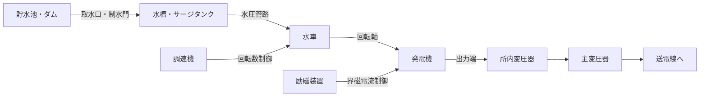

# ⚡ 水力発電

> 水の位置エネルギーを電気エネルギーに変換する。P=9.8QHηが全計算の出発点。

!!! warning "⚠️ 未確認"
    このページはv0.5ドラフトです。教科書との照合は未完了。数値・公式は参考書で確認してください。

---

## 🧠 直感的理解

水力発電は「高いところにある水を低いところへ落とす」だけ。これをエネルギー変換として整理すると：

- **位置エネルギー**（水の高さ × 重さ）→ **運動エネルギー**（水車を回す）→ **電気エネルギー**（発電機）

アナロジーで言えば、**水 ≒ 電流、落差 ≒ 電圧**。水が多く（大流量）、落差が大きいほど大きなエネルギーが得られる。これはオームの法則 P=VI の構造と同じ。

損失がなければ位置エネルギーがすべて電力になる（エネルギー保存）。実際には水圧管路の摩擦損失・水車効率・発電機効率が絡む。これらをまとめたのが総合効率 η。

**直感的な公式の読み方**：
- `9.8` = 重力加速度 (g≒9.8 m/s²) × 水の密度 (1000 kg/m³) をkW換算した係数
- `Q` = 流量 [m³/s]（水の量）
- `H` = 有効落差 [m]（実際に使える高低差）
- `η` = 総合効率（水車効率 × 発電機効率）

!!! tip "5秒で思い出す"
    ==**P = 9.8 × Q × H × η　「9.8・流量・落差・効率」**==

    単位を確認：[kW] = [9.8 kN/m³] × [m³/s] × [m] × [-]

---

## 🏭 設備を歩く



**主要機器テーブル**

| 機器名 | 役割 | 試験で問われるポイント |
|--------|------|----------------------|
| 取水設備（ダム・堰） | 河川水を取り込み、有効落差を確保 | 調整池式・貯水池式の違い |
| 沈砂池・スクリーン | 土砂・異物を除去し水車を保護 | 摩耗防止の観点 |
| 水路・水槽 | 水を水圧管路まで導く | 無圧水路（開水路）と圧力水路の区別 |
| サージタンク | 水撃（ウォーターハンマー）を吸収 | 圧力変動の緩衝装置 |
| 水圧管路（ペンストック） | 高圧水を水車へ送る | 損失水頭の発生源；肉厚設計 |
| 水車 | 水の運動エネルギーを回転力に変換 | 衝動型・反動型の分類；比速度 |
| 発電機 | 回転力を電気に変換 | 突極機（低速）vs 円筒機（高速） |
| 調速機（ガバナー） | 負荷変動に対し回転数を一定に保つ | 周波数調整の仕組み |
| 励磁装置 | 発電機の界磁電流を制御 | 電圧調整・力率制御の役割 |
| 主変圧器 | 発電電圧を送電電圧に昇圧 | 変圧比・タップ切換 |

!!! note "現場の視点"
    揚水発電の「ポンプ水車」は電力系統の需給調整装置としても機能する。昼間は発電、夜間は揚水で系統の安定化に貢献する。これはバッテリーの充放電に相当する「電力の貯蔵」であり、再生可能エネルギーの普及に伴い重要性が増している。

---

## ⚖️ 水車の種類比較

### 衝動水車 vs 反動水車

| 比較項目 | 衝動水車（ペルトン） | 反動水車（フランシス・カプラン） |
|---------|-------------------|-------------------------------|
| 作動原理 | ノズルから噴射した水流の運動エネルギーで回す（水圧は大気圧） | ランナーを水中に浸し、圧力差と速度で回す |
| 適用落差 | **高落差**（300m以上が多い）・小流量 | **低〜中落差**（フランシス：40〜700m、カプラン：10〜60m） |
| 比速度 Ns | 低い（10〜30 rpm） | 高い（フランシス：50〜350、カプラン：200〜900） |
| 構造特徴 | バケット（羽根椀）にノズル噴流を当てる | ランナー翼が水圧差で回転；渦巻ケーシング内 |
| 出題ポイント | 「ノズル」「バケット」「高落差」キーワード | フランシス：混流型。カプラン：プロペラ型・可動翼 |
| 効率の特徴 | 部分負荷でもニードル弁で効率維持しやすい | フランシスは設計点から外れると効率低下 |

> **比速度 Ns の公式**：Ns = N × √P / H^(5/4)
> Ns が大きいほど低落差・大流量型。

### 発電所の分類

| 分類 | 特徴 | 出力の安定性 | 用途 |
|------|------|-------------|------|
| **流れ込み式** | 河川の自然流量をそのまま利用（調整機能なし） | 河川流量に左右され不安定 | ベース電源（流量が安定な河川） |
| **調整池式** | 数日〜数週間分の水量を調整池に貯留 | 日〜週単位で調整可能 | 日負荷調整 |
| **貯水池式** | 大型ダムで季節間調整 | 季節変動を吸収 | 季節負荷調整 |
| **揚水式** | 上部・下部調整池を設け、電動ポンプで揚水 | 需要に合わせ自在に発電・揚水 | ピーク対応・需給調整 |

---

## 🔍 公式の意味マップ

### レイヤーA：基本公式

**理論出力（損失なし）**
```
P_theory = 9.8 × Q × H_gross  [kW]
```

**実際の出力（損失あり）**
```
P = 9.8 × Q × H × η  [kW]
```
- H = H_gross - h_loss（有効落差 = 総落差 - 損失水頭）
- η = η_turbine × η_generator（総合効率 = 水車効率 × 発電機効率）

**有効落差の構成**
```
H = H_gross - h_friction - h_other
```
- h_friction：管路摩擦による水頭損失（Darcy-Weisbach式で算出）
- h_other：取水口損失・ゲート損失など

**ベルヌーイの定理との接続**（参考）
```
P1/ρg + v1²/2g + z1 = P2/ρg + v2²/2g + z2 + h_loss
```
有効落差Hはこの式の位置水頭差からエネルギー損失を引いた値に対応する。

### レイヤーB：応用公式

**揚水所要電力**
```
P_pump = 9.8 × Q × H_p / η_pump  [kW]
```
発電と逆方向（割り算）。η_pump はポンプ効率（ポンプ効率 × 電動機効率）。

**揚水式発電の総合効率**
```
η_total = P_gen / P_pump = (9.8 × Q × H × η_gen) / (9.8 × Q × H_p / η_pump)
         ≒ η_gen × η_pump  （H ≒ H_p の場合）
```

**年間発電電力量**
```
E = P × T  [kWh]
```
T：年間運転時間 [h]。設備利用率 = E / (P_rated × 8760) × 100 [%]

**流量と流速の関係**
```
Q = A × v  [m³/s]
```
A：水路断面積 [m²]、v：平均流速 [m/s]

---

## 🛤️ 解法パターン

### パターン①: 発電出力を求める

**見分け方**：流量Q・有効落差H・効率η（または水車効率・発電機効率が別々）が与えられている

**手順**：
1. η_total = η_turbine × η_generator（別々の場合は先に掛け算）
2. P = 9.8 × Q × H × η に代入
3. 単位確認：Q [m³/s]、H [m] → P [kW]

**例題**：Q = 50 m³/s、H = 100 m、η = 0.85 のとき
→ P = 9.8 × 50 × 100 × 0.85 = **41,650 kW = 41.65 MW**

---

### パターン②: 有効落差を求める

**見分け方**：総落差（H_gross）と損失水頭（h_loss）が与えられている、または損失率が与えられている

**手順**：
1. H = H_gross - h_loss
2. 損失率で与えられた場合：h_loss = H_gross × 損失率
3. 求めたHをP=9.8QHηに代入

**例題**：総落差200m、損失水頭10m、Q=30 m³/s、η=0.90
→ H = 200 - 10 = 190 m
→ P = 9.8 × 30 × 190 × 0.90 = **50,274 kW**

---

### パターン③: 揚水発電の電力・効率計算

**見分け方**：「揚水」「ポンプ」「揚程」「ポンプ水車」のキーワード。発電と揚水の両方が問われる

**手順**：
1. 発電出力：P_gen = 9.8 × Q × H × η_gen
2. 揚水入力：P_pump = 9.8 × Q × H_p / η_pump
3. 総合効率：η_total = P_gen / P_pump

**注意点**：発電時はηを「掛ける」、揚水時はηで「割る」。方向が逆！

**例題**：発電時 Q=40 m³/s、H=150 m、η_gen=0.88、揚水時 η_pump=0.82
→ P_gen = 9.8 × 40 × 150 × 0.88 = 51,744 kW
→ P_pump = 9.8 × 40 × 150 / 0.82 = 71,707 kW
→ η_total = 51,744 / 71,707 ≒ **72.2%**

---

## 🕳️ 勘違いTOP3

### 1. 「9.8」の単位と由来
よくある誤解：「なんで9.8なのか分からないまま使っている」

**導出**：
- 水の密度：ρ = 1000 kg/m³
- 重力加速度：g = 9.8 m/s²
- 重力 = ρ × g = 1000 × 9.8 = 9800 N/m³ = 9.8 kN/m³
- 出力 [W] = 力 [N] × 速度 [m/s] = 9800 [N/m³] × Q [m³/s] × H [m]
- kW換算：÷ 1000 → 9.8 × Q × H [kW]

つまり **9.8 はγ（比重量）を kW/m³/s/m にまとめた係数**。

### 2. 有効落差と総落差の混同
問題文に「総落差H₀ = 200 m、損失水頭 = 10 m」とあるとき、H₀をそのまま使ってしまう誤り。

**正しくは**：H（有効落差）= 200 - 10 = 190 m を使う。P=9.8QH₀ηは誤り。

### 3. 揚水の効率方向の間違い
「発電も揚水もηを掛ける」という誤解。

- 発電時：出力 = 入力エネルギー × η（損失があるから小さくなる）→ **掛ける**
- 揚水時：必要入力 = 揚水に必要なエネルギー ÷ η（損失があるから余計に必要）→ **割る**

フレーム：「欲しい量に対して損失が加わるなら割る」

---

## 📝 正誤判定の急所

| 文 | 正誤 | 解説 |
|----|------|------|
| フランシス水車は衝動水車である | **誤** | 反動水車（ランナーを水中に浸し圧力差で回す） |
| 流れ込み式発電所は河川の自然流量をそのまま利用する | **正** | 調整機能がないため出力は河川流量に依存 |
| ペルトン水車は低落差・大流量に適している | **誤** | 高落差・小流量に適する（ノズル噴流方式） |
| 有効落差は総落差から損失水頭を引いたものである | **正** | H = H_gross - h_loss |
| 揚水発電の揚水所要電力はP=9.8QHηで求められる | **誤** | 正しくはP=9.8QH/η（ηで割る） |
| カプラン水車は可動式のランナー翼を持つ | **正** | 低落差・大流量用；プロペラ型で翼角度を変えられる |
| 調整池式発電所は季節間の負荷調整に使われる | **誤** | 季節間は「貯水池式」。調整池式は日〜週単位の調整 |
| サージタンクはウォーターハンマーを吸収する | **正** | 急激な流量変化による圧力変動の緩衝装置 |

---

## 📊 出題実績

| 年度 | 問 | 難易度 | 形式 | 何が問われたか |
|------|---|--------|------|-------------|
| R3 | 1 | ★★☆ | 計算 | 流量・落差から出力算定（P=9.8QHη） |
| R2 | 2 | ★★☆ | 計算 | 有効落差と損失水頭を含む出力計算 |
| R1 | 1 | ★☆☆ | 正誤 | 水車の種類（衝動・反動）の正誤判定 |
| H30 | 3 | ★★★ | 計算 | 揚水発電の総合効率計算 |
| H29 | 2 | ★★☆ | 計算 | 年間発電電力量と設備利用率 |

> ⚠️ 詳細は [電験王](https://denken-ou.com/denryoku/) の水力カテゴリを参照。年度・問番号は照合が必要。

---

## 🔗 関連テーマ

- [火力発電](karyoku.md) — 熱サイクルとの比較で「変換効率」の考え方を整理
- [電力系統・需給運用](denryoku-keitou.md) — 揚水発電の需給調整機能・周波数制御との接続
